CUDA Path Tracer
======================

**University of Pennsylvania, CIS 565: GPU Programming and Architecture, Project 3**

Hannah Bollar: [LinkedIn](https://www.linkedin.com/in/hannah-bollar/), [Website](http://hannahbollar.com/)
 
Tested on: Windows 10 Pro, i7-6700HQ @ 2.60GHz 15.9GB, GTX 980M (Personal)
____________________________________________________________________________________

   

[//]: # ( 

[Introduction](#introduction) - [Graphics Features](#graphics-features) - [Optimization Features](#optimization-features) - [Key Controls](#key-controls) - [Bloopers](#bloopers) - [References](#references) 

# Path Tracer

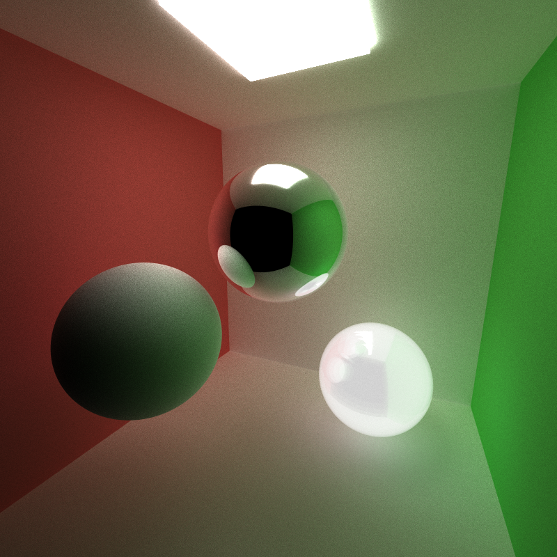

## Introduction

### What is a Path Tracer

This is a GPU implementation of a Monte-Carlo Path Tracer. Path Tracers aim to realistically simulate how light bounces in a scene to acurrately render images. By implementing this on the GPU, versus the CPU, the final output renders much more efficiently. This is a Monte-Carlo Path Tracer because of its raybounce sampling technique.

The goal of this project is to change the recursive computations found in the CPU implementation to a more parrallel, streamlined version. The implementation is simplified at the moment in that it uses Naive integration and doesnt do actual BSDF material calculations. Instead, we use an imputed sampling function that becomes our probability checker. This is discussed more in the [BSDF](#bsdf) section.

Though the Path Tracer is considered more physically accurate and features such as caustics are properly computed (see BSDF images), most companies in the graphics industry working on real-time implementations are still focusing on the improvements of the Raytracer since it's computationally less expensive and includes fewer memory calls making it more optimal for a real-time GPU implementation. Additionally, the increase in use of denoisers also has aided the field in terms of simulated real-time rendering.

### All Current Features

The flags of all toggleable features can be updated in `utilities.h`.

Graphics Features
- Bidirectional Scattering Distribution Function
	- Ideal Diffuse Surfaces (Cosine Weighted Scattering Function)`*`
	- Perfectly Specular-Reflective Surfaces`*`
	- Specular-Refractive/Transmissive Surfaces (using Schlick's approximation)
- Anti Aliasing
	- Regular
	- Bonne Projection Bokeh Mapping
- Motion Blur
- Depth of Field
	- Normal Depth of Field based on a circular lens

Optimization Features
- Stream Compaction`*`
- Intersections Contiguous in memory by Material`*`
- Caching the First Bounce`*`

`*` = required.

## Graphics Features

### BSDF

Terms used below:
- `iteration` - When we actually reshoot samples from the camera into the scene. Each following iteration sends out an increased number of samples per pixel. All images in this write-up are rendered with about 1000 iterations.
- `depth` - the max number of bounces of each ray that was shot for one iteration round. All images in this project are rendered with a depth of 8.

Since the implementation wasn't focused on the usual recursive aspect of a cpu Pathtracer, the BSDF sampling here is skewed without using a bounce sampling function (`Sample_f`) or a probability density function (`pdf`). Instead, the initial weightings in terms of `refractive`, `reflective`, and `diffuse` for a material's general `bsdf` function are loaded up from the inputted scene file at the beginning. Then as the `iterations` continue, we begin sending out an increased number of `samples per pixel` to get a more accurate result. As the ray bounces, it multiplies it's current color by the new calculated color of its intersecting location, which is done based on the probability of the ray being `refractive` or `reflective` (if neither then it's just a normal diffuse bounce). For this implementation we are using Schlick's approximation for `transmissive` surfaces. Note the caustic in the transmissive image.

Diffuse                    |  Reflective               | Transmissive
:-------------------------:|:-------------------------:|:-------------------------:
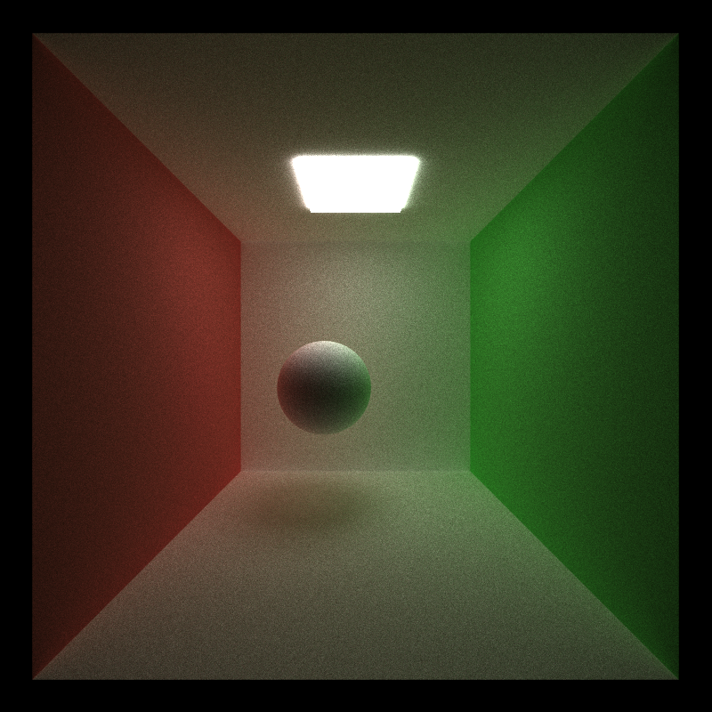| 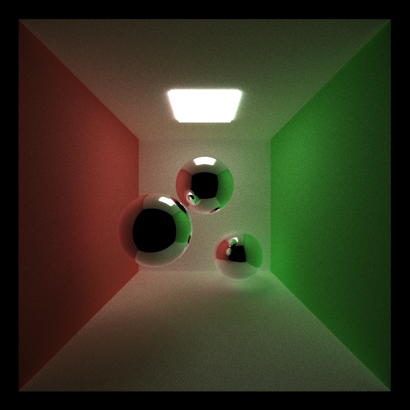 |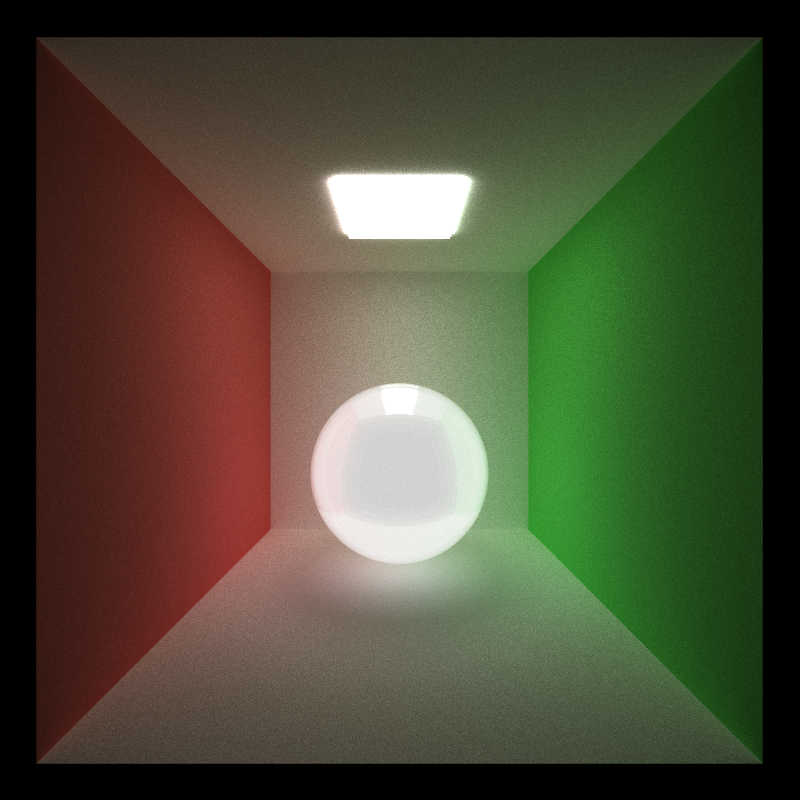

### Anti Aliasing

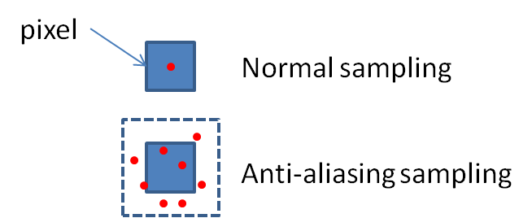

`anti aliasing` is the jittering of the origin of a ray sent out from each pixel to create a "blur" preventing the original pixelated effect.

No Anti Aliasing           |  With Anti Aliasing
:-------------------------:|:-------------------------:
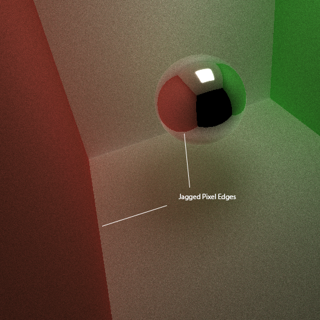| 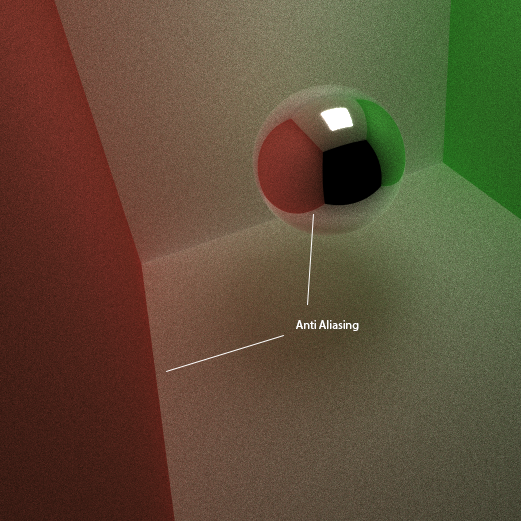 |

### Motion Blur

Motion blur is the "averaging" of multiple shots of an object in motion. This project simulates that effect by moving the object between each iteration.

Here's two examples of motion blur on a sphere. The first is a diffuse sphere bouncing out of the box. The second is on a transmissive sphere.

Diffuse Motion Blur        |  Refractive Motion Blur
:-------------------------:|:-------------------------:
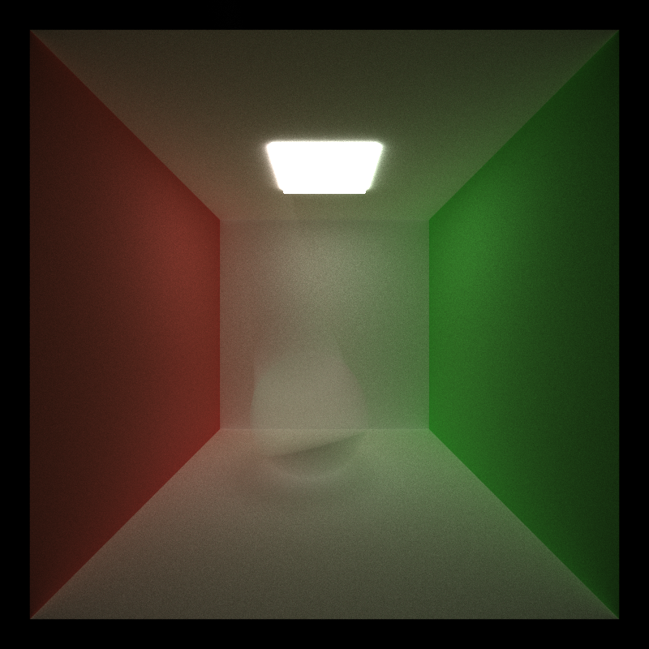| 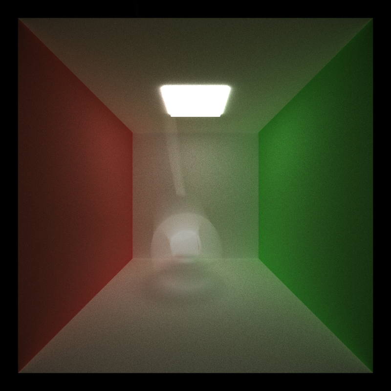 |

### Depth of Field

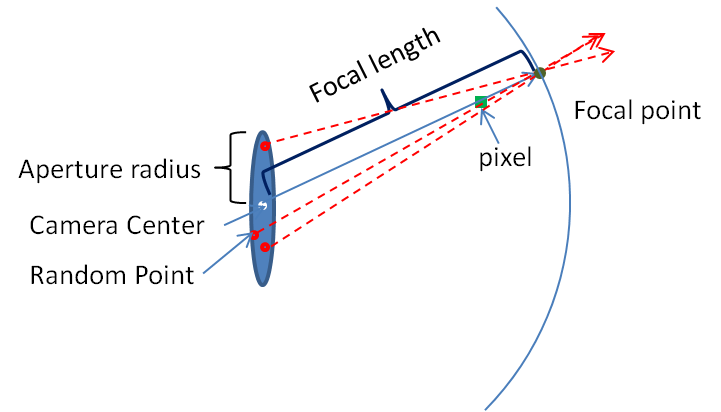

Similar to `anti aliasing` and `motion-blur`, depth of field is also a blurring of the images by adjusting aspects of the ray shot from the camera.

No Depth of Field | Lens Radius 0.2 Focal Distance 5
:-------------------------:|:-------------------------:
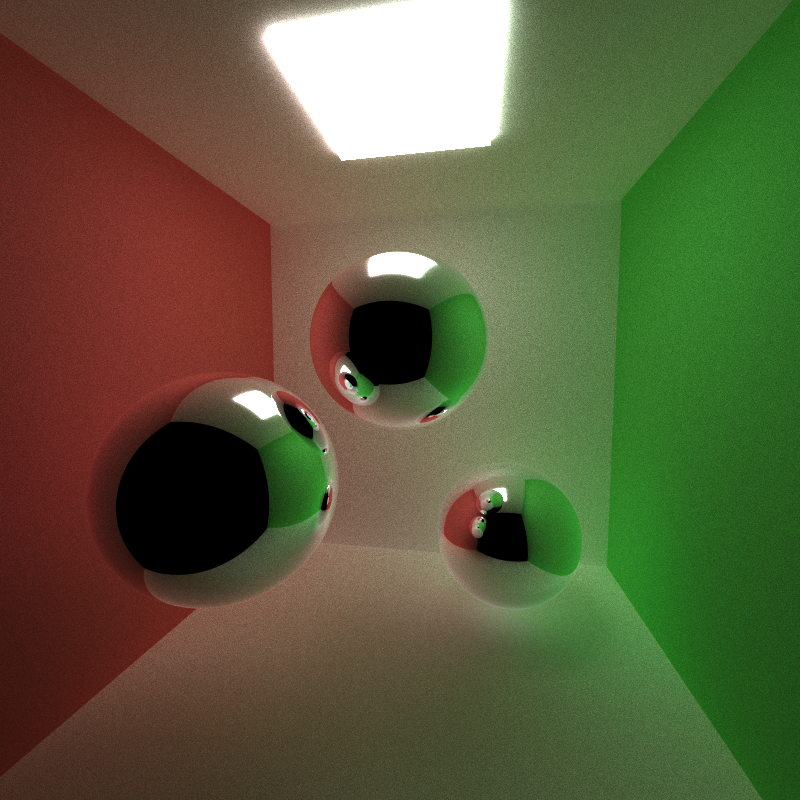| 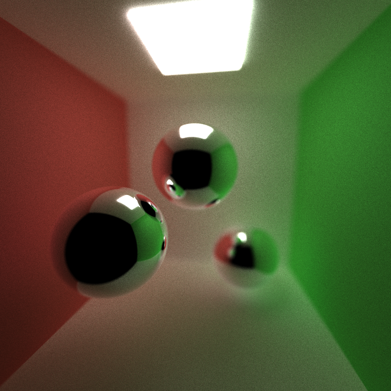 |

### Bonne Projection Bokeh

This is an extension of the depth of anti aliasing implementation; however, instead of sampling a spherical lens, the origin gets mapped to a heart shape. This copies the "bokeh" effect in the depth of field where lights in the distance become obscured into a specific shape.

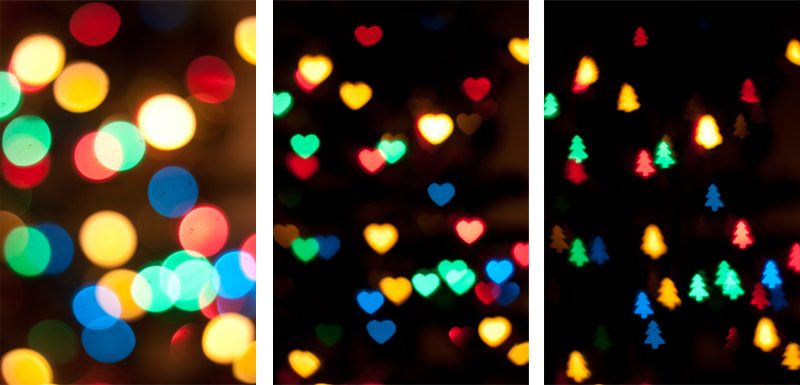

My implementation focused on changing the effect from a circle to a heart using bonne projection, which is the formula to map a sphere to flat heart shape (a technique that was used extensively by cartographers before the current robinson projection). This version of the globe has skewing more towards the edges; however, the landmasses stay more accurately represented.

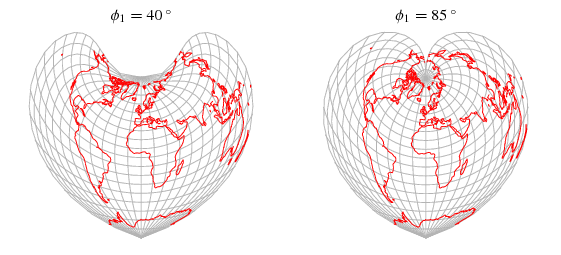

There are certain aspects I still need to adjust for this implementation; however, you can still see its effect providing an upside down heart shape in the following image. It's not as distinct as I would like; however, this is probably due to certain depth of field adjustment parameters.

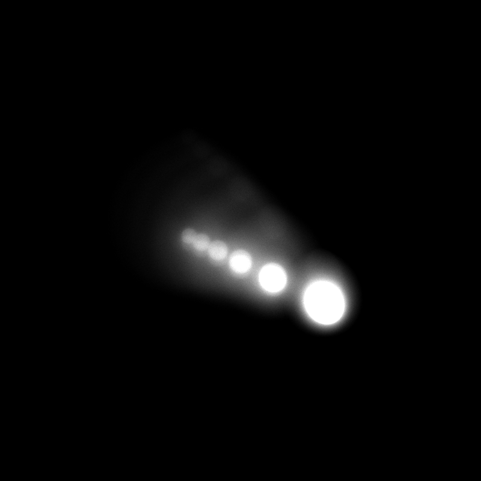

## Optimization Features

Note some of the reasons why the optimizations might not be as "optimal" as originally expected could be due to the small scene sizes and small element count that are being used for demonstration. For our purposes, all the optimizations are supposed to improve the runtime of the path tracer (though the below chart shows that that's not necessarily the case).

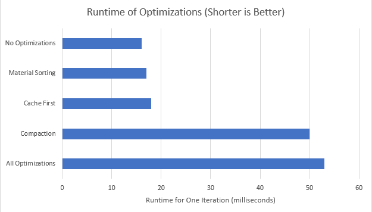

### Stream Compaction

This project contains path continuation/termination stream compaction. That is, once a ray is not hitting anything anymore, regardless of if it hasn't hit max depth yet, we can remove it from our calculating rays. Further explanation for why this is effective can be found in the additional features section of my [GPU stream compaction project](https://github.com/hanbollar/CUDA-Stream-Compaction#additional-features).

### Material Contiguous In Memory

This is an extension of the stream compaction idea. Knowing that stream compaction is being used, this sorts rays and segments in the looping of the path tracer by their intersection material. This is an optimization, because rays intersecting the same material are more likely to take the same amount of runtime in the `bsdf` calculation function and also run for closer to the same number of bounces in the end. Doing this sorting allows the project to make the most of the stream compaction mentioned above.

### Cache First Bounce

Caching first bounce intersections for re-use across all subsequent iterations optimizes performance, because we know all rays will be used in that first step, so we dont need to recalculate their intersections based on direction for stream compaction at all. 

# Key Controls

* `esc` - save an image and exit.
* `s` - save an image. Watch the console for the output filename.
* `spacebar` - re-center the camera at the original scene lookAt point
* `left mouse button` - rotate the camera
* `right mouse button` - the vertical axis to zoom in/out
* `middle mouse button` - move the LOOKAT point in the scene's X/Z plane

# Bloopers

Improper Light Calculation | Used Incorrect Direction for Normal Comparison | Sampler was Restarted at Each Bounce
:-------------------------:|:-------------------------:|:-------------------------:
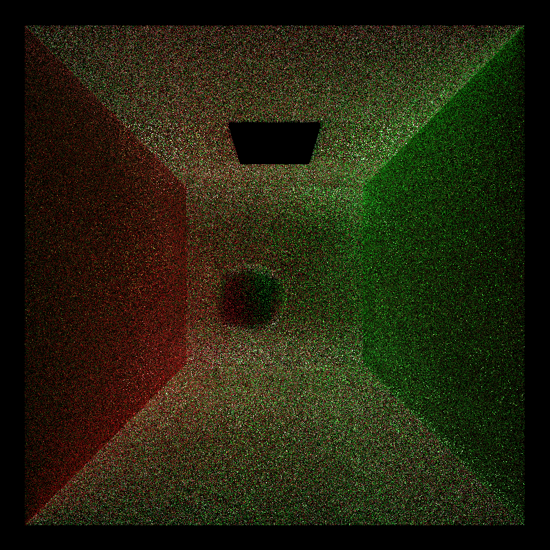| 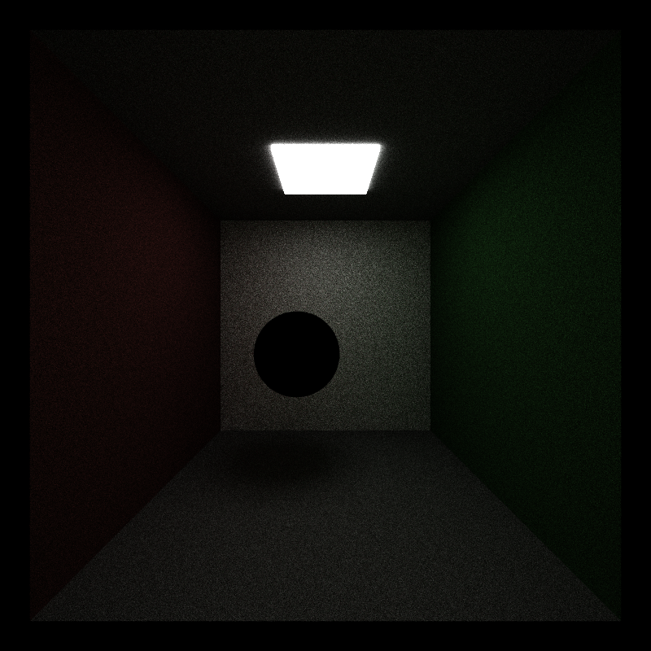| 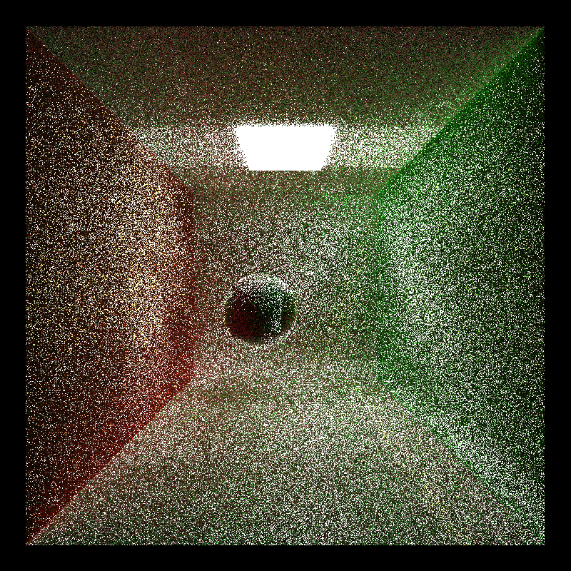

- improper light calculation blooper - when it hit the light I was having it return black instead of the light's color.
- incorrect normal - i was using the updated direction for the normal comparison instead of the original ray direction used throughout the color calculation.
- sampler restart - this caused the skewed effect, because though the sampler is technically a random number generator, just like in perline noise, the randomness is uniform in the fact that given a function `f`, for each x input, the value `f(x)` will remain the same for the `x` input every time it's called. I was giving the function 0 instead of making it based on depth, causing it to reset.

# References

[GPU Gems 3](https://developer.nvidia.com/gpugems/GPUGems3/gpugems3_pref01.html)

[PBRT] Physically Based Rendering, Second Edition: From Theory To Implementation. Pharr, Matt and Humphreys, Greg. 2010.

CIS 565 slide deck

Reference images from 565's how to build a good github repo 

Bonne Map Projection - [What is it](http://mathworld.wolfram.com/BonneProjection.html), [Sampling techniques](https://blog.thomaspoulet.fr/uniform-sampling-on-unit-hemisphere/)