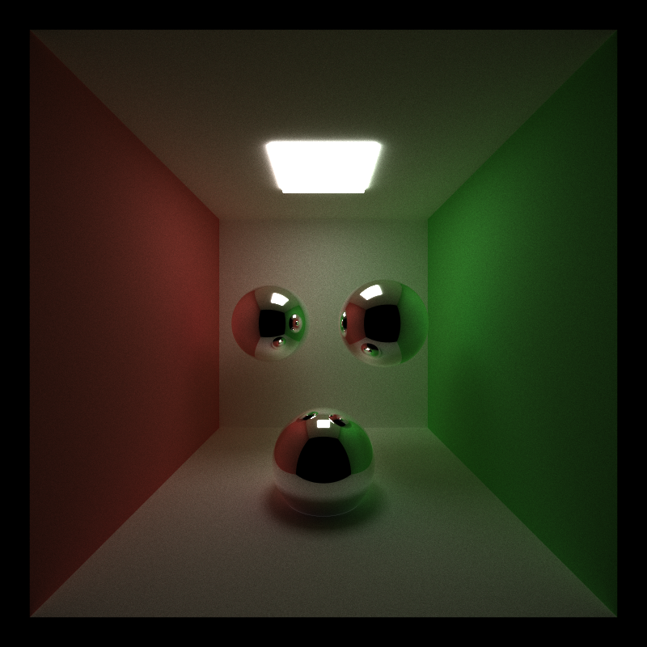
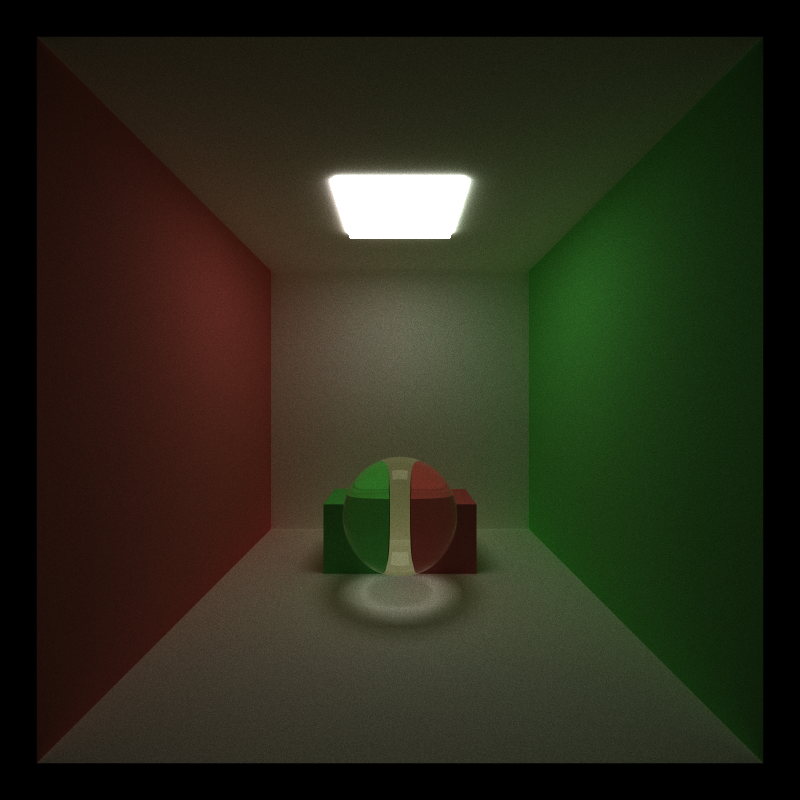
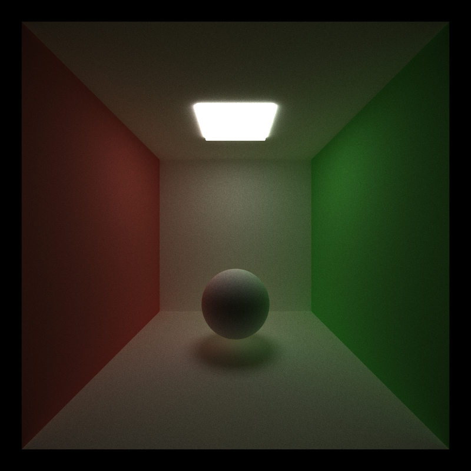
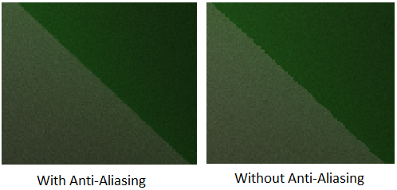
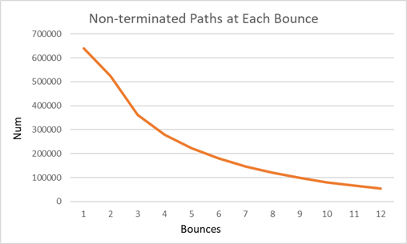
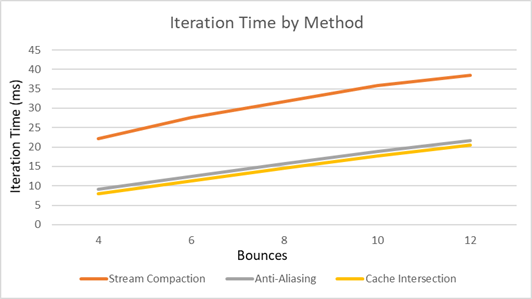
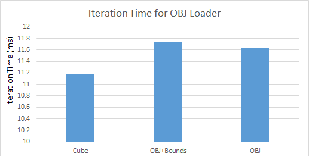

CUDA Path Tracer
======================

* Salaar Kohari
  * LinkedIn ([https://www.linkedin.com/in/salaarkohari](https://www.linkedin.com/in/salaarkohari))
  * Website ([http://salaar.kohari.com](http://salaar.kohari.com))
  * University of Pennsylvania, CIS 565: GPU Programming and Architecture
* Tested on: Windows 10, Intel Xeon @ 3.7GHz 32GB, GTX 1070 8GB (SIG Lab)

### Introduction
My GPU path tracer produces accurate renders in real-time. The rays are scattered using visually accurate diffuse, reflection, and refraction lighting properties. Techniques such as stream compaction and particular memory allocation help speed up the iteration time. Other features of the path tracer include arbitrary mesh loading and anti-aliasing.

Some terms will be important for understanding the analysis. Each ray cast from the camera has a maximum number of **bounces** carrying the light before it terminates. When every pixel's non-deterministic path reaches the maximum bounces or does not collide with anything in the scene, one **iteration** is completed. Performance analysis will focus on number of bounces and average iteration time for various features.

## Algorithm
1. Initialize array of paths (project a ray from camera through each pixel)
2. Compute intersection with ray along its path
3. Stream compaction to remove terminated paths (optional)
4. Shade rays that intersected something using reflect, refract, or diffuse lighting to multiply with the current color of the ray
5. Repeat steps 2-4 until max bounces reached or all paths terminated
6. Add iteration results to the image, repeating steps 1-5 until max iterations reached

## Images

### Analysis

As expected, the remaining paths decay with bounces. (Cornell box with reflective sphere)

Using stream compaction seems to slow down iteration time significantly versus anti-aliasing and caching the first bounce intersection for future iterations. Perhaps if stream compaction only took place for the first few bounces, it would provide a speedup for a larger number of bounces. (Cornell box with reflective sphere)

Using a bounding box test before checking all triangles is actually slower than just checking the triangles for a very low poly cube. This is not the case with a larger mesh. Using the Stanford bunny resulted in about 750ms per iteration without bounding box, while using it could reduce it down to 11.72ms if it is entirely offscreen. (Cornell box with reflective objects)
