CUDA Path Tracer
================

**University of Pennsylvania, CIS 565: GPU Programming and Architecture, Project 3**

* Wanru Zhao
  * [LinkedIn](www.linkedin.com/in/wanru-zhao).
* Tested on: Windows 10, Intel(R) Core(TM) i7-8750H CPU@2.2GHz, GTX 1070 with Max-Q Design(Personal Laptop)

### Final

  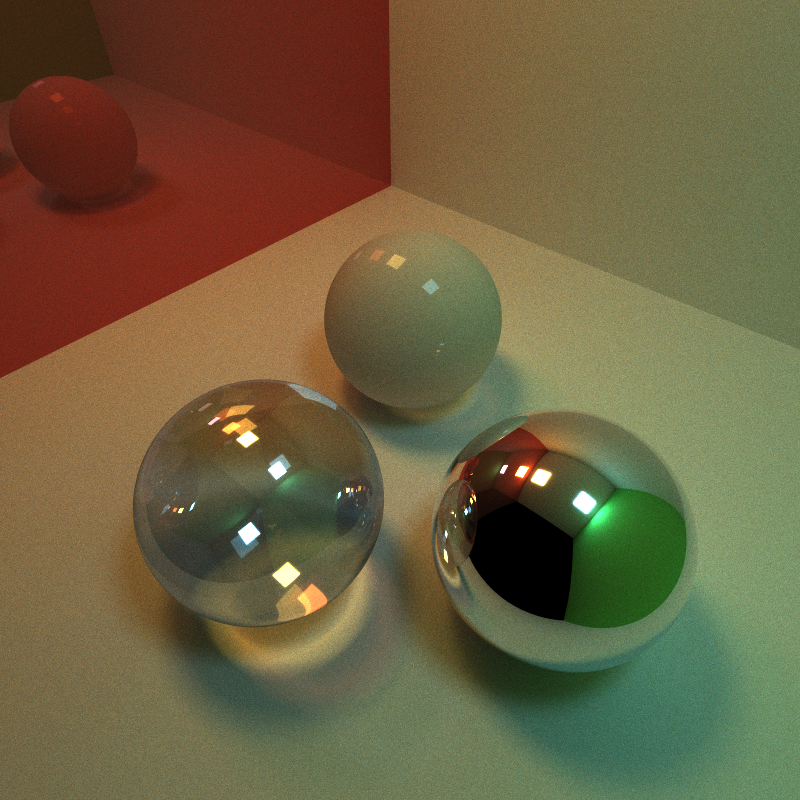
  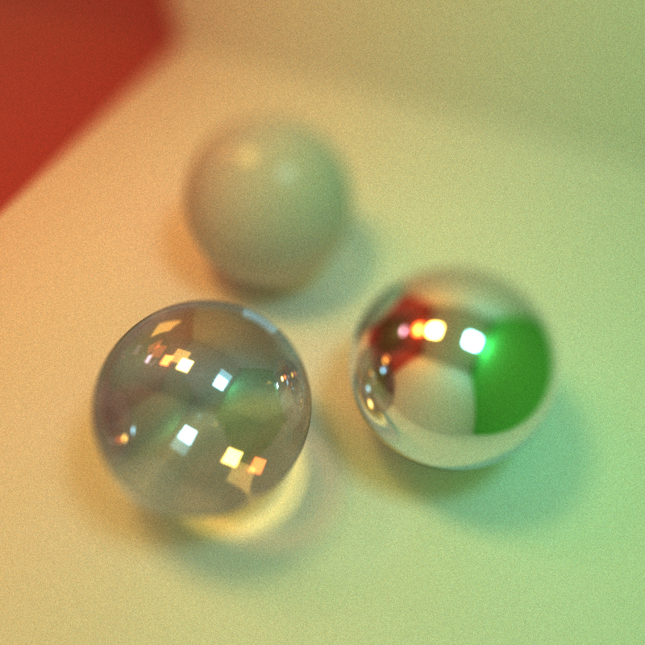 

### Features

- Shading kernel with BSDF features: diffuse and perfectly specular
- Path termination with stream compaction
- Material sort
- First cache
- Refraction with fresnel effects
- Physically based depth of field
- Stochastic sampled antialiasing
- Direct lighting
- Motion blur

### Analysis
#### Stream compaction

In each iteration, apply stream compaction on pathsegments according their remaining bounces after each bounce, remove the pathsegments with 0 remaining bounce, and adjust the number of launched threads. When there is no pathsegments alive left, bouncing can be terminated earlier.

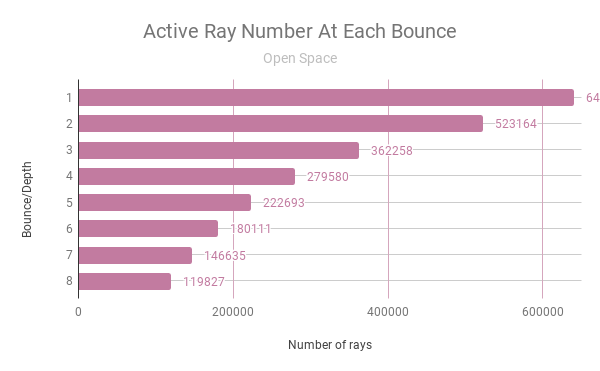

#### Cache first intersection

Cache first intersection at the first bounce and first iteration. Cached data is used for initializing following iterations as results for first bounce. This skips the same intersection calculation. (Since this assuming the intersectionsof first bounce are always the same, this cannot be used with antialiasing.)

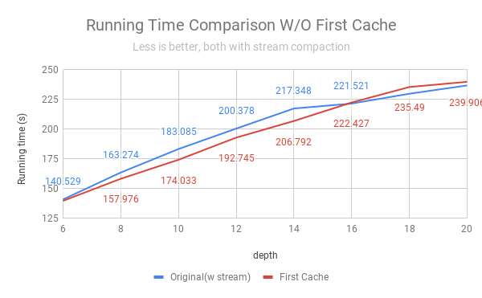

From above image, we can see for depth from 6 to 16, performance with cache first intersection is slightly better than naive way, for it reduces the calculation of first bounce for iteration 2 to iteration 5000. However, when bounce count increases from 16 to 20, performance of caching is worse than naive way. I think this is because when bounce times is large enough and the number of iterations is the same, the benefit from reducing first bounce calculation can not exceed the increasing cost of branching.

#### Material sort

Sort the rays/path segments so that rays/paths interacting with the same material are contiguous in memory before shading. 

The performance of material sort is much worse than naive way, since it does the sorting each bounce each iteration, which consumes a lot of time. This might be optimized by better sorting algorithm and the following optimization of shading with different materials.

#### Different materials

Diffuse, perfect specular, refraction (5000 iterations, 8 bounces)

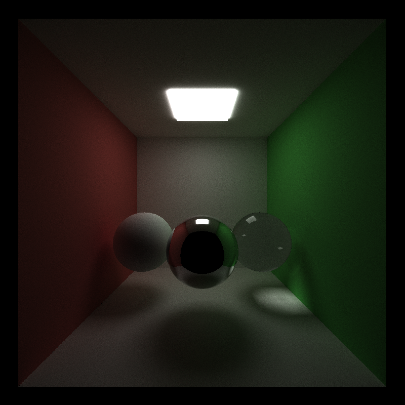

#### Antialiasing

Perform antialiasing by jittering ray direction calculated by camera and averaging results of multiple iterations.

(5000 iterations, 8 bounces)

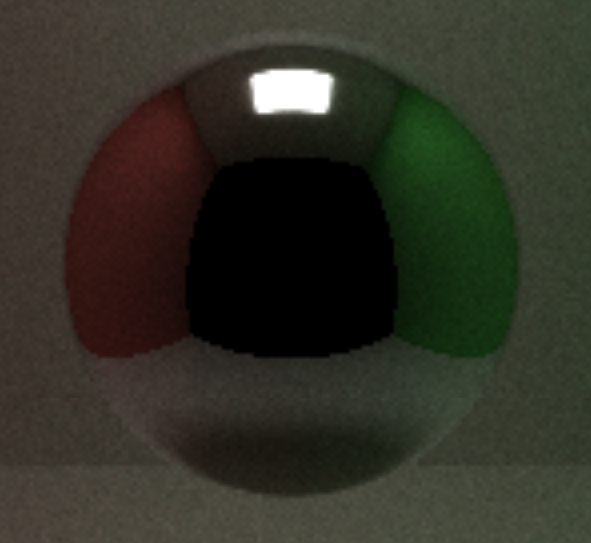
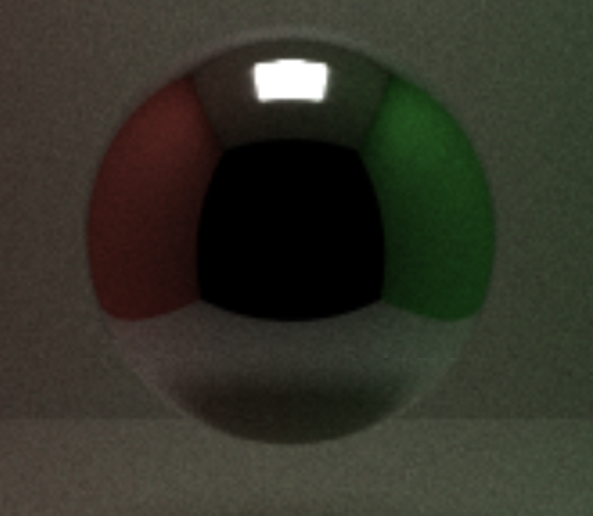

#### Depth of field

Jitter the ray origin and direction from camera according to lens effects.

DOF
:--:
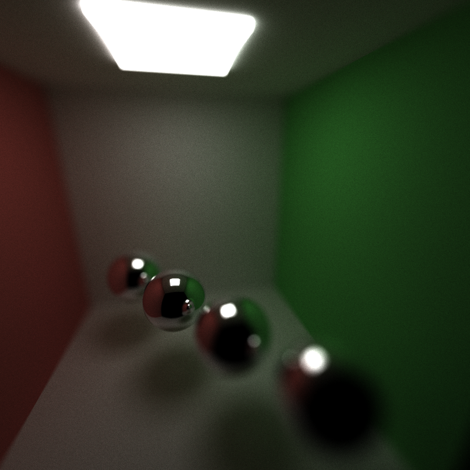
(5000 iterations, 8 bounces, len radius 0.5, focal distance 7.0)

#### Direct lighting

Take the final ray directly to a random point on an emissive object.

Sample final ray direction | Without direct lighting | Direct lighting 
:--:|:--:|:--:
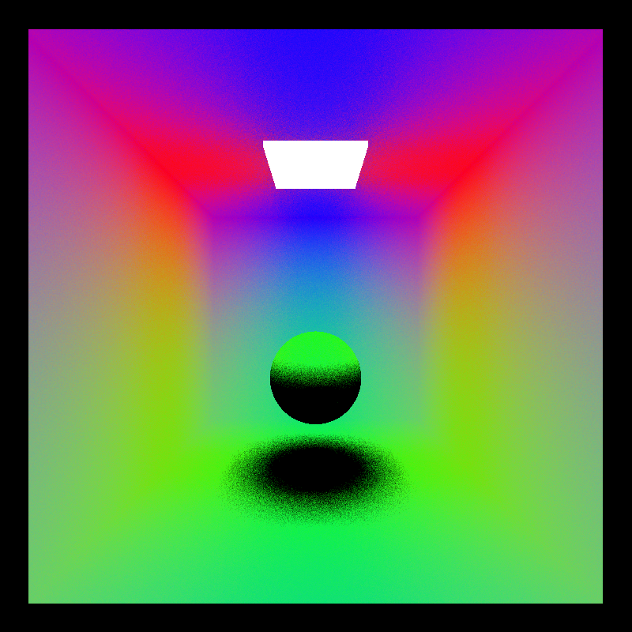 | 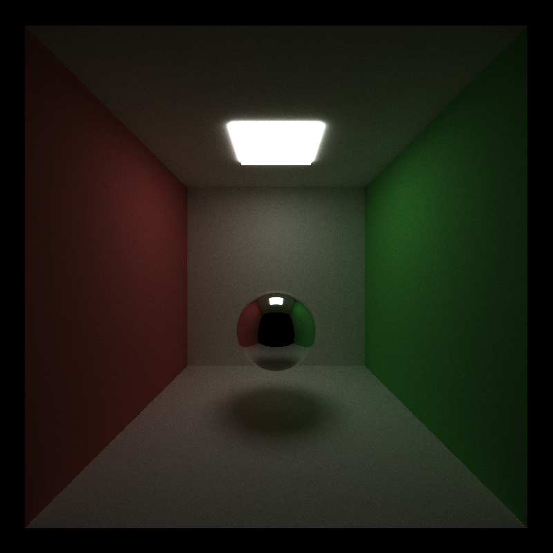 | 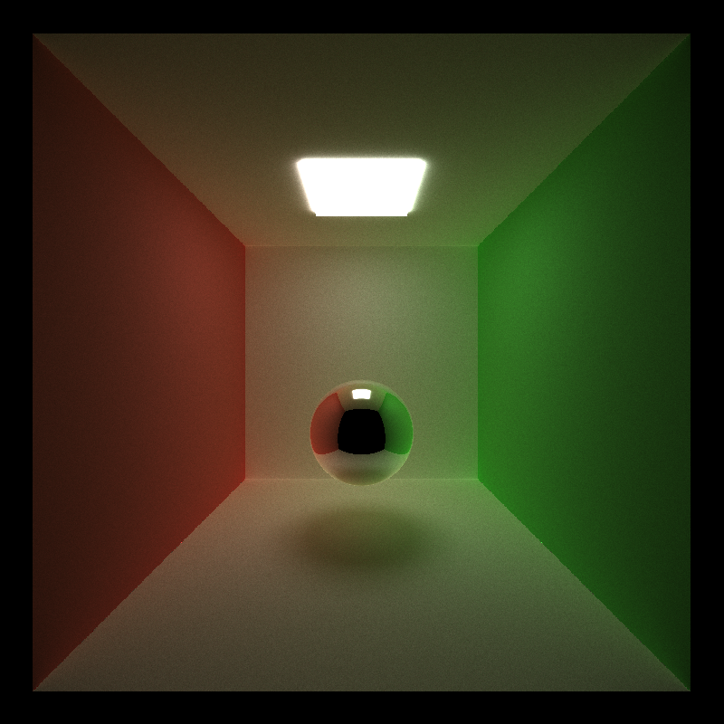
(5000 iterations, 8 bounces) |(5000 iterations, 8 bounces)| (5000 iterations, 8 bounces)

#### Motion blur

Average samples at different times in the animation.

Motion Blur
:--:
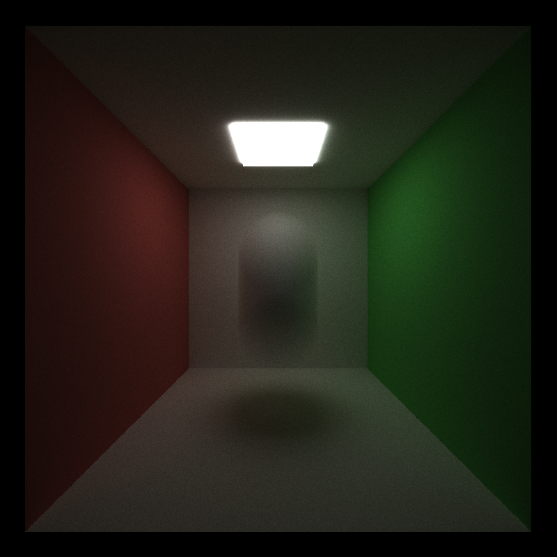
(5000 iterations, 8 bounces)
