CUDA Path Tracer
================

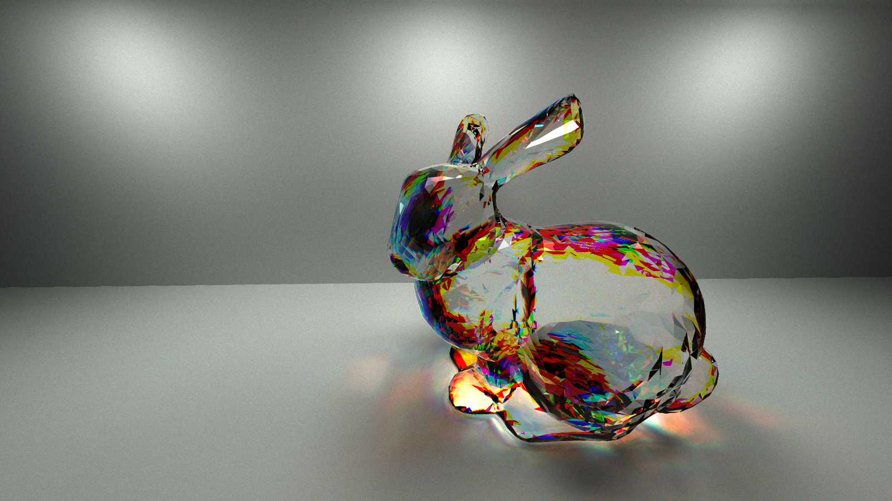

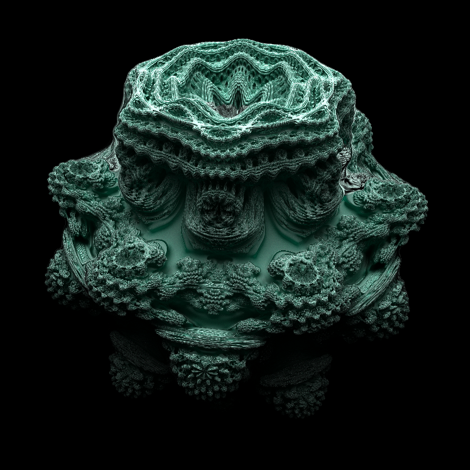

**University of Pennsylvania, CIS 565: GPU Programming and Architecture, Project 2**

* Emily Vo
  * [LinkedIn](linkedin.com/in/emilyvo), [personal website](emilyhvo.com)
* Tested on: Windows 10, i7-7700HQ @ 2.8GHz 16GB, GTX 1060 6GB (Personal Computer)
Updated the CMakeLists.txt to sm_61.

### Features
* Stream Compaction, Materials Sorting, First Bounce Caching
* Anti-aliasing and Refraction with Fresnel
* Dispersion and Chromatic Abberation
* Texture and Normal Mapping
* Raymarched SDFs
  * Diamond
  * Mandelbulb
* Mesh Loading
* KD-Tree Acceleration Structure

#### Anti-Aliasing
##### Anti-Aliasing vs. None

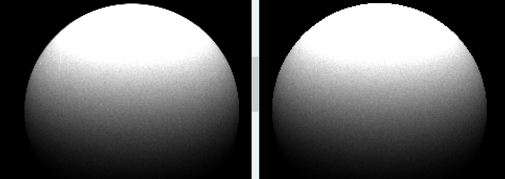

There is no performance hit from anti-aliasing because it is simple to jitter the pixel by random floats before generating the camera ray from the pixel coordinates. However, it shows a significant improvement in the appearances of the edges.
#### Refraction with Fresnel
To implement fresnel effects, I added a function that computes the fresnel value, and tested a random number against it to determine whether the ray hitting a glass surface will reflect or refract. 
I tested my refraction against a checkerboard texture.

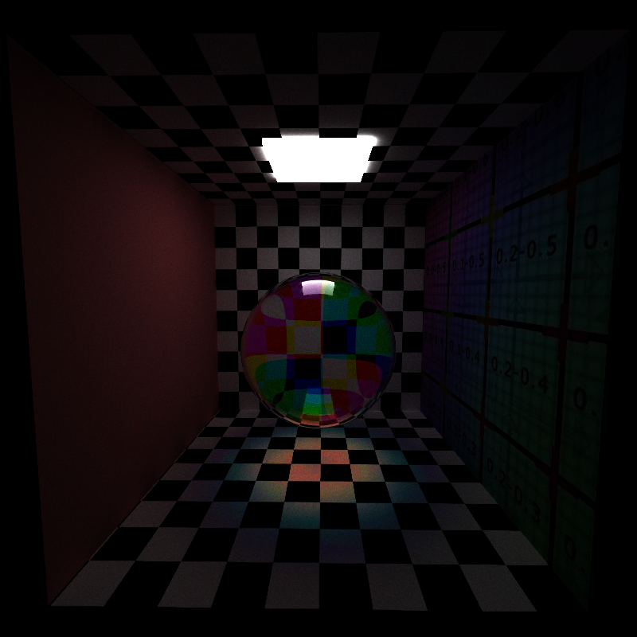

##### Fresnel vs. No Fresnel

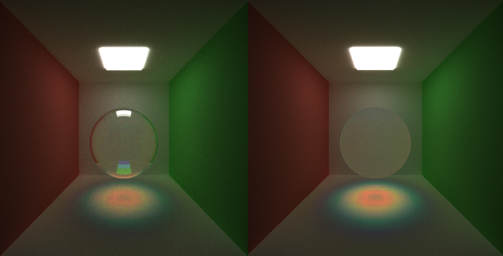

Fresnel definitely added a more realistic element to have the outer edges of the sphere where light will graze surface to be more reflective. 

#### Dispersion
Dispersion occurs when light splits into multiple colors/wavelengths. The index of refraction changes with the wavelength.

The sphere below is rendered with 10 times the dispersive index of diamond (0.44 instead of 0.044) for exaggeration. This shows the effect that dispersion will have on caustics.

The diamond SDF rendered below shows chromatic aberration (dispersive index of 0.44)

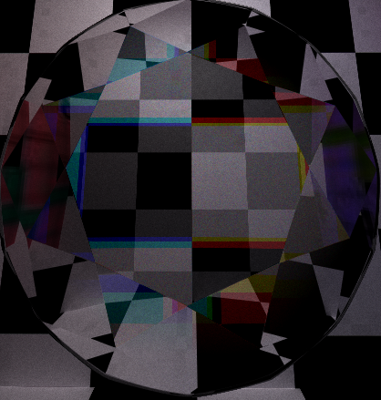 

#### Texture Mapping And Normal Mapping
The render below demonstrates support for multiple textures and bump mapping. I loaded the textures into one array and added an offset to the material to show where in the texture array to begin reading the texture data from. For normal mapping, I read the normals in as I would a texture and computed tangent to world space matrices for each geometry to properly transform the normal.
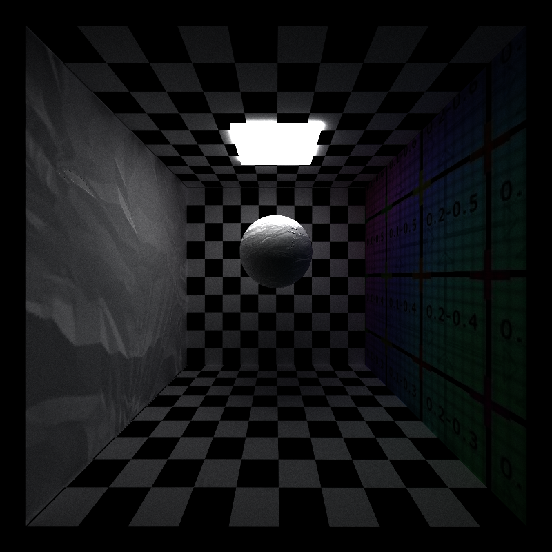 
##### Procedural Textures vs. Loaded Texture Performance Analysis
To create the procedural texture, I modified the UVs according to a sin wave, and computed a t-value to pass into a [cosine color palette](http://www.iquilezles.org/www/articles/palettes/palettes.htm).

With the procedural texture, it took 149 seconds to render. Each iteration took 0.029 seconds to render. 

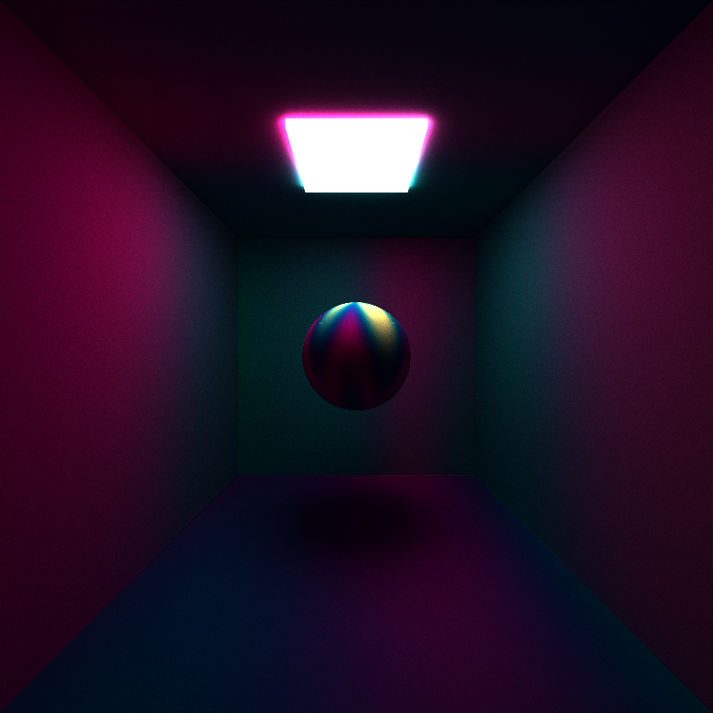 

For this checkerboard scene, it took 150 seconds to render. With a small amount of texture data to read from, the difference in rendertime is not significant.

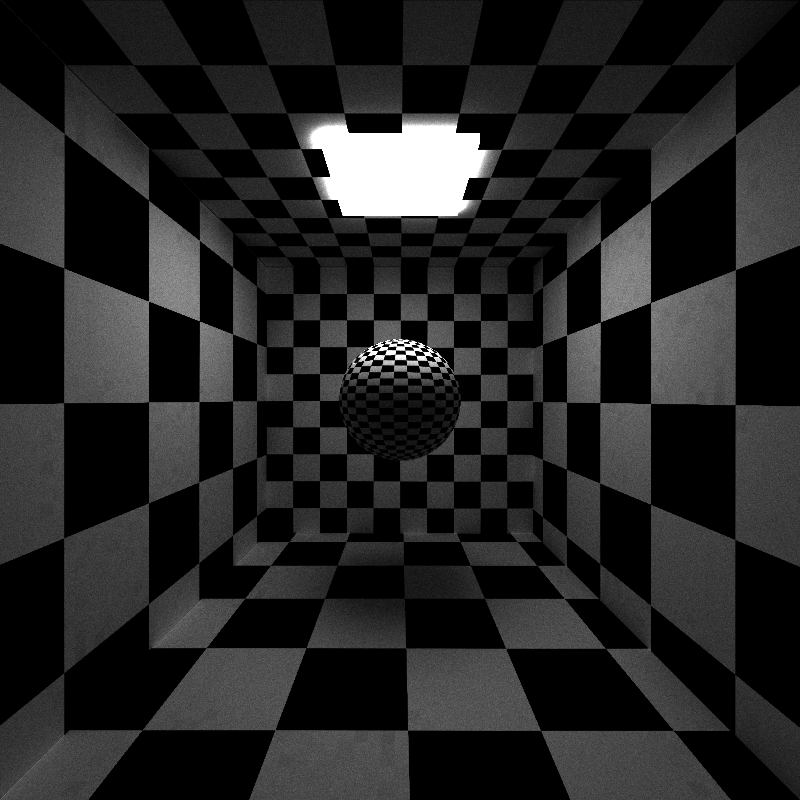 

When I added 2 more large textures to the scene, it took 155 seconds to render. Each iteration took 0.035 seconds to render. It is expected that reading from the texture array is much slower because if there is a cache miss, you lose many cycles attempting to fetch the data from physical memory. Overall, the difference is not as significant in my cornell box scenes, but procedural textures would make a huge difference in production level scenes.

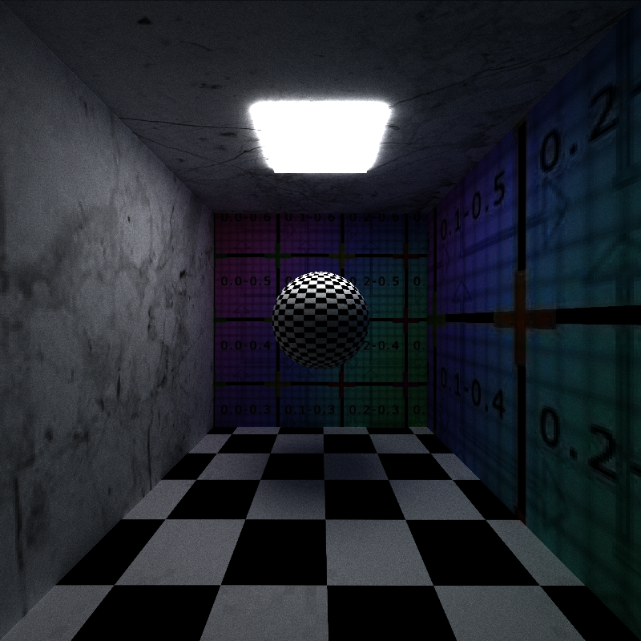 

#### Signed Distance Functions
##### Diamond
I used the SDF function in [this shader](https://www.shadertoy.com/view/XdtGDj), but implemented the sphere ray marching step and normal computation from scratch. I had some trouble at first with flipping the normals when I was inside the diamond, I didn't realize how necessary this step was because most sources on SDFs don't pair SDFs with refractive materials. 

Below the diamond is rendered with 10x the dispersive index of natural diamonds in the real world.
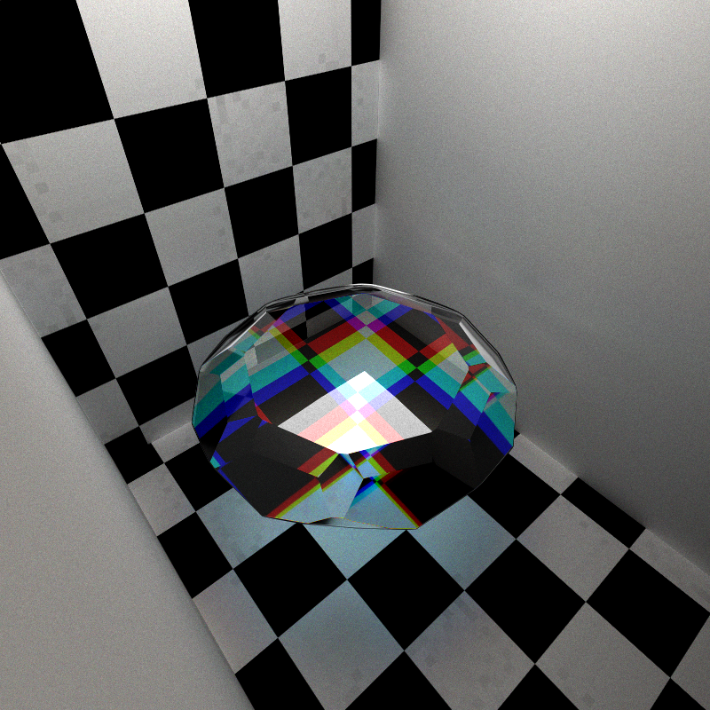

##### Mandelbulb
I used a mandelbulb SDF developed by IQ, presented in [this shader](https://www.shadertoy.com/view/ltfSWn). The ray marching step was the same as the one I developed from scratch.

Below are mandelbulbs textured using spherical UV coordinates. Diamonds also use spherical UV coordinates in my path tracer.

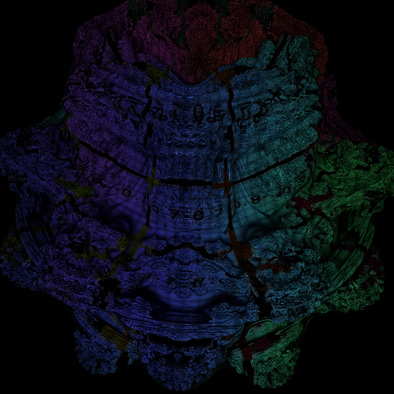

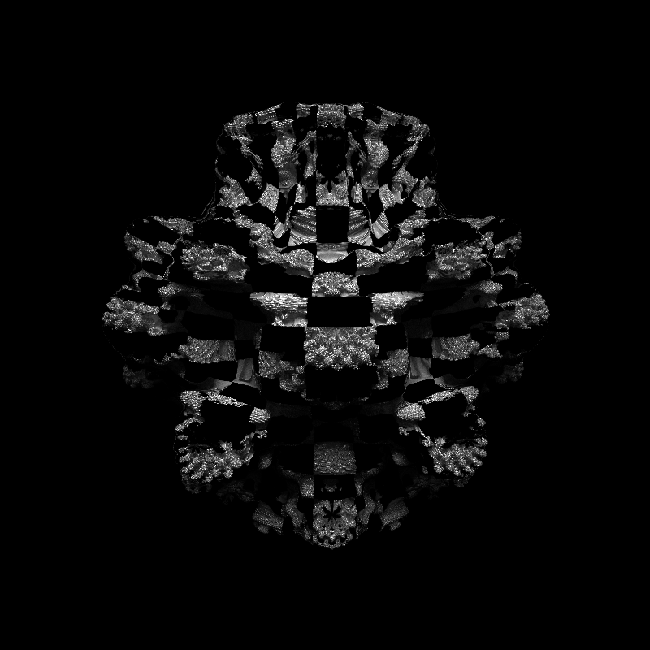

##### Performance Analysis (Sphere SDF vs. Sphere Implicit Surface)
To gauge the performance of the SDF intersection tests, I decided to compare a sphere SDF vs. an implicit surface. The sphere SDF takes 0.121 seconds per iteration. The regular implicit sphere is 0.101 seconds per iteration. It makes sense that a sphere SDF would performance so poorly. For each ray marching test, I iterate 100 times along the ray to test if I hit the surface, and call the SDF function in each iteration. I have to performance this ray marching test once to calculate the point on the surface and another 3 times to calculate the normal. For more detailed SDFs, it becomes very expensive.

#### Meshes and KD-Trees
##### Performance Analysis
###### No KD-Tree
Without a KD-Tree, a scene with 5000 primitives containing the Stanford Bunny took 6.7 seconds for an iteration.
###### Median Point Splitting
With a KD-Tree constructed using a median point to split the bounding boxes, it took 0.47 seconds to complete 1 iteration.
###### Surface Area Hueristic
I implemented a variant of the surface area hueristic that uses the length of the diagonal of the bounding box instead of compute surface area for each primitive. ith the KD-Tree using SAH, it takes 0.41 to complete an iteration. The difference is slight, but it would make a bigger difference in scenes where there are more meshes with varying surface areas.

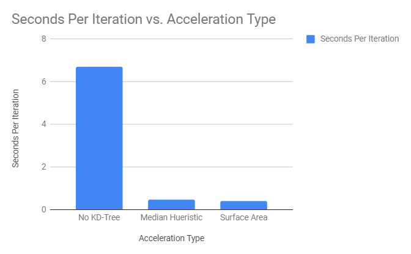

#### Further Performance Analysis
To test the benefits of stream compaction and materials sorting, I created a scene that has many materials and loaded the cubes in as meshes to test a more complex scene.

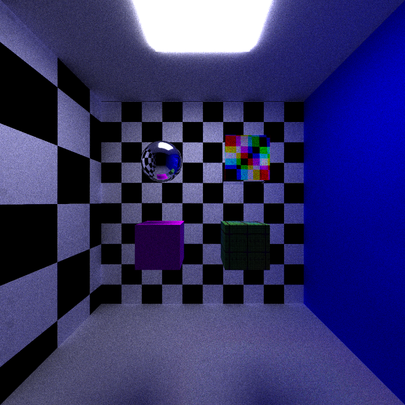

##### Stream Compaction
I compared the average iteration compute time with and without stream compaction. 
Without stream compaction, this scene took 0.13 seconds per iteration.
With stream compaction, it took 0.11 seconds per iteration.
It is also expected that stream compaction would have greater benefits with each iteration. I plotted the number of rays remaining after each bounce for every 10 iterations. The benefits of stream compaction are not clear from this data set. It would be interesting to further investigate which scenes would benefit the most.

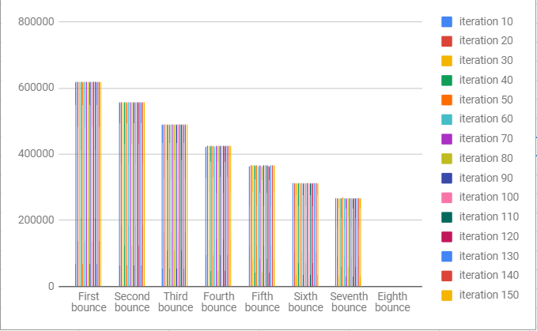

##### Materials Sorting
With materials sorting, this scene took 0.21 seconds per iteration.
Without materials sorting, this scene took 0.13 per iteration.
Materials sorting made rendering this scene much slower.

##### First Bounce Caching
TO DO.

##### Open vs. Closed Scenes
It is expected that a closed scene would take longer because the rays would bounce off into space, ending the path trace for that particular ray.

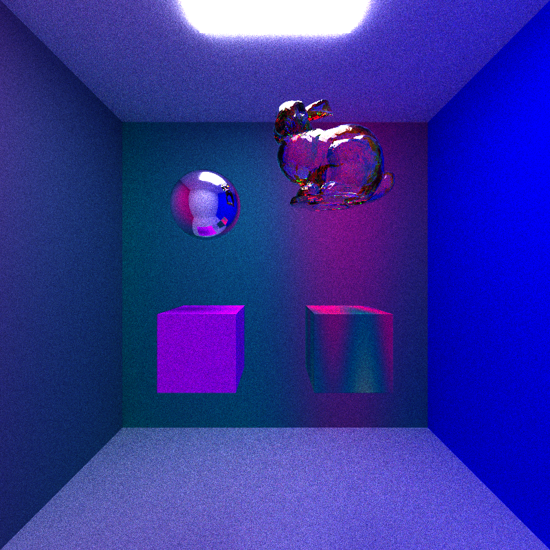

When tested against this scene, the time per iteration for the open scene was 0.31 seconds, whereas the closed scene was 0.50 seconds.

The chart below demonstrates that the number of live rays per bounce is much greater in the closed scene.

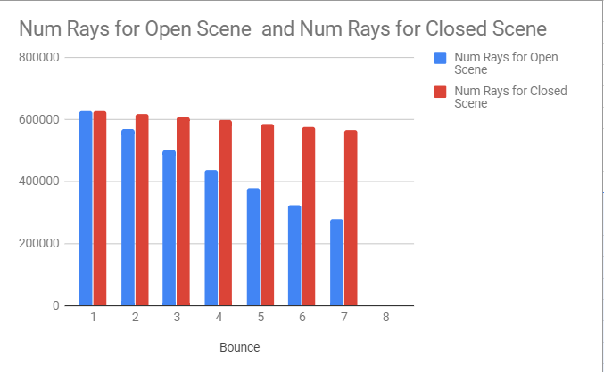

##### Further Improvements
If I were to continue this project, I would improve my path tracer's performance by including russian roulette termination. It would be effective because we can conclude the path of a ray if the energy is too low. This would be really effective in scenes with a lot of diffuse surfaces because the ray would lose a lot of energy in each bounce. It would be worthless to follow a ray extensively that ends up having little contribution to the overall pixel color.

### Conclusion
We see benefits from all features except for SDFs and materials sorting. For materials sorting, it was disappointing, but for SDFs, it was to be expected that it is so expensive. Below is a chart that shows the percent difference in performance from when that feature is turned on or when it is turned off.

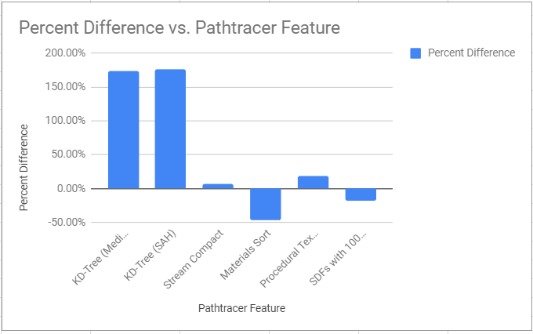
