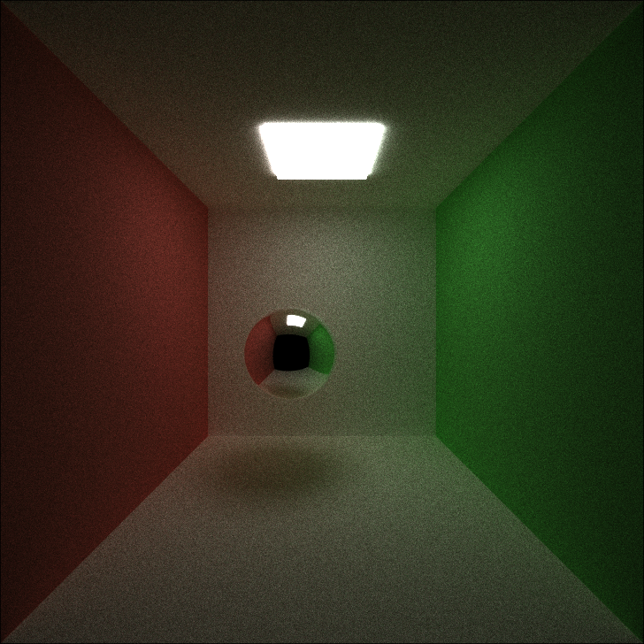
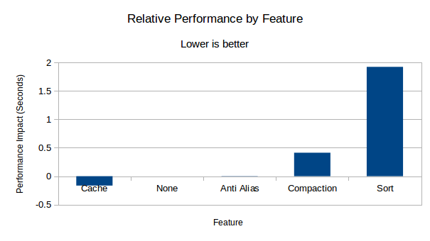
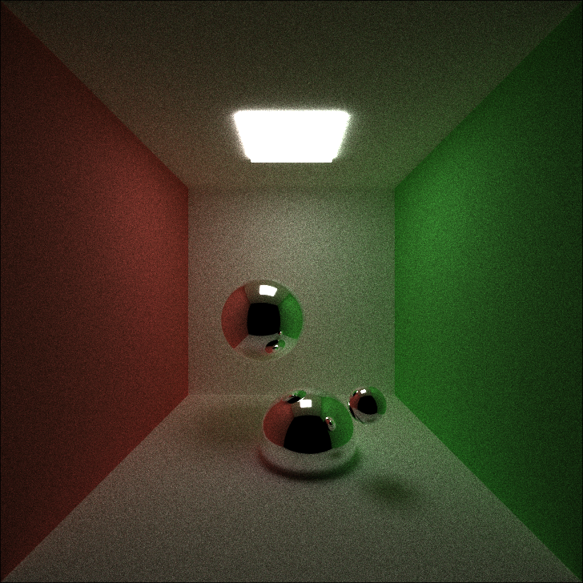
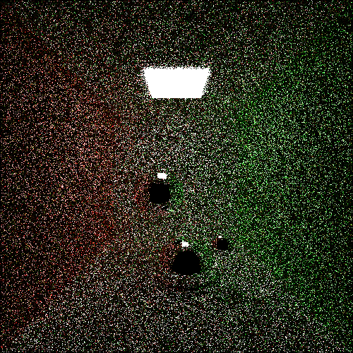
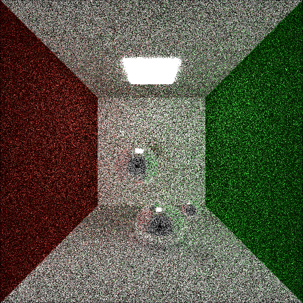
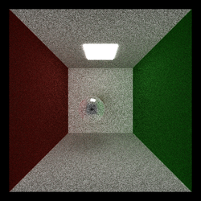
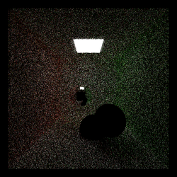
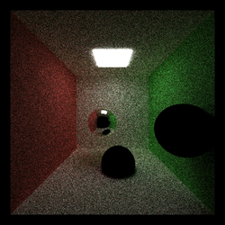
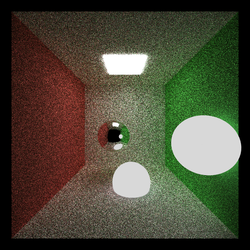

CUDA Stream Compaction
======================

**University of Pennsylvania, CIS 565: GPU Programming and Architecture, Project 2**

* Edward Atter
  * [LinkedIn](https://www.linkedin.com/in/atter/)
  * Tested on: Linux Mint 18.3 Sylvia (4.13.0-41-generic), Ryzen 7 2700x @ 3.7 ghz (base clock) 16GB, GTX 1070 TI 8GB GDDR5 (Personal)
  * CUDA 9

## Overview

This project implements a path tracer with the following features:
 - A shading kernel capable of diffuse, specular, and refractive surfaces with Fresnel effects
 - Antialiasing
 - Stream compaction
 - Material sorting
 - First bounce caching
 - Built in frame timer

All features may be toggled by changing the defined constants in `src/pathtracer.cu`.

## Performance

#### Methodology

Frame timings were calculated by taking the average over 5 frames. In general, after the initial frame, very little variance was observed. The timing for each feature was performed with all other toggleable features disabled.

#### Relative Performance Impact

The graph above shows the relative performance impact of each feature, represented in seconds. A negative time indicates the feature had a positive impact on performance, while a positive number represents a decrease in performance. "None" is with all features disabled and is the baseline in this test, set to 0. 

Analysis of `nvidia-smi` suggests the application is GPU bound, as expected, pegging the GPU usage at 100%.

    +-----------------------------------------------------------------------------+
    | NVIDIA-SMI 396.26                 Driver Version: 396.26                    |
    |-------------------------------+----------------------+----------------------+
    | GPU  Name        Persistence-M| Bus-Id        Disp.A | Volatile Uncorr. ECC |
    | Fan  Temp  Perf  Pwr:Usage/Cap|         Memory-Usage | GPU-Util  Compute M. |
    |===============================+======================+======================|
    |   0  GeForce GTX 107...  Off  | 00000000:0A:00.0  On |                  N/A |
    | 47%   65C    P2   116W / 180W |   1055MiB /  8116MiB |    100%      Default |
    +-------------------------------+----------------------+----------------------+
                                                                                   
    +-----------------------------------------------------------------------------+
    | Processes:                                                       GPU Memory |
    |  GPU       PID   Type   Process name                             Usage      |
    |=============================================================================|
    |    0      1570      G   /usr/lib/xorg/Xorg                           400MiB |
    |    0      3563      G   cinnamon                                     140MiB |
    |    0      4200      G   ...-token=A7907B8E58127E7F09984994A2B09AB9    48MiB |
    |    0      6463      C   gimp-2.8                                     107MiB |
    |    0     10622      G   ...-token=A3470AA5428C5FF1C71554B5AC8CA77C    41MiB |
    |    0     12950    C+G   ...DA-Path-Tracer/build/cis565_path_tracer   209MiB |
    |    0     23722      C   /usr/lib/libreoffice/program/soffice.bin     105MiB |
    +-----------------------------------------------------------------------------+

## Features

#### Anti-Aliasing

 

Anti-aliasing can even out rough edges. This is done by "jittering" the rays' x and y positions slightly at each iteration. The effect is most noticible in high-contrast situations, as in the images above. The image on the left has anti-aliasing disabled, while the image on the right has AA enabled. The image on the right appears less pixelated. 

Anti-aliasing had a negligible impact on performance, .003 seconds. This is well within the margin of error.

#### Sorting
In theory, sorting by material type should yield a large improvement. The GPUs scheduler can skip warps if each thread in the warp is returned. Sorting by material type should increase the liklihood of this happening. In addition, it should clean up memory accesses and branch prediction since most warps will consist of a single material type. 

Unfortunately, as shown in the graph above, this theoretical gain was not realized. The overhead of sorting is much greater than the gains it provides.

#### Stream Compaction
Interestingly, stream compaction resulted in a slight decrease in performance. In theory, we should be able to eliminate many of the dead, black rays; but at least with the current implementation, the compaction overhead was to great to yield any appreciable results.

I hypothesized that mostly black images would benefit the most from stream compaction, so I tried again on the `sphere.txt` scene. The results were the same, rendering was faster without stream compaction.

#### First Bounce Caching
Caching the first bounce yielded the largest increase. Unfortunately, it has the effect of dampening the anti-aliasing affect (if both are enabled simultaneously), since the random jitter of the array is cached and reused for each iteration, only being updated during a new frame. 

## Gallery

 

 
 
 
