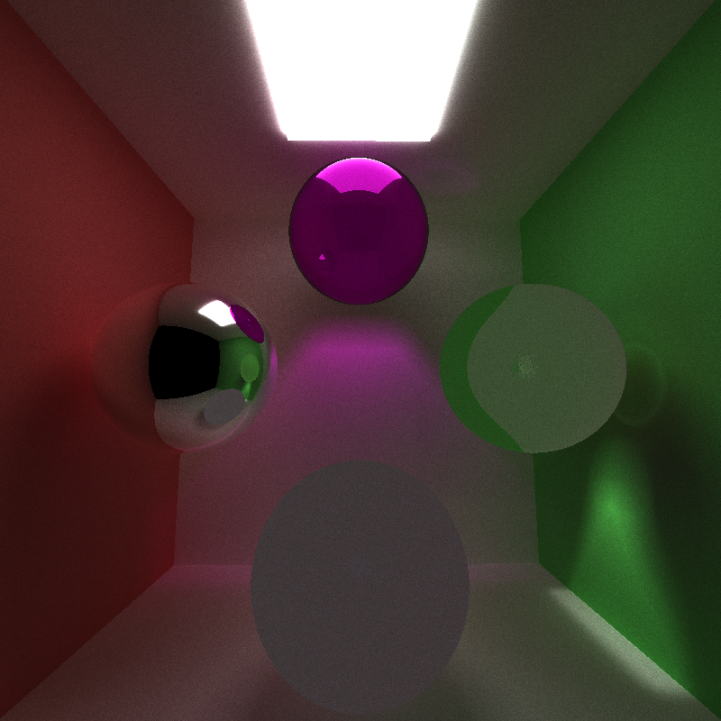

CUDA Path Tracer
================

**University of Pennsylvania, CIS 565: GPU Programming and Architecture, Project 3**

* Angelina Risi
  * [LinkedIn](www.linkedin.com/in/angelina-risi)
  * [Twitter](https://twitter.com/Angelina_Risi)
* Tested on: Windows 10, i7-6700HQ @ 2.60GHz 8GB, GTX 960M 4096MB (Personal Laptop)

### (TODO: Your README)

