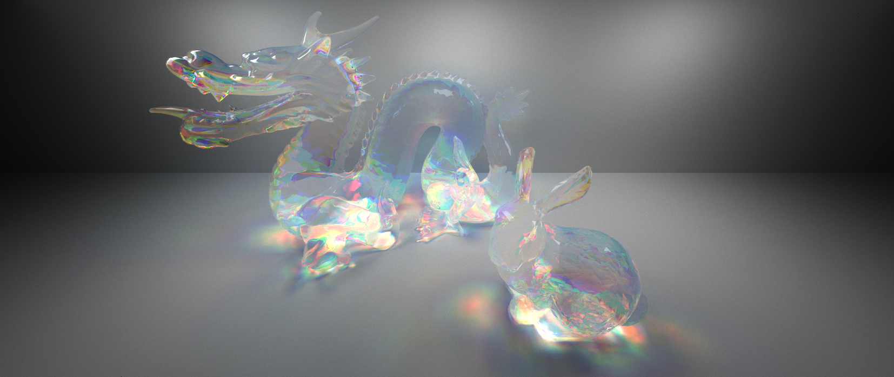

CUDA Path Tracer
================

**University of Pennsylvania, CIS 565: GPU Programming and Architecture, Project 3**

* Alexander Chan
* Tested on: Windows 10 Version 1803, i7-5820k @ 3.70 GHz 16GB, GTX 1080 @ 1620 MHz 8GB (Personal Computer)

Click on the images for full resolution.

## Summary
A physically based pathtracer written in CUDA. Supports the following:
* Diffuse and perfectly specular reflective materials
* Refractive materials with controllable dispersion
* .obj loading for meshes
* Scene kd-tree with SAH for acceleration
* Texture mapping
* Normal mapping
* Antialiasing
* Stream compaction for early terminating rays

## Features

#### Refraction with Fresnel
Refractive materials are with Fresnel. The proportion of reflected and refracted light is computed using the actual Fresnel equations. A random number from 0 to 1 is generated, and if it is less than the proportion of reflected light, the ray is scattered via specular reflection, otherwise it is scattered via refraction. See the [textures](#textures) section as well as the [final](#more-renders) section for renders.

#### Dispersion
In real life, light of different wavelengths are refracted by different amounts. A classic example is a prism, where white light is split up into a rainbow, because the longer wavelengths of light (red) are bent less than shorter wavelengths of light (blue). Here's the same scene rendered with and without dispersion. All the materials used are colorless, and all the color comes from dispersion.

| Dispersion = 0 | Dispersion = 0.44 |
|---------------|------------------|
|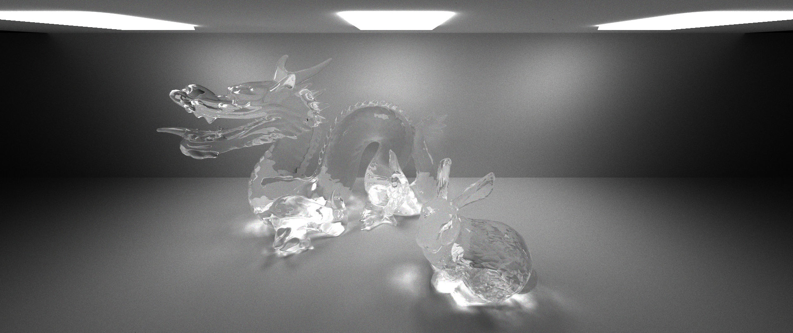 | 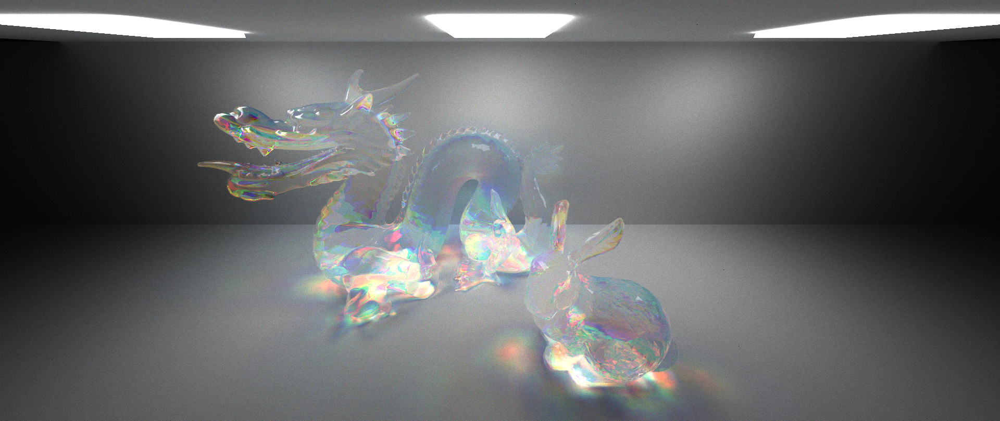|

The banner image at the top was rendered with 45000 samples and took 12 hours. The two images above are at 7500 samples and took approximately 2 hours each.

Here's a comparison of different dispersion coefficients. Each of these renders are at 6000 samples and rendered in approximately one hour.

| Dispersion = 0 | Dispersion = 0.1 |
|:-:|:-:|
|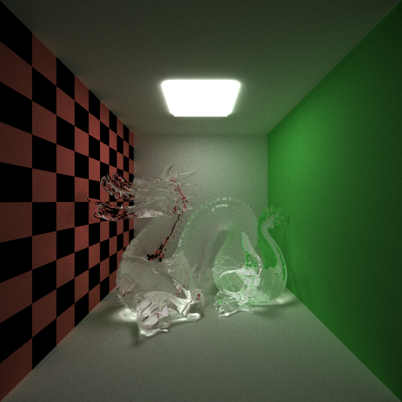|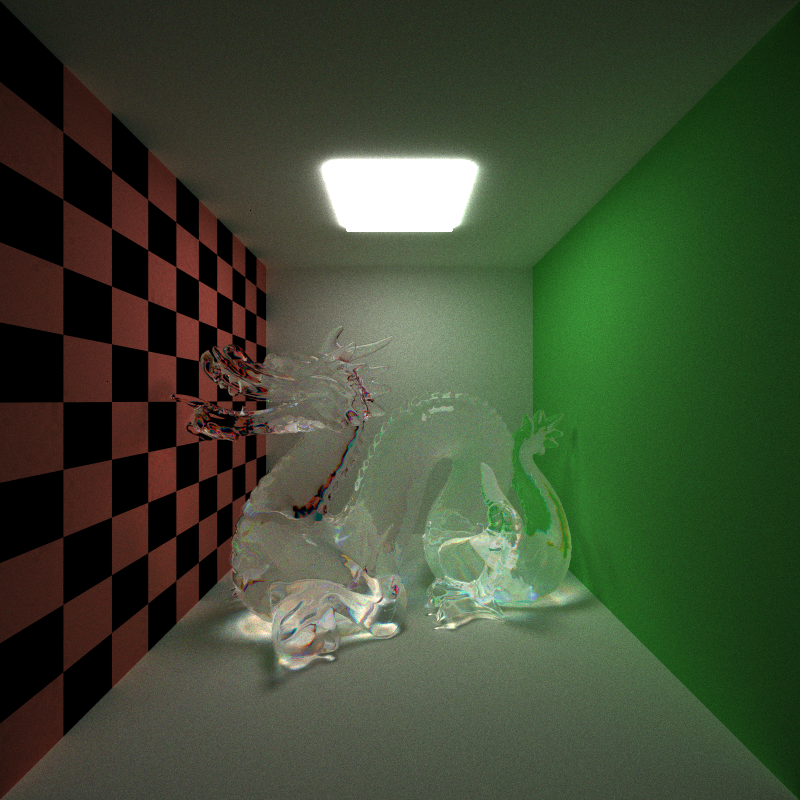|
| **Dispersion = 0.5** | **Dispersion = 1** |
|Render to come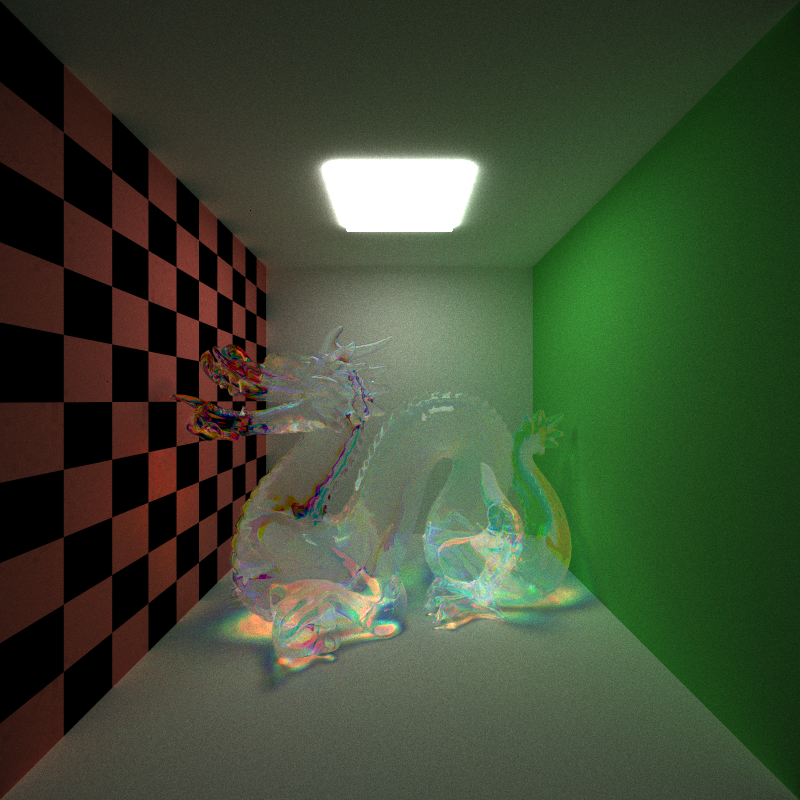|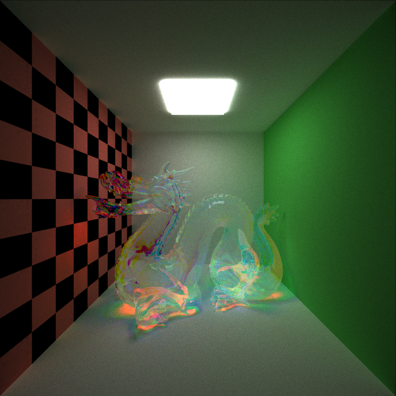|

Dispersion does not cause each iteration to take more time, but rendering with a high dispersion may take more iterations to reach the same level of convergence.

#### Meshes
Mesh rendering is implemented using a triangle geometry. When a mesh is loaded via tinyobj, its vertex positions, normals, and uv coordinates are assembled into Geoms. Because of the large number of triangles that even simple meshes may have, rendering a scene containing a mesh without the use of an acceleration structure is incredibly slow.

#### Acceleration structure
To render large amounts of geometry, like those present in meshes, a kd-tree is used to accelerate ray intersection testing. After the scene is loaded, a kd-tree is built on the CPU, using either the split method by median of longest axis, or the surface area heuristic. Performance comparison for these two heuristics follow. The kd-tree is flattened on the CPU, then copied to the GPU. Traversal on the GPU uses a stack. As kd-tree nodes in the flattened tree can contain variable amounts of geometry, each node contains an index into a geometry array. This geometry array is sorted so that all the primitives in the same node are contiguous in memory. Much of the implementation is based on PBRT and previous code written for a raytracer and a CPU pathtracer.

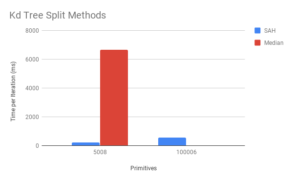

The surface area heuristic is about 32 times faster on a 5000 primitive scene (Stanford bunny). On a 100k primitive scene (Stanford dragon), the SAH method was a little more than twice as slow as the 5000 prim scene, and the median split method didn't even finish one iteration (rendering with no acceleration structure wasn't tested, as one iteration never finished even for the 5000 primitive scene). Having some acceleration structure is better than none, but having a good split heuristic while constructing the tree makes a big difference.

#### Textures
Diffuse textures and normal maps are supported using the `TEX` and `NOR` attributes when defining materials. As textures are loaded, their data is added onto a flat array containing every texture. Each material stores an offset to the array to where its texture starts, along with the texture width to correctly compute the location in the array of a given pixel. Both normal maps and diffuse textures are stored in the same array. UV mapping is implemented for cubes, spheres, and meshes.

|||
|---------------|------------------|
|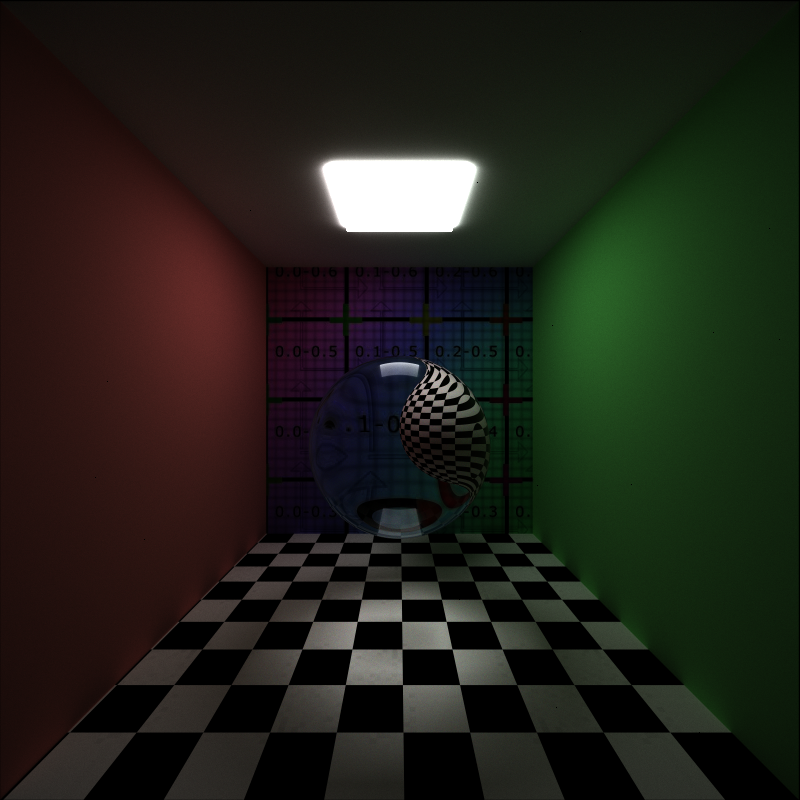|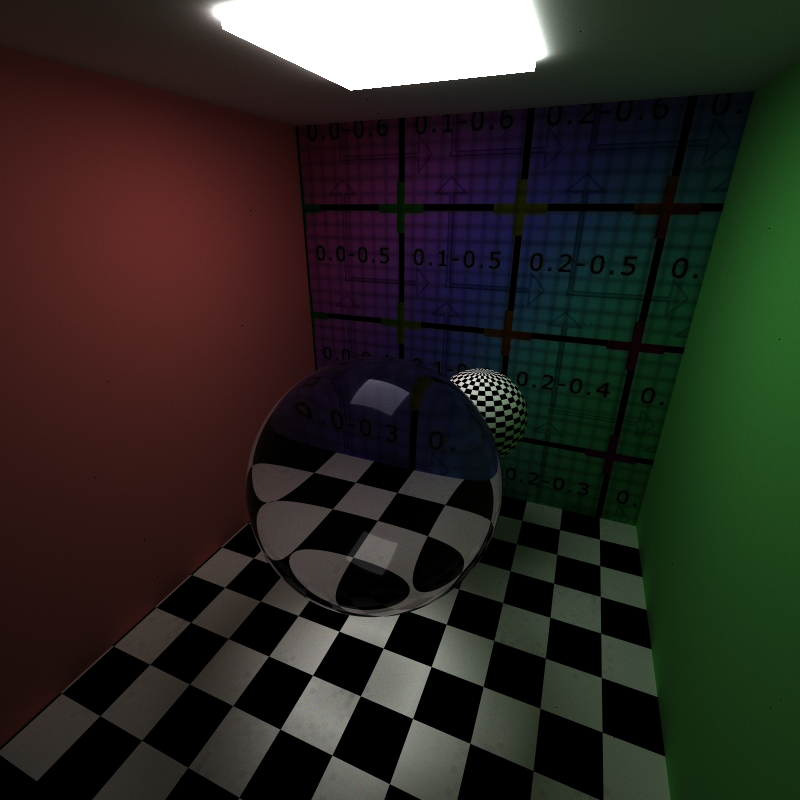|
|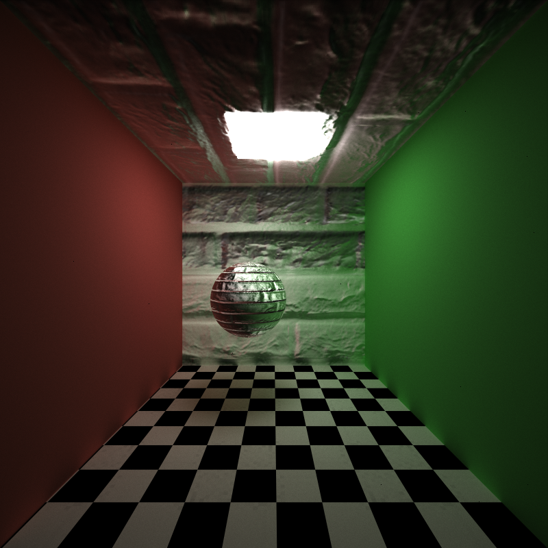|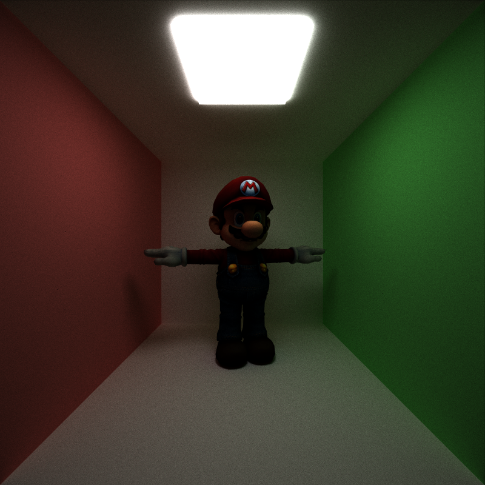|

#### Antialiasing
First rays emitted from the camera are uniformly jittered within each pixel so that each first bounce is not the same.

## More renders
Finally, here are more renders to show correctness. Note that I turned up the emittance of the light to 8 from 5, so these may look brighter than reference renders.

||||
|---------------|------------------|-|
|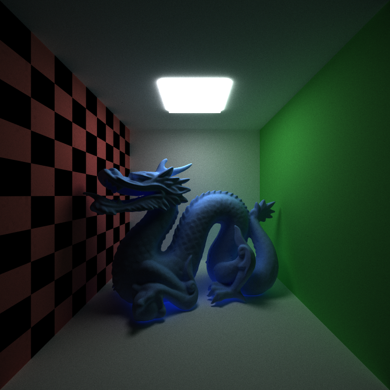|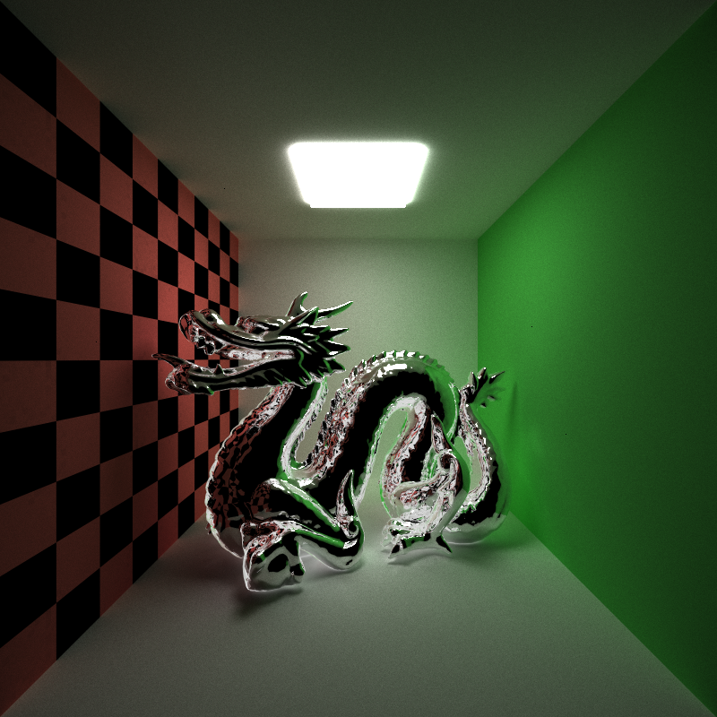||

|||
|---------------|------------------|
|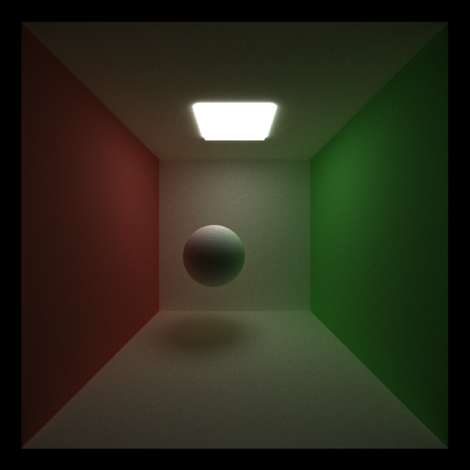||

## References
* tinyobj loader
* PBRT v3
* Emily Vo (Dispersion)