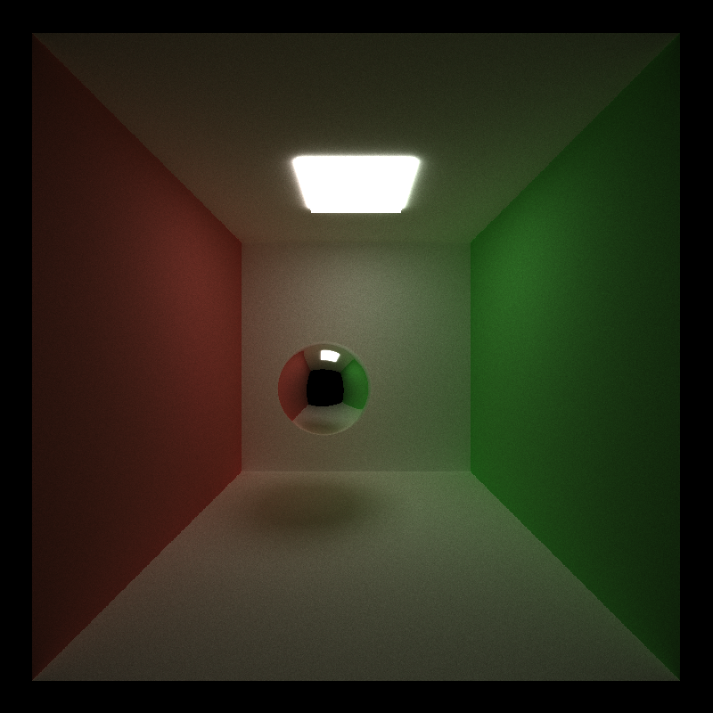
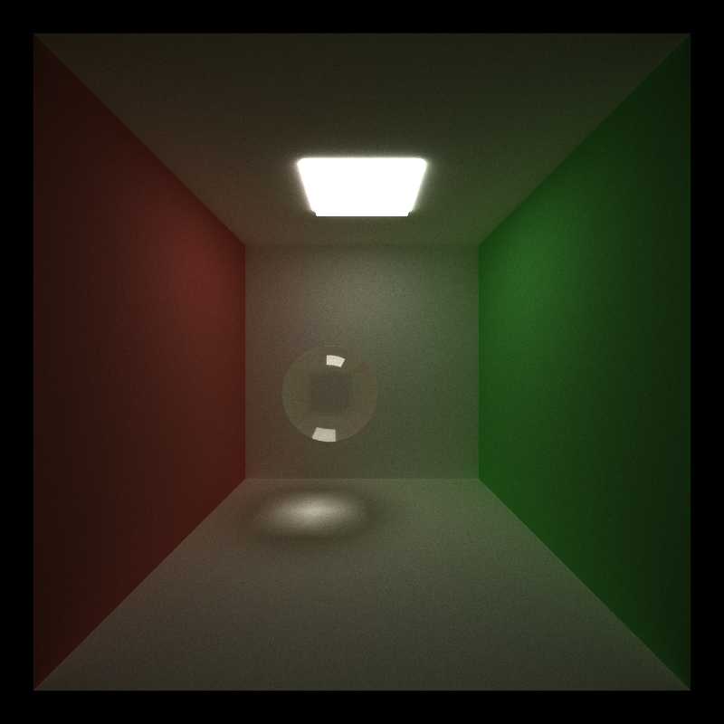
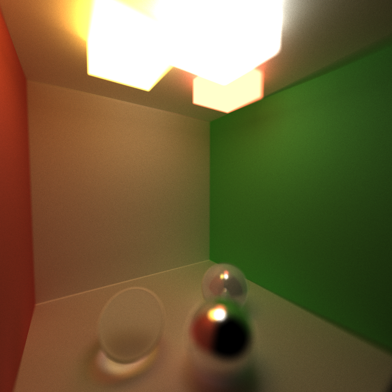
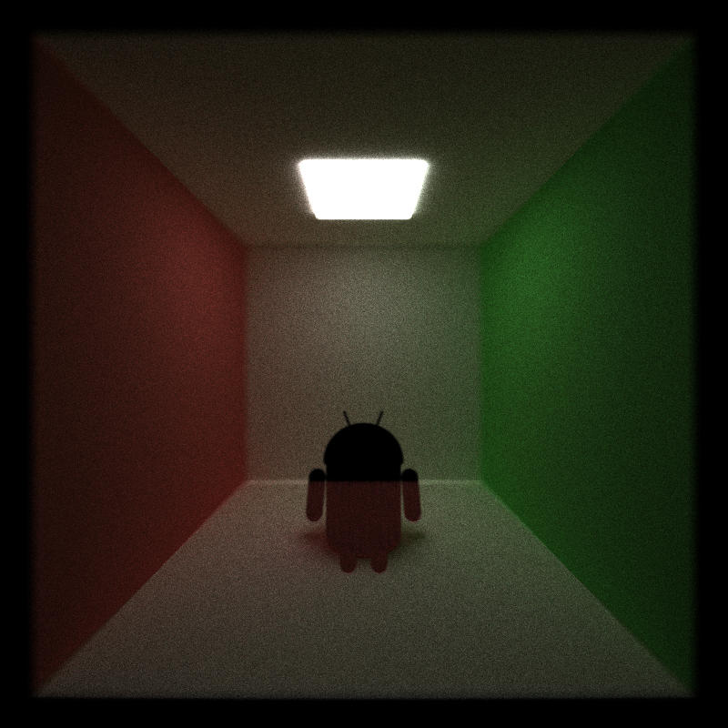
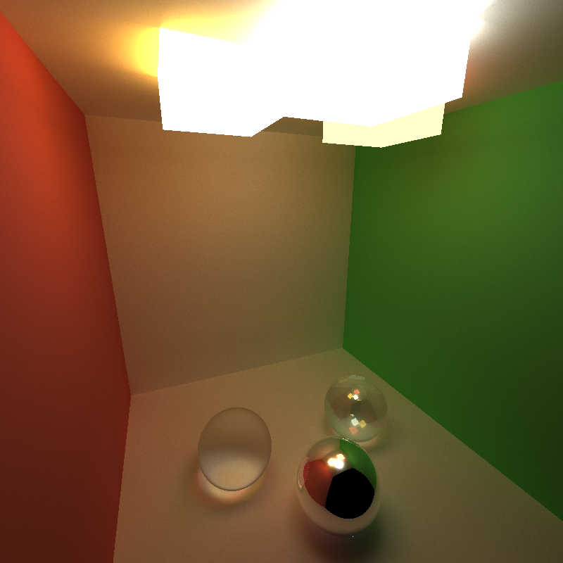

CUDA Path Tracer
================

**University of Pennsylvania, CIS 565: GPU Programming and Architecture, Project 3**

* Xinyu Lin
[Linkedin](https://www.linkedin.com/in/xinyu-lin-138352125/)
* Tested on: Windows 10, Intel(R) Core(TM) i7-6700HQ CPU@2.60GHz, 16GB, GTX960M(Private Computer)

# Features:
- **Basic features**
  - A shading kernel with BSDF evaluation for:
    - Ideal diffuse shader.
    - perfect specular reflective surface.
  - Stream compaction for terminating unwanted thread from thread pool using thrust::partition
  - material sorting using thrust::sort_by_key
  - caching first bounce information for future iteration use
- **Advanced features**
  - refreaction with Frensel effects using Schlick's approximation 
  - physically based depth of field
  - stochastic sampled antialiasing
  - Arbitrary mesh loading and rendering
  
Diffuse | Specular | Glass
------|------|------
 |  | 

# DOF
  
  - 5000 iterations
  
# OBJ
  
  - 3000 iterations

# Multiply lights
  
  - 10000 iterations

time cost to 5000 iterations

time(secs)	|sort by material id	|store first intersections |  stream compaction | Time
--------------|---------|-------|---------|-------
Diffuse|	0|	0 | 1| 6m54s
Diffuse|	1|	0| 1|12m11s
Diffuse|0 | 1| 1|5m33s

# References
- [ConcentricSampleDisk function](https://pub.dartlang.org/documentation/dartray/0.0.1/core/ConcentricSampleDisk.html)
- [GPU gem3](https://developer.nvidia.com/gpugems/GPUGems3/gpugems3_pref01.html)
- [Schlick's approximation wiki](https://en.wikipedia.org/wiki/Schlick's_approximation)
- some iterative solutions for binary search tree 
