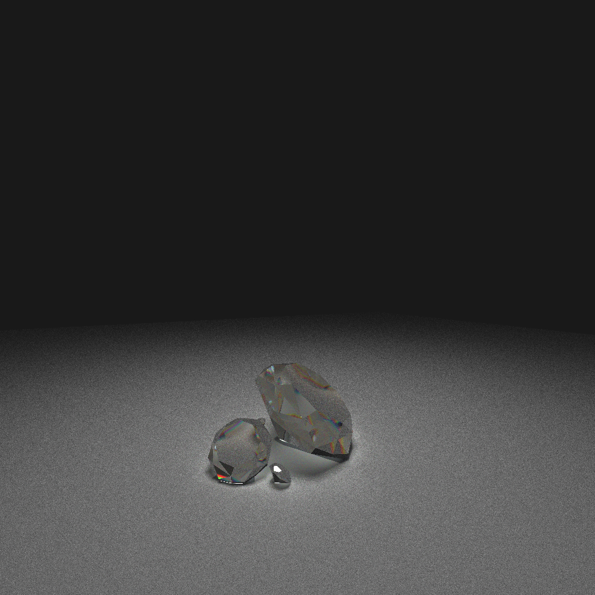

CUDA Path Tracer
================

**University of Pennsylvania, CIS 565: GPU Programming and Architecture, Project 3**

* Lan Lou
* Tested on: Windows 10, i7-6700HQ @ 2.60GHz 16GB, GTX 1070 8GB (Personal Laptop)

### Sample render

a scene including different materials : **pure reflective**, **diffuse**, and **refraction with reflect** based on Schlick's approximation


### Glass Dragon 

```resolution``` : 1000X1000 ```iteration``` : 2000 ```render time``` : 25min  ```vertex count``` : 12.5k 


### Interactions


# Features:
- **Basic features**
  - A shading kernel with BSDF evaluation for:
    - Ideal diffuse shader.
    - perfect specular reflective surface.
  - Stream compaction for terminating unwanted thread from thread pool using thrust::partition
  - material sorting using thrust::sort_by_key
  - caching first bounce information for future iteration use
- **Advanced features**
  - refreaction with Frensel effects using Schlick's approximation 
  - physically based depth of field
  
    - in short, this effect is achieved by jittering the ray within a certain area.
    - to be more clear, for each ray, we will first create a point having a specific distance (i.e the focal length) away from the cam .
    - then, according to the conventional knowledge we learned from high school, when we are looking through the lens, we can think it as we are actually looking from another position dpending on the rfraction ratio of the lens, simmilarily, we will change the origin of the ray in the code by using a concentric disk sampling method as well as the focal radius as a parameter to determine how obvious we want the effect to be, then, since we have the origin and target, we can have our new DOF ray.
  
  
  
  - stochastic sampled antialiasing
    - achieved by jittering the ray before it's generated from the camera.
    - this method is actually a little bit like the mutiple-sampling anti-aliasing (MSAA) method in rasterization, the basic idea for both are like this: pick neccessary information for generating color buffers from different target instead of just one.
    - now we take a look at the following image, to the left of the image, what we see is the not anti-aliased version result of rendering a simple trangle, the right image , however, is what happend when we choose to jitter the rays, we will get color info from different locations, therefore giving us nicer renders.
    
  
  
    - the following image explicitly shows the benefit of AA by doing a comparision of same scene with and with out it.
  
AA off | AA on
------|------
|
  - arbitrary mesh loading and rendering
    - used [tinyObj loader](http://syoyo.github.io/tinyobjloader/)
    - used glm's triangle intersection method
    - bounding bolumn intersection toggle
### Dragon 

```resolution``` : 1000X1000 ```iteration``` : 2000 ```render time``` : 25min for glass, 28min for specular ```vertex count``` : 12.5k 

Glass dragon | Specular dragon
------|------
|

### Sword

a great sword of Artorias the Abysswalker from dark souls series with simple specular material
```resolution``` : 1000X1000 ```iteration``` : 5000 ```render time``` : 26min ```vertex count``` : 1k 


  - KD tree for mesh rendering acceleration
  - Spectrum rendering:
  
  
  
# Performance analysis:

## stream compaction
- stream compaction is needed because if we don't do this, a lot of the threads will simply contribute no efforts once their current work is done, this can result from situations like ray's remaining bounces turned to zero in code (varous reasons can cause this, like hitting the light source, or the ray simply run out of 'depth'), hence, we can simply terminate these unneeded thread stalling, and put them into use again using stream compaction.
- one thing I discover is that stram compaction would not be that good in a closed scene, which I think can be reasulting from the rays keep travling inside the box without being able to get out of it increases the reamaining bounces higher number possibility for each ray, what happens is that ray can only get terminated in two ways: meet the light source or reach the maximum bounce number.

## cache first bounce:

- We want to cache the first iteration's information because before the first bounce, all the information including ray origin ray directions are all the same in spite of different iterations.
- according to the chart bellow, by caching the first bounce, we slightly improved the efficiency

time cost to 500 iterations:

time(ms)	|cached	| no cache
--------------|---------|-------
test scene|	31861.30 |	34134.12

## sort material:
- For different rays, depending on the material of object they hit, the rays will perform differently, and it's always better to put rays that hit the same material closely in the same block instead of those having different materials, this will prevent some unneccesary stalling condition caused by rays' different behaviour(different thread running time).
- In terms of my own test, with sorting toggled on, the program always experience slower performace than before, I guess this is because the number of materials is not big enough to cover the efficiency lost from the sorting operation.

## bounding box for mesh
- it's quite obvious that by adding bounding box to mesh we can prevent unneccessary triangle checks from happenning, resulting in some performance improvement.
- here's my test result (naive)time cost to 100 iterations

time(sec)	|added	| not added
--------------|---------|-------
dragon|	597.20 |	623.11

## KD tree acceleration : 

time cost to 100 iterations

time(secs)	|dragon(12.5 kverts)	|sword (1k verts)
--------------|---------|-------
KD accelerated|	121|	32
Nive|	603|	50


  - I choosed to implement a KD tree for the acceleration of obj loading, the following are the main features of the tree
    - For the spatial division, I made the current tree node to divide along the longest axis of the node's bounding box, since it minimize the waste of extra divisions,
    - Another thing about division is the magnitude of it, I choosed to use the metric that when the left child node and right child node is having more than half of their triangles in common, we stop doing the division.
    - After we build the tree on cpu, we can trasfer the tree's data to GPU
    - In GPU, since recursion and stl library is unavailable, I instead passed two extra buffers to GPU : first one ```dev_KDtreenode``` which is the array of kdtree nodes each having idx of it's children ,it's parents' index ,bouding box and triangle idx in gpu triangle list, second one : ```dev_gputriidxlst``` which is an array especially for storing triangle indices mapping from kdtree to the actual triangle buffer for each node.
    - as for the target node(containing intersected triangle) searching algorithm, I used a mutation of an iterative in-order binary tree search method and C - style stack, I don't think this is a good solution, but it works and give me no small performance boost, but anyway, I will change to use a better method in the future.

# References
- [KD Trees for Faster Ray Tracing ](https://blog.frogslayer.com/kd-trees-for-faster-ray-tracing-with-triangles/) 
- [ConcentricSampleDisk function](https://pub.dartlang.org/documentation/dartray/0.0.1/core/ConcentricSampleDisk.html)
- [GPU gem3](https://developer.nvidia.com/gpugems/GPUGems3/gpugems3_pref01.html)
- [Schlick's approximation wiki](https://en.wikipedia.org/wiki/Schlick's_approximation)
- some iterative solutions for binary search tree 
