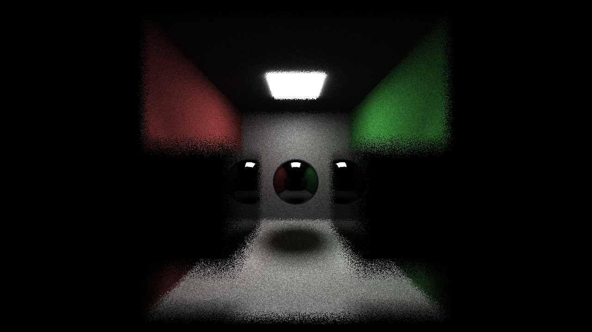
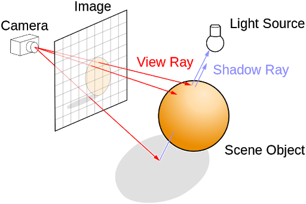
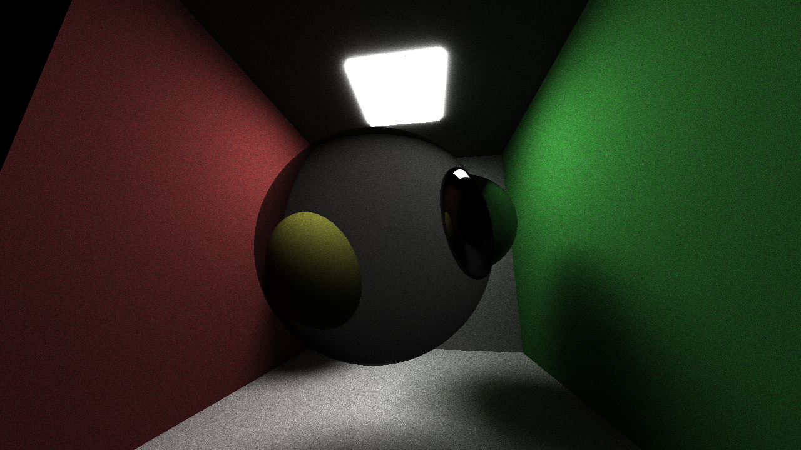
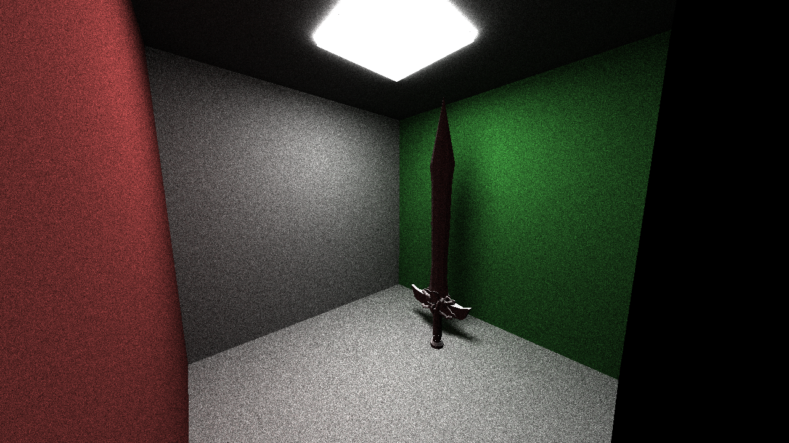
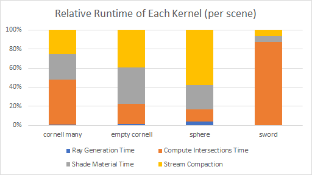
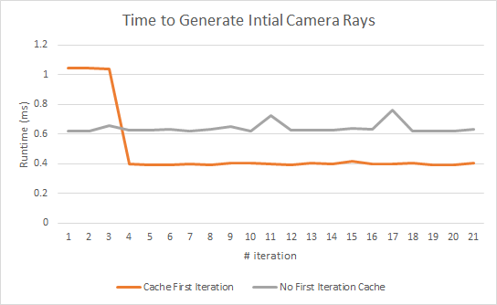
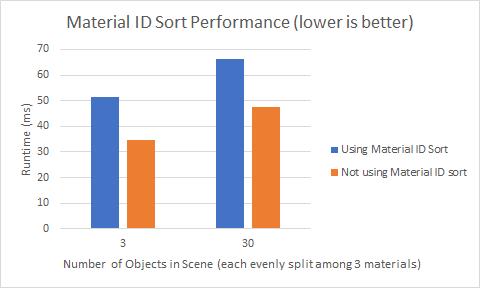
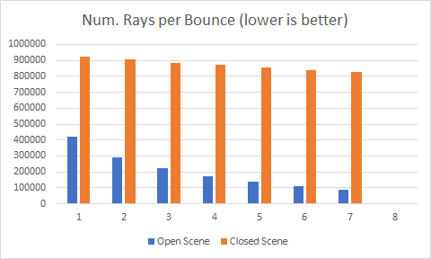
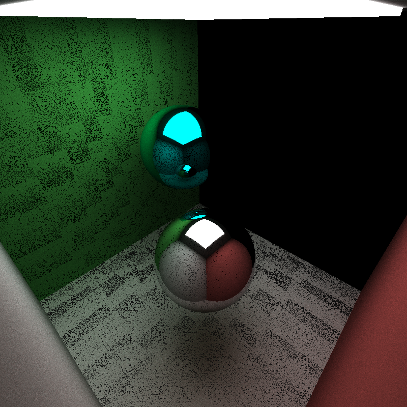
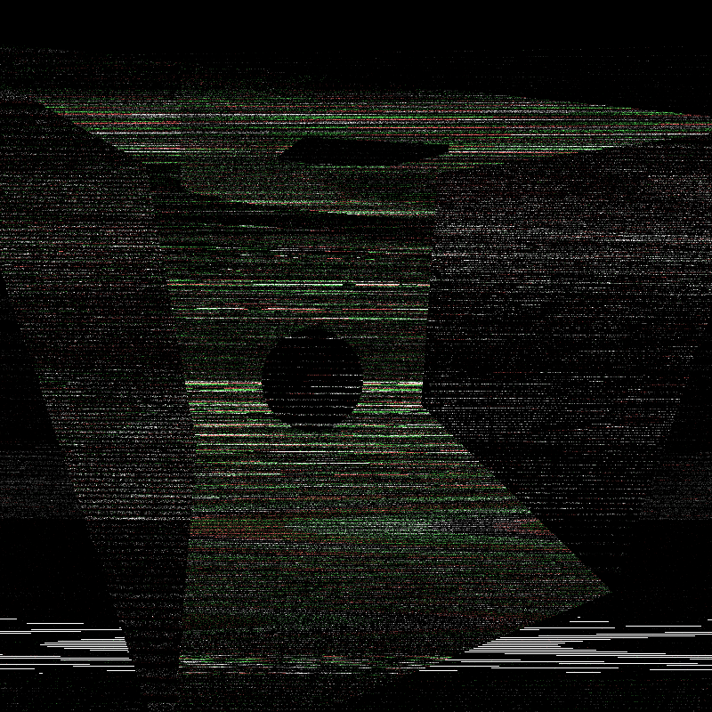

CUDA Path Tracer
================
**University of Pennsylvania, CIS 565: GPU Programming and Architecture, Project 3**

* Liam Dugan -- Fall 2018
  * [LinkedIn](https://www.linkedin.com/in/liam-dugan-95a961135/), [personal website](http://liamdugan.com/)
* Tested on: Windows 10, Ryzen 5 1600 @ 3.20GHz 16GB, GTX 1070 16GB (Personal Computer)

What is Path Tracing?
=============

Path Tracing is a technique for creating images by emulating certain physical properties of light

In the real world a ray of light:
1. Is emitted from **Light Sources**
2. **Bounces** around a scene and changes color depending on what it hits
3. Some hit pixels on the camera, and those get seen

However, a Path Tracer does this backwards by firing rays out of the camera pixels:
1. Rays bounce around in the scene a certain number of times
2. If they hit a light source they terminate and color the camera pixel
3. If they terminate without hitting a light, the pixel is colored black

(Picture taken from course path tracer lecture slide 3)

Scenes
================

Reflection / Refraction / Diffuse
---------

In these scenes we can see not only the reflection working (in the infinite wall room), but also we can see refraction and diffuse lighting being accounted for.

Depth of Field
-------

Depth of Field requires jittering the generated ray based on a given distance from a focal point.

Arbitrary Object Loading (with tinyObj)
-------

I loaded in .obj files using tinyObj and then used `glm::intersectRayTriangle` to check for intersections between our ray and every triangle of the mesh.

Performance Optimizations
================

Total Performance Breakdown
------

To conduct this test I measured the runtime of each of our four main kernels across 4 different scenes and normalized them relative to each other. As we can see from this result the bottleneck of our pipeline is the compute intersections kernel. This is most evident in the sword scene as each ray has to for loop through the many triangles of the mesh. This bottleneck could be relieved greatly by the implementation of a kd tree or other such bounding data structure. 

Otherwise our bottleneck seems to be stream compaction, which can be improved greatly by using shared memory

First Iteration Caching
-------

As we can see from the graph here, the average runtime of the ray generation kernel is drastically reduced when the first iteration caching is activated. We do take a performance hit at the beginning due to having to copy the generated rays into the cache but it is well worth it.

Material ID Sorting
-------

Sorting the rays based on material ID attempts to exploit warp coherence to get extra performance, however it seems that in our case, the extra added overhead of the sort was just too significant. The material ID sort performed significantly worse over both a scarcely populated scene and a heavily populated scene.

Stream Compaction
-------

Taking my implementation from Project 2 for Stream Compaction and adapting it here allows us to greatly decrease the total number of rays for which to calculate intersections. This is especially true in more open scenes, where the rays have plenty of room to shoot off into the distance and terminate. One the other hand in a closed scene (like the infinite reflection room) rays will almost always reach their depth limit unless they hit an emittant surface.

## Bloopers
Because all good things come from humble beginnings.

