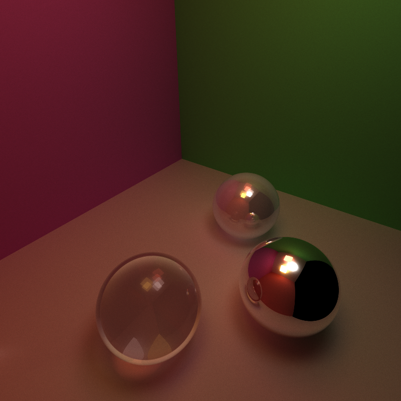
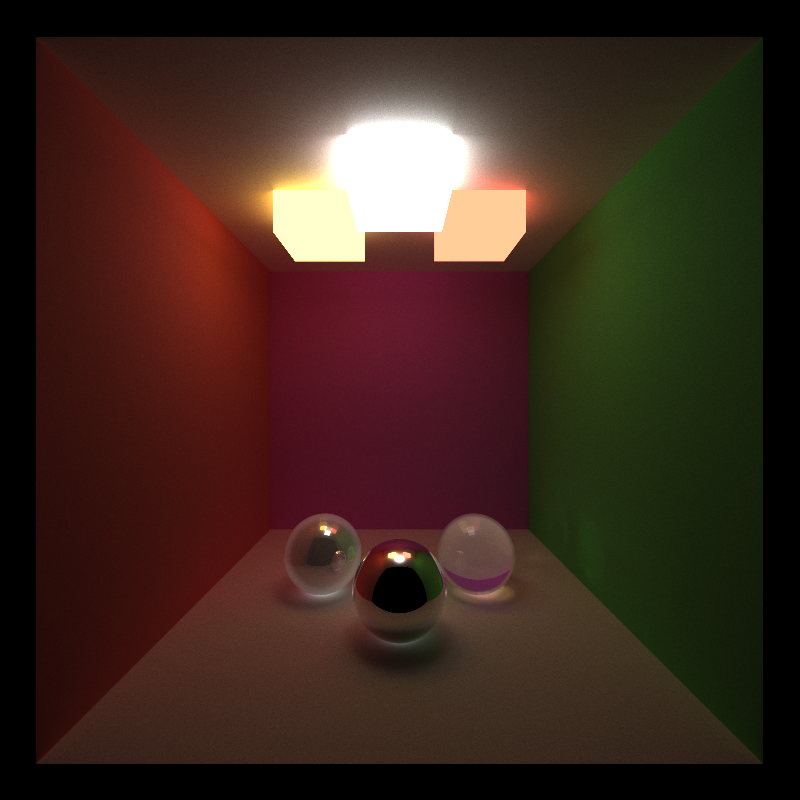
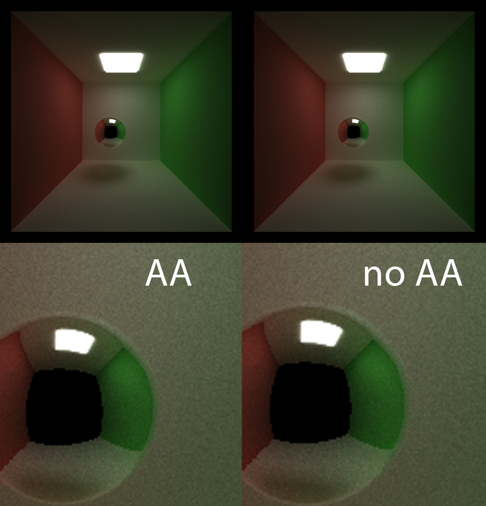
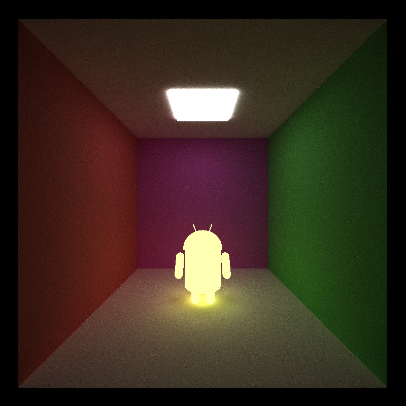
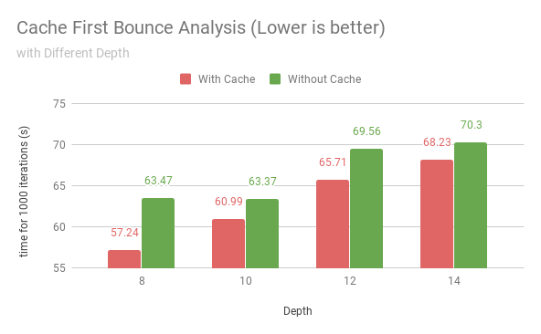
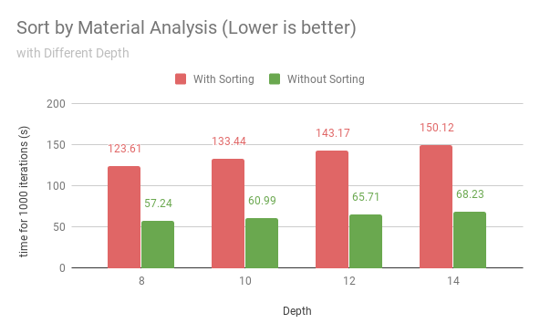
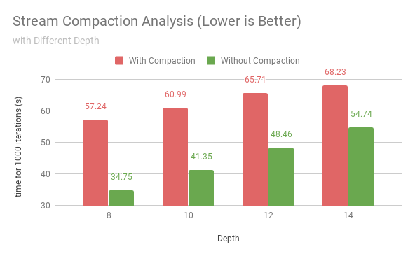

# CUDA Path Tracer

**University of Pennsylvania, CIS 565: GPU Programming and Architecture, Project 3**

* Zichuan Yu
  * [LinkedIn](https://www.linkedin.com/in/zichuan-yu/), [Behance](https://www.behance.net/zainyu717ebcc)
* Tested on: Windows 10.0.17134 Build 17134, i7-4710 @ 2.50GHz 16GB, GTX 980m 4096MB GDDR5

  
   

## Features

- Diffuse and perfectly specular shading kernel
- Path termination with stream compaction
- Sort by material
- Caching first bounce
- Refraction with fresnel term
- Stochastic sampled antialiasing
- OBJ file loading

## Feature Demo

### Antialiasing

### Refraction with Fresnel

### OBJ Loading

## Analysis

### Cache First Bounce

### Sort by Material Analysis

### Stream Compaction Analysis

## Credits

- Android Model Credit: https://free3d.com/3d-model/android-44714.html
- tiny_obj_loader Credit: https://github.com/syoyo/tinyobjloader
