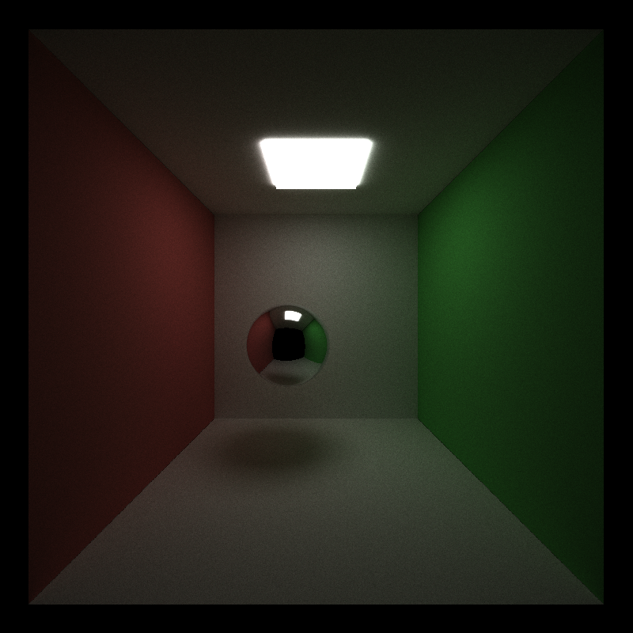
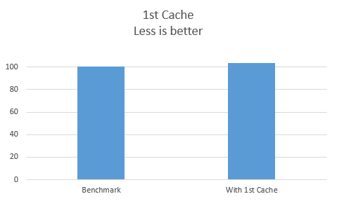
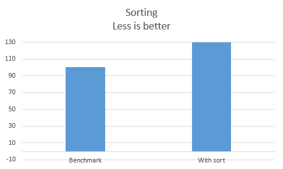
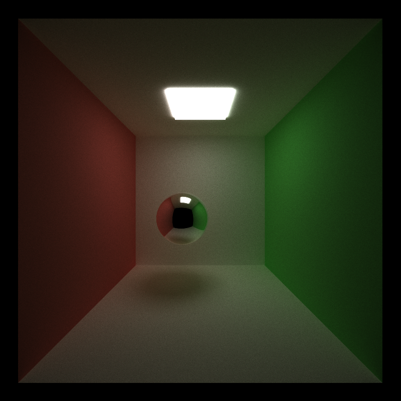
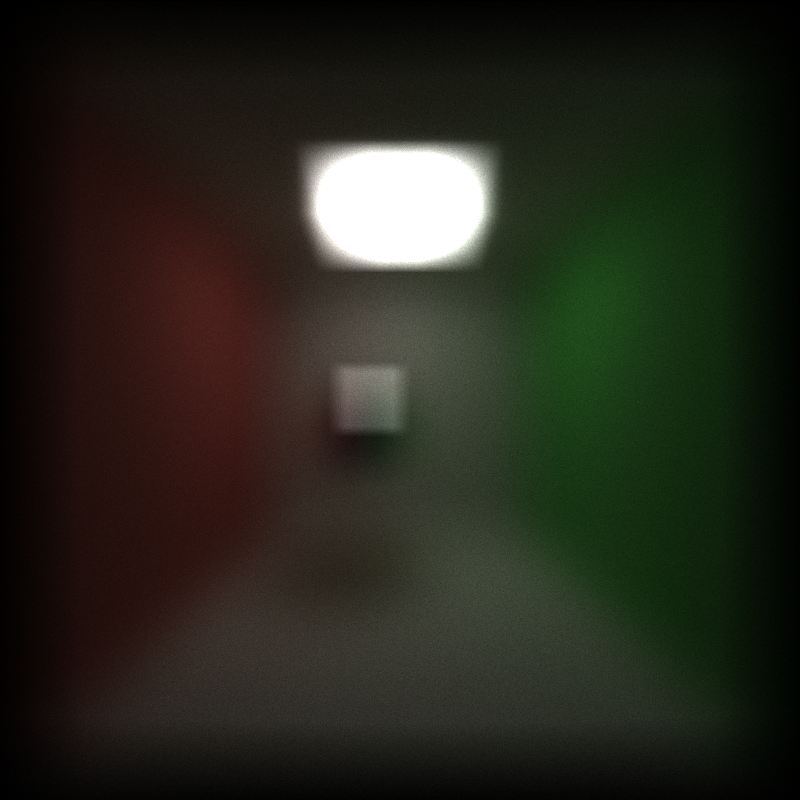
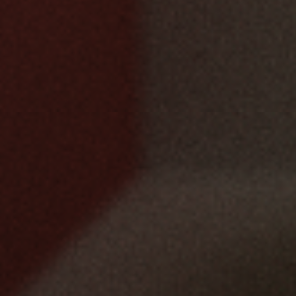
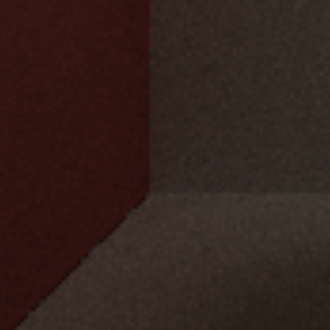
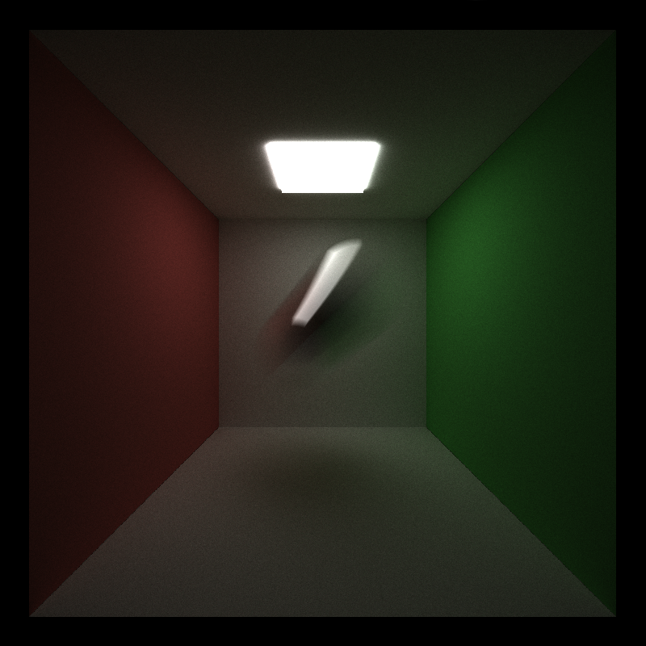
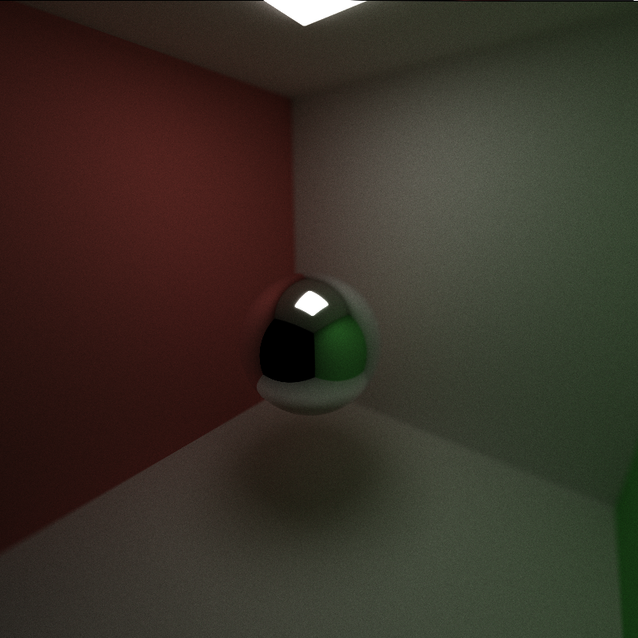

CUDA Path Tracer
================

**University of Pennsylvania, CIS 565: GPU Programming and Architecture, Project 3**

* Name: Bowen Yang
  * [LinkedIn](https://www.linkedin.com/in/%E5%8D%9A%E6%96%87-%E6%9D%A8-83bba6148)
  * [GitHub](https://github.com/Grillnov)
  * [Facebook](https://www.facebook.com/yang.bowen.7399)
  * [Steam](https://steamcommunity.com/id/grillnov)
* Tested on: Windows 10 x64, i7-6800K @ 3.40GHz 32GB, GTX 1080 8GB (Personal computer at home)

# Description

Implement a path tracer with CUDA acceleration enabled, capable of rendering globally-illuminated, photo-realistic images at high speeds. The basecode already has the auxiliary services like I/O, keyboard interrrupts, and OpenGL calls. What we're supposed to do is to implement the core of it.

# Part 1: Basics


The picture pretty much says it all.

## Performance analysis so far
We choose this default configuration as the benchmark of our performance analysis:
*Anti-aliasing: OFF*
*Depth of Field: OFF*
*1st Cache: OFF*
*Material sort: OFF*

### Performance analysis phase 1: The cached rays


As we can see here the caching of the 1st arrays created slightly more overhead and consequently had negative effect on the performance.

### Performance analysis phase 2: The sorting

Thoretically we can expect some performance boost from sorting all the intersections by their material keys to make them continuously scattered in memory, so that the spatial locality becomes better in succeeding phases that calculate the scatters, etc.

However many of our classmates are suffering from severe performance loss due to this sorting operation. Some even faced a 90x execution time increase.

After careful referring the thrust library I found out that, unless sorting primitive integers, thrust::sort() or thrust::sort_by_key() will call its merge-sort subprocedure, not the radix-sort one, although for our purposes radix-sort is the optimal solution. So I headed out and implemented one on my own since it's way too hard to inherit the boolean functors in thrust library.



Still some performance loss, but a lot better than using sort in thrust library directly.

# Part 2: Detail of the radix sort implementation

To perform radix sort or bucket sort in our case, first we need to allocate the buckets, one for each material ID. Each bucket is sized $num_paths for the worst case.
Then we perform 2 passes to complete the radix sort:

## 1. Collect
Fill the buckets with corresponding intersections.
```
__global__ void fillBuckets(
	int num_paths
	, const ShadeableIntersection * shaderableIntersections
	, ShadeableIntersection ** shadeableIntersectionBucketsPtr
	, int * bucketSizes
)
{
	int idx = blockIdx.x * blockDim.x + threadIdx.x;
	if (idx < num_paths)
	{
		int materialIndex = shaderableIntersections[idx].materialId;
		int &indexWithinBucket = bucketSizes[materialIndex];
		
		shadeableIntersectionBucketsPtr[materialIndex][indexWithinBucket] = shaderableIntersections[idx];
		++indexWithinBucket;
	}
}
```
## 2. Expand
Recover the new sequence of the original array by expanding each bucket back into the array.
```
//For each bucket, do
__global__ void expandBuckets(
	const int materialId
	, ShadeableIntersection * shaderableIntersections
	, const ShadeableIntersection * shadeableIntersectionBucketI
	, const int * bucketSizes)
{
	int idx = blockIdx.x * blockDim.x + threadIdx.x;
	int bucketISize = bucketSizes[materialId];
	if (idx < bucketISize)
	{
		int offset = 0;
		for (int i = 0; i < materialId; ++i)
		{
			offset += bucketSizes[i];
		}
		shaderableIntersections[offset + idx] = shadeableIntersectionBucketI[materialId];
	}
}
```

## Calling kernels from host side
```
//Set the buckets to empty
cudaMemset(reinterpret_cast<void*>(validElementNumbers), 0, numOfBuckets * sizeof(int));

fillBuckets <<<numblocksPathSegmentTracing, blockSize1d >>> (
		num_paths
		, dev_intersections
		, dev_intersectionBucketsPtrs
		, validElementNumbers
		);
for (int i = 0; i < numOfBuckets; ++i)
{
	expandBuckets <<<numblocksPathSegmentTracing, blockSize1d >>> (
		i
		, dev_intersections
		, dev_intersectionBuckets[i]
		, validElementNumbers
		);
}
```

## Discussions
As we can see here my somewhat primitive radix sort is not optimized well enough, especially when it comes to expanding the buckets back to the original array. To remedy this we can either unroll the loop in the host and move it to the kernel, since we're calling one kernel for each bucket, which is a significant waste of threads. Secondly we can cache the sizes of the buffer somewhere else on the device so that we don't have to calculate the offset for each thread.

# Part 3: Anti-Aliasing

Jitter the rays with an amplitute taken from thrust::uniform_real_distribution, with a range of (-JITTER_RANGE, JITTER_RANGE). Since we're doing multiple iterations of sampling anyway, the multisampling is automatically


With jitter = 0.008f.


It's a little tricky to tackle with the jitter amplitute or you'll end up like this.

Some comparison between AA switched on/off.

With AA on:



With AA off:



# Part 4: Motion Blur

I added a translational velocity to the sphere, and added an explicit time integration with iteration increasing, so that the sphere translates with time elapsing.


# Part 5: Depth of Field

To implement DOF with physically-based lens, I referred to [this page](https://pub.dartlang.org/documentation/dartray/0.0.1/core/ConcentricSampleDisk.html) to get a better sampling throughout the disk. This sampled amplitute is then applied on the rays to create the effect of looking through an aperture of the camera, with certain focus and thickness of the lens.

Depth of Field render.


Close-up scene render.


