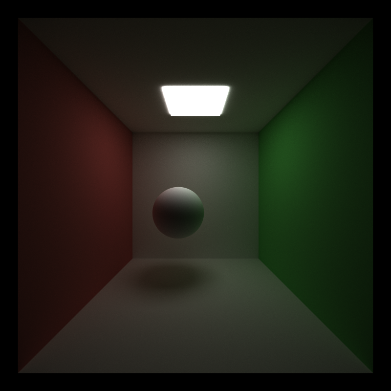

CUDA Path Tracer
================

**University of Pennsylvania, CIS 565: GPU Programming and Architecture, Project 3**

## Path tracing with CUDA on the GPU
### Connie Chang
  * [LinkedIn](https://www.linkedin.com/in/conniechang44), [Demo Reel](https://www.vimeo.com/ConChang/DemoReel)
* Tested on: Windows 10, Intel Xeon CPU E5-1630 v4 @ 3.70 GHz, GTX 1070 8GB (SIG Lab)

  
A render with full lighting

## Introduction
The goal of this project is to write a path tracer that runs on the GPU using CUDA. Each thread of the GPU followed a ray, and updated color calculations as it bounced in the scene. Three different integration algorithms were implemented: Naive, Direct Lighting, and Full Lighting. In addition, this project supports three light scattering models: Diffuse Lambert, reflective, and refractive. The latter two use a Fresnel dielectric computation to accurately simulate the ratio of reflection to refraction. The three scattering methods can be combined in any way to create interesting materials. To make the final image look nicer, anti-aliasing was added by jittering the rays as they left the camera.  
  
Some optimizations were added to speed up the render. To reduce warp divergence, dead rays are partitioned out. Therefore, the dead rays do not occupy any threads and the live rays are bundled together in warps. Furthermore, there is an option to cache the first bounce of the first ray casted from each pixel, reducing the computations required for the first bounce on subsequent samples. However, this cache does not work with anti-aliasing. Lastly, there is another option to sort materials such that rays hitting the same material are bundled together. Unfortunately, this did not provide much of an optimization.  

## Implementation Details

## Usage and Scene File Description

## Performance
