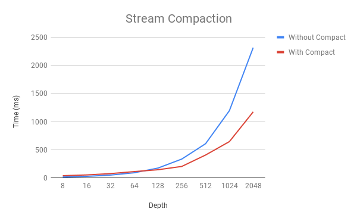
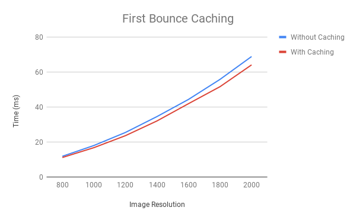
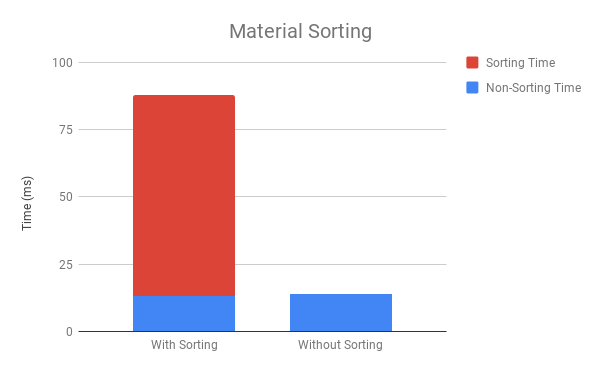
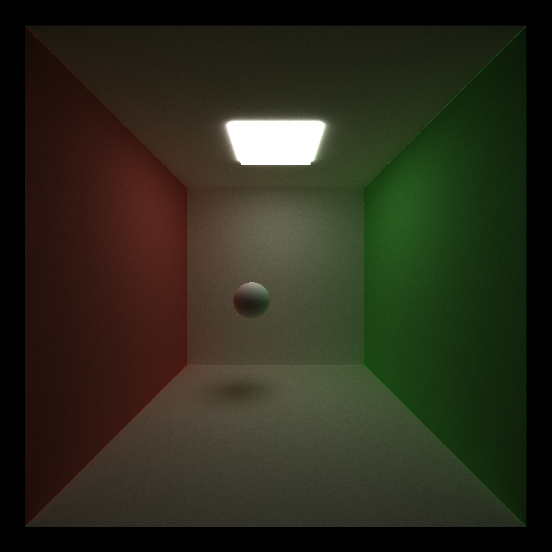
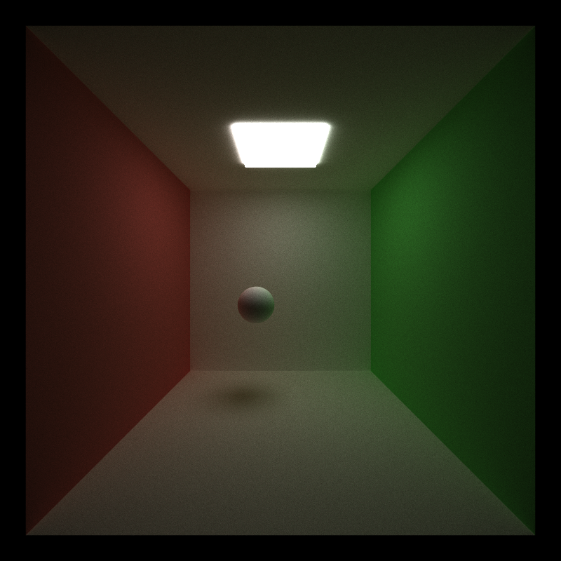
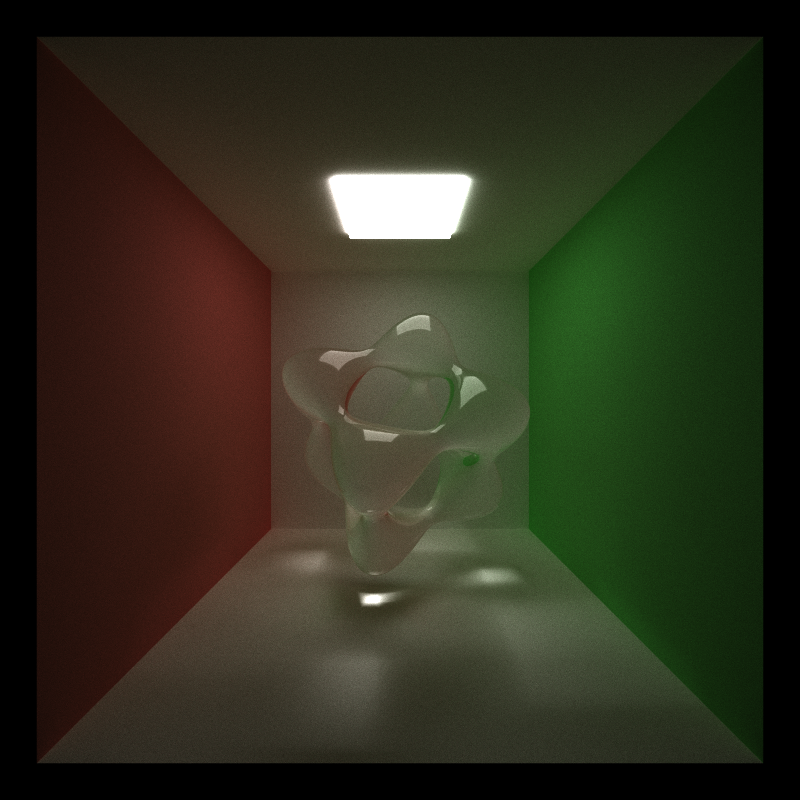
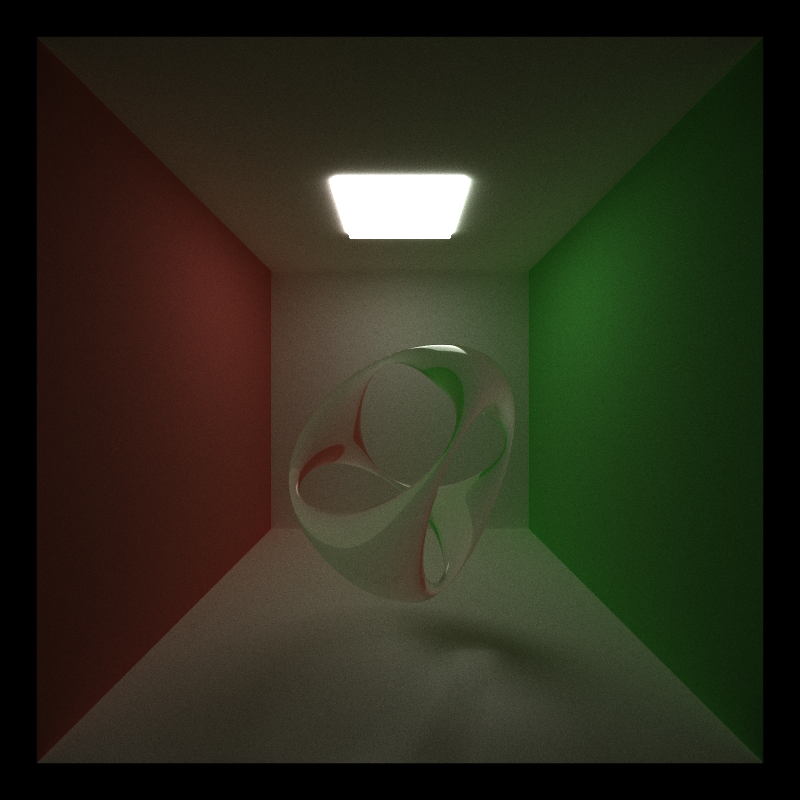

CUDA Path Tracer
================

**University of Pennsylvania, CIS 565: GPU Programming and Architecture, Project 3**

* Eric Chiu
* Tested on: Windows 10 Education, Intel(R) Xeon(R) CPU E5-1630 v4 @ 3.60GHz 32GB, NVIDIA GeForce GTX 1070 (SIGLAB)

## Description

This project explores and compares different CPU and GPU implementations of the scan (prefix sum) and the compaction algorithms. Some implementations include naive and work efficient methods.

## Stream Compaction

## First Bounce Caching

## Material Sorting

## Anti-Aliasing

## Refraction

## Procedural Shapes

