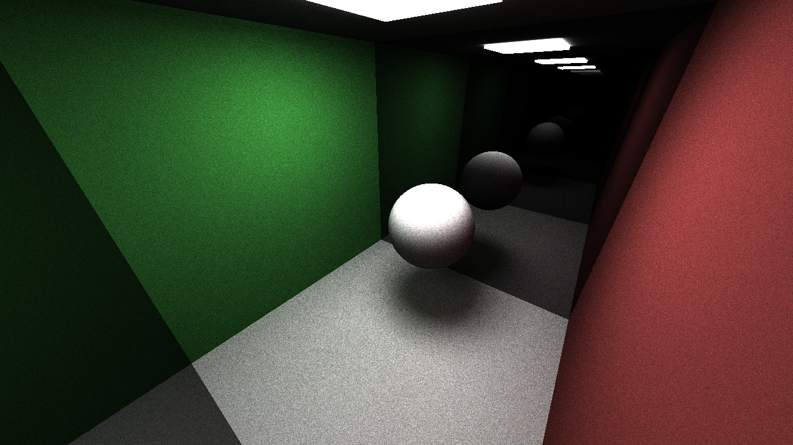
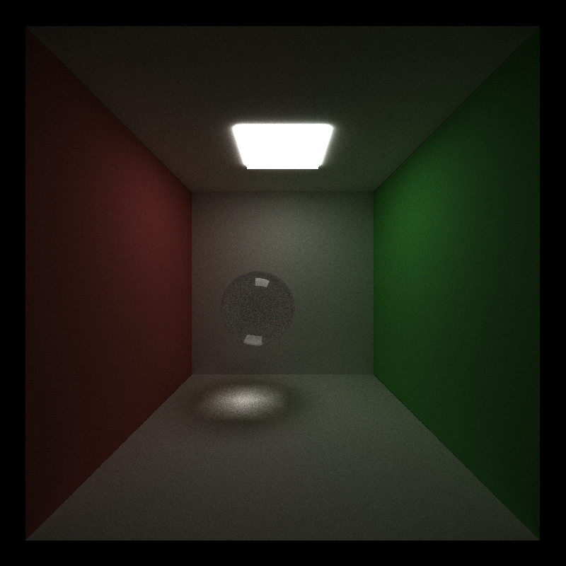
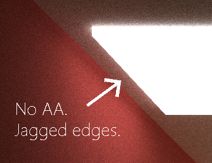
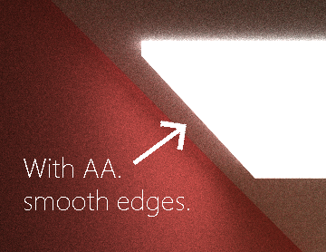
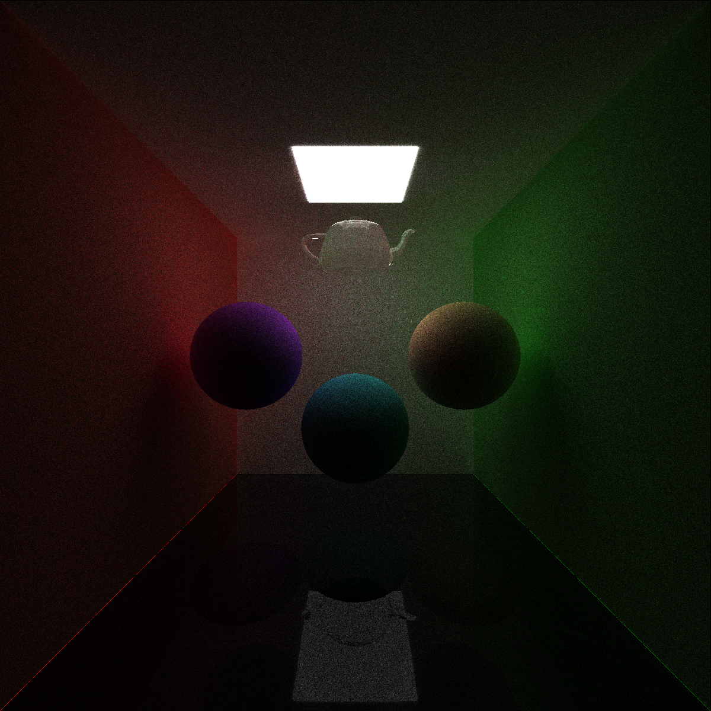
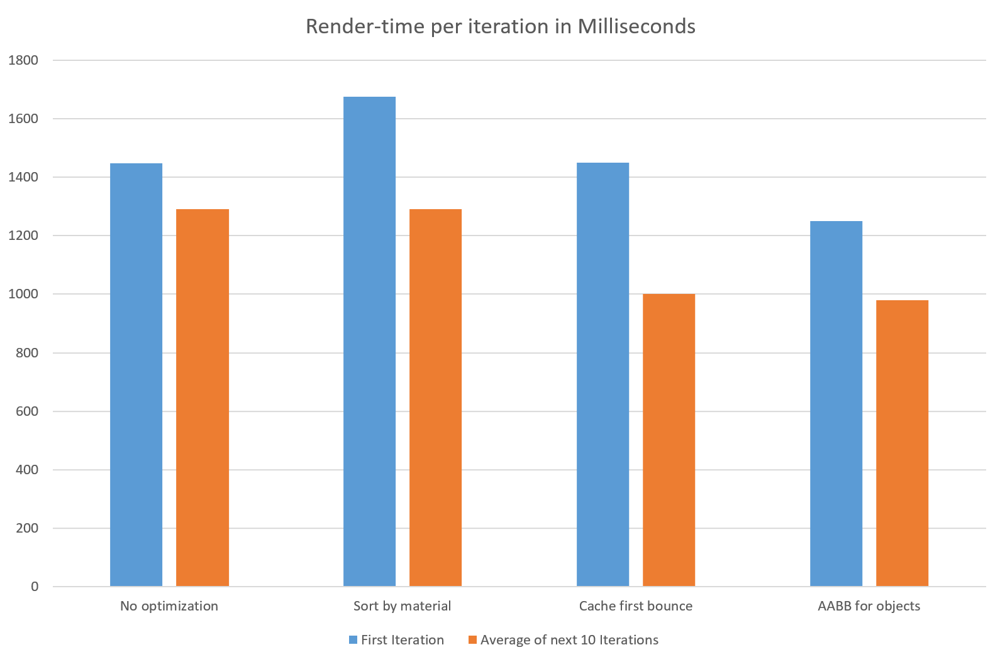

CUDA Path Tracer
================

**University of Pennsylvania, CIS 565: GPU Programming and Architecture, Project 3**

* Yichen Shou
  * [LinkedIn](https://www.linkedin.com/in/yichen-shou-68023455/), [personal website](http://www.yichenshou.com/)
* Tested on: Windows 10, i7-2600KU @ 3.40GHz 16GB RAM, NVIDIA GeForce GTX 660Ti 8GB (Personal Desktop)

## Project Showcase

## Project Overview

This project implements a monte carlo path tracer on the GPU using CUDA. [Path Tracing](https://en.wikipedia.org/wiki/Path_tracing) is a rendering graphics in Computer Graphics that accurately simulates global illumination by tracing individual light ways as they bounce around the scene from light sources into the camera. Each time the light way bounces, the surface's [BRDF](https://en.wikipedia.org/wiki/Bidirectional_reflectance_distribution_function) is sampled to calculate a physcially accurate color contribution and bounce direction. Because there are infinitely many light rays to trace, we use [Monte Carlo integration](https://en.wikipedia.org/wiki/Monte_Carlo_integration) techniques so that we can still achieve good results with a finite number of samples. 

Though path tracing has mostly been used only in big budget movies until now (due to how long it takes to render), they're beginning to take hold in the game industry thanks to the latest push from NVIDIA with their RTX line of graphics card, which does ray/path tracing in _real time_ thanks to amazing algorithms and machine learning. You can learn more about the amazing stuff they're doing [here](https://developer.nvidia.com/rtx/raytracing).

Even without NVIDIA latest graphics cards, you can still use your GPU to speed up your render time, which is what this project is all about. Tradition CPU-based path tracing relies on recursively tracing each ray until it terminates by hitting a light or reaching the bounce limit. Multithreading can be used to trace multiple rays at a time. GPUs can mulithread a lot better than the CPUcan, but they do nt allow recursion. We can still make it work though by redesigning the algorithm: instead of recursivly tracing each ray, we can store a pool of all rays and use the GPU to advance each ray by one bounce at every iteration. This not only makes path tracing extremely paralizable, but also allows us to render frames one bounce at a time, instead of waiting for all pixels to finish all bounces. 

## Features 

### Monte Carlo Path Tracing
- The basic path tracing algorithm is implemented on the GPU by keeping an array of all rays (one per pixel), and iteratively tracing over them until all have been terminated or we have reached our bounce limit. At each bounce, we sample the material hit for the color and to calculate how the ray should bounce. 
- Basic diffuse shading is achieved using a cosine-weighted sampling function, which favors sampling light rays towards the middle of the hemisphere to speed up convergence.
- Monte Carlo Integration ensures that as we continue to sample the scene, the image will eventually converge to its actual state.

### Optimizations
- Stream Compaction is used after every iteration to discard terminated rays so we don't waste time checking useless rays. 
- Since rays always start at the pixel they belong to and shoot out in the same direction (the direction the camera is looking at), the first bounce is always at the same location. This location is cached for every ray to speed up performance.
- Since different materials take different times to compute their color/bounce direction, we can sort the rays by the materials they hit so that materials that take similar amounts of time would end up on the same GPU block. This reduces the chance for a wrap to hang. 

### Ideal reflective materials 

- Simple ideal reflection can be implemented easily using the basic law of reflection. Glm::reflect is used in code. 

### Refractive materials with caustics using Fresnel Schlick's approximation

- Refraction is generally handled using Fresnel's equation and taking into account special cases like when the light strikes at a critical angle or gets reflected internally. 
- The [Fresnel Shlick Approximation](https://en.wikipedia.org/wiki/Schlick's_approximation) was used in the code to speed up this step.

### Anti-Aliasing

- Anti-Aliasing can be achieved easily by slightly jittering the start location of the each ray within the pixel they're coming out of. Multiple sampling methods can be used for this purpose to different effects. The code uses standard uniform sampling.

 

### Custom OBJ Loader

- Loads custom OBJ files into the renderer using the wonderful [tinyObjLoader](https://syoyo.github.io/tinyobjloader/)
- Implements Axis-Aligned Bounding Boxes for each object to prevent checking against every triangle of every object every time. 

## Performance analysis

Performance analysis was done to render the above 1200x1200 image of 10 objects and 10 materials. Compilation time per iteration is averaged over 10 iterations. 

The blue bars represent the compilation time for the first iteration, while the orange bars represent the average compilation time for the next 10 iterations. 

In all cases, subsequent iterations run faster than the first iteration. Notice how caching the first bounce dramatically increases the speed up from the first iteration to following iterations. 

Though sorting rays by materials is supposed to help speed up compilation, in my implementation it actually makes everything slower. I think this is probably due to the fact that though I had a lot of different material types, most of them take the same amount of time to compute since I didn't implement any complicated sampling methods like Multiple Important Sampling.

## References
- [tinyObjLoader](https://syoyo.github.io/tinyobjloader/)
- [Physically Based Rendering](https://www.pbrt.org/)
- [Path-tracing Primer slides from CIS565](https://docs.google.com/presentation/d/11ZBENtCqqWIplLXq34hFlJuwSUmbKqWs5ItFV7mjD0s/edit#slide=id.g16c5ceb07d_0_426)
- [Fresnel Schlick Approximation explanation](https://www.youtube.com/watch?v=iKNSPETJNgo)