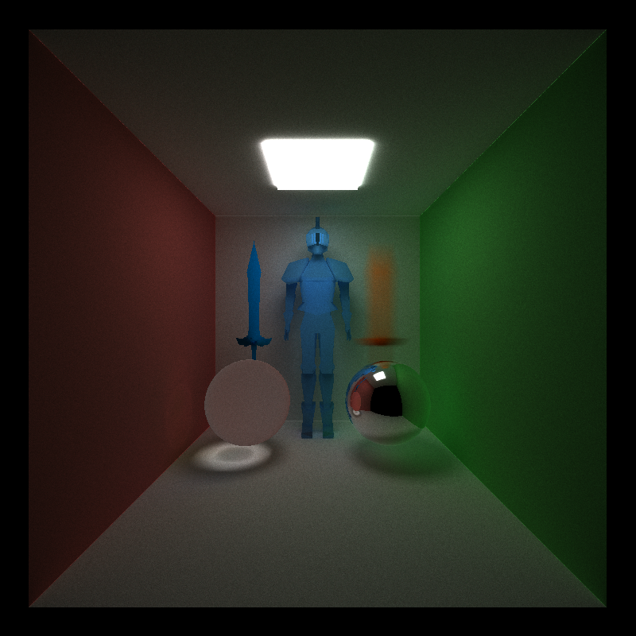
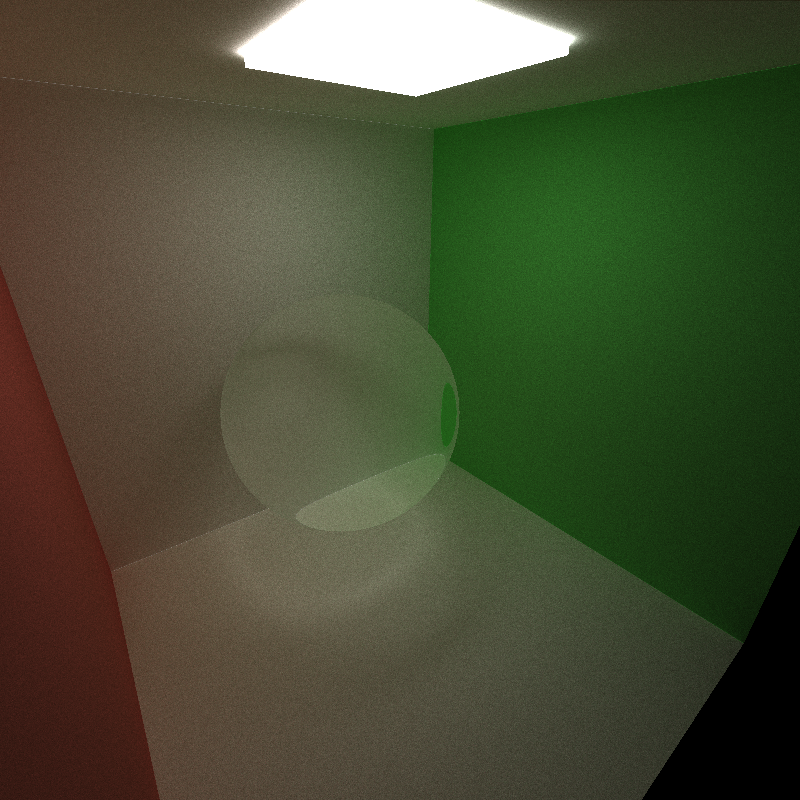
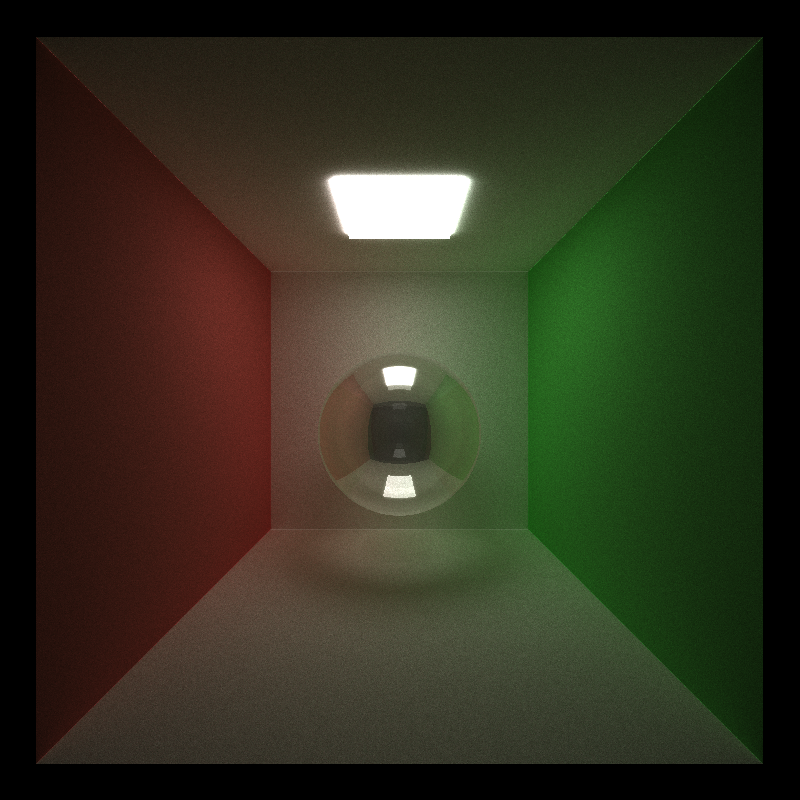
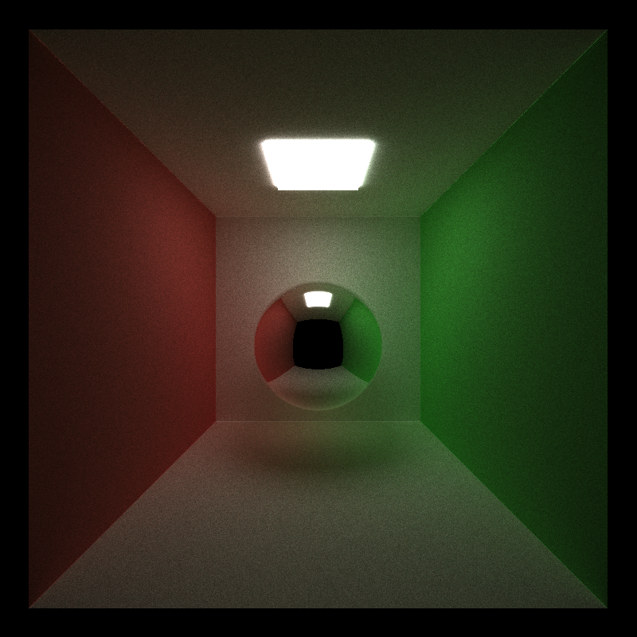
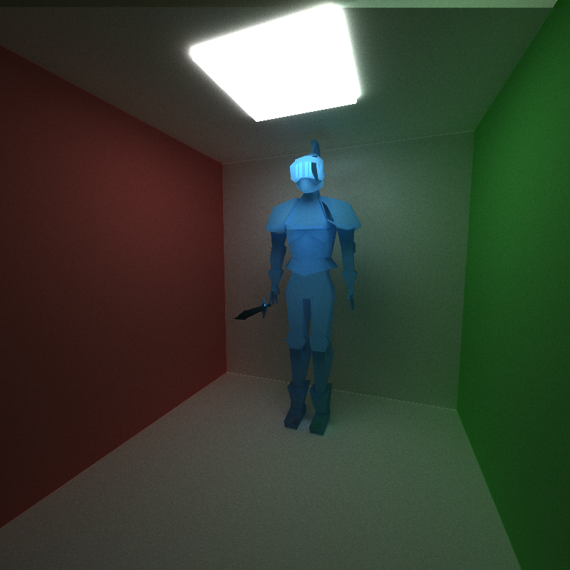

CUDA Path Tracer
================

**University of Pennsylvania, CIS 565: GPU Programming and Architecture, Project 3**

* Henry Zhu
  * [Github](https://github.com/Maknee), [LinkedIn](https://www.linkedin.com/in/henry-zhu-347233121/), [personal website](https://maknee.github.io/), [twitter](https://twitter.com/maknees1), etc.
* Tested on: Windows 10 Home, Intel i7-4710HQ @ 2.50GHz 22GB, GTX 870M (Own computer)

## Nice Kuda pics

## What is a path tracer?

A pathtracer is a method of rendering realistic images that I would say is better than the images produced by ray tracing.

Essentially, a pathtracer shoots a ray into the image from each pixel (screen space) into the scene and the collects all the colors from the material it hits until it reaches a light source. If the light source is not reached in x bounces, the ray does not contribute to the color. The ray is produced for each iteration in order to average out the inconsistenties and to average out the color for the pixel that is drawn.

## What features of my path tracer implement?

- The path tracer works
- Refraction with fresnel effects
- Reflection 
- Anti-aliasing
- Motion-blur
- Model loading (using [tinyObj](https://github.com/syoyo/tinyobjloader)) with toggleable bounding volume intersection culling

## Reflection/Refraction

### Refraction

### Refraction with fresnel (half refraction, half reflection)

### Reflection

### Refraction/Reflection evaluation

This feature consists of creating reflection and refraction on objects, so they are realistic like real world reflection/refraction occurances.

Refraction occurs when light that passes through an object blends as shown by light bending when entering water.

Reflection occurs on objects like a mirror.

One can can combine reflection/refraction using fresnel values.

#### Performance

The performance was not that much worse than computing just with diffuse. The only real way that performance could be impacted is the amount of calculation that has to be done in the glm::reflect/glm::refract computations. 

#### GPU/CPU implementation (hypothetical)

The GPU version should be no different from the CPU version other than having each ray's reflection/refraction computation become parallized (the only benefit I see from the GPU, which is still huge because instead of doing 800 x 600 rays in serial, the GPU handles them in parallel.

#### Future optimizations

As of right now, I'm using a fresnel calculation that could be replaced with a more optimized technique.

For a combination of refraction/reflection, I use a branch and compute a refraction or reflection ray based on the percentage of the refraction/reflection. Branches are bad especially in this case since the branch is computed randomly. There is defnitely a way to do this in a predictable way.

## Anti-aliasing

### Anti-aliasing evaluation

Anti-aliasing is used when pixels become too distinctive and one "averages" out the pixels color over its neighbors. This is done easily in the path tracer as one just needs to move the ray slightly towards a direction randomly.

#### Performance

The performance is definitely being hit here in the sense that one need to compute more iterations in order to get a better image. This is because since the rays are not always hitting the same point and more randomly in the points around the point one used to hit, it takes longer to average out the colors in order to get a crisp image.

#### GPU/CPU implementation (hypothetical)

The GPU version would be much different than the CPU version. In the GPU version, one needs to just shift the ray slightly to add anti-aliasing. In the CPU version, one needs to keep track of the pixels and sample it with the pixels around it (way more code and a lot more iterations as well)

#### Future optimizations

Optimizations could defnitely be added. Instead of having a ray shift right and left every time, one could do it x times over an iterval or average the pixels out at the end when the image wants to be saved. This would create a not-as-strong anti-aliasing effect, but would improve performance.

There are possibly other anti-aliasing methods for the path tracer, but I have not dug into this as of yet.

## Object loading

### Object loading evaluation

Object loading is awesome! When I ran it the first time, I was shocked at how slow the render was. This is due to the check against every single triangle to see if the ray intersects the object. So, the more triangle the model has, the more slow the path tracer becomes. The volume bound testing definitely helps by checking if the ray even hits in the vinicity of the object's triangles by basically doing a AABB testing.

#### Performance

Performance is definitely a big problem here. Testing against every triangle in the mesh (which could be thousands if not millions) is intense, even for the GPU. On my current computer setup, each iteration takes approximately one second for a mesh with a couple thousand triangles. 

#### GPU/CPU implementation (hypothetical)

One can sort of compare the GPU with the CPU in this scenario. The GPU implementation (if done with optimizations and with a powerful GPU), can check the intersections for all triangles in parallel (unlike mine, which checks triangles with one thread). Currently, however, if I were to port my implementation to the CPU, it would run the same except, it's not in parallel for computing all the rays.

#### Future optimizations

There are optimizations that could make model loading/intersection a world's ton faster.

KD-trees are the first to come to mind. KD-trees are essentially boxes for each set of triangles in a model to test for instead of testing for all the triangles for the model. 

The triangle intersection itself can be done in parallel (with a strong enough GPU) instead of checking all the triangles for each ray.

Models could use less triangles for speed up.

 

