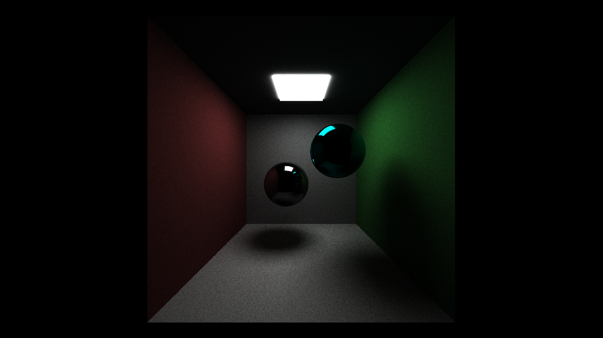

CUDA Path Tracer
================

**University of Pennsylvania, CIS 565: GPU Programming and Architecture, Project 2**

* Liam Dugan
  * [LinkedIn](https://www.linkedin.com/in/liam-dugan-95a961135/), [personal website](http://liamdugan.com/)
* Tested on: Windows 10, Ryzen 5 1600 @ 3.20GHz 16GB, GTX 1070 16GB (Personal Computer)

# Path Tracer

This homework involves writing a path tracer (a simplified version of a ray tracer).

## Features Completed
* First iteration caching
* Material ID sorting
* Stream compaction
* Reflection shading
* Diffuse shading
* Refraction shading
* Depth of Field

## Screenshots
* Reflection

