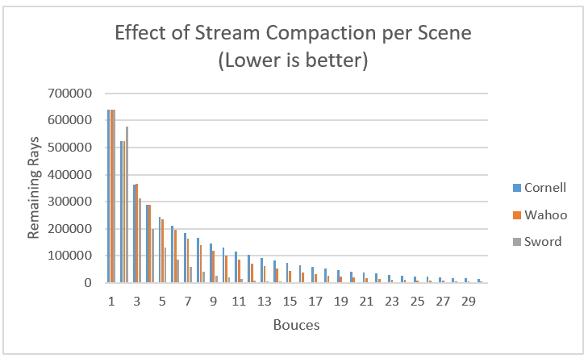
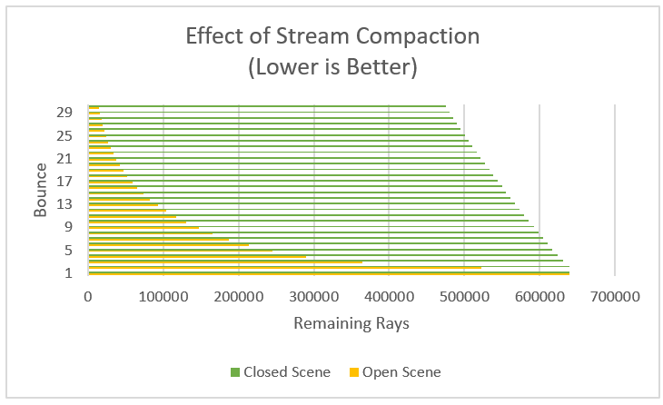
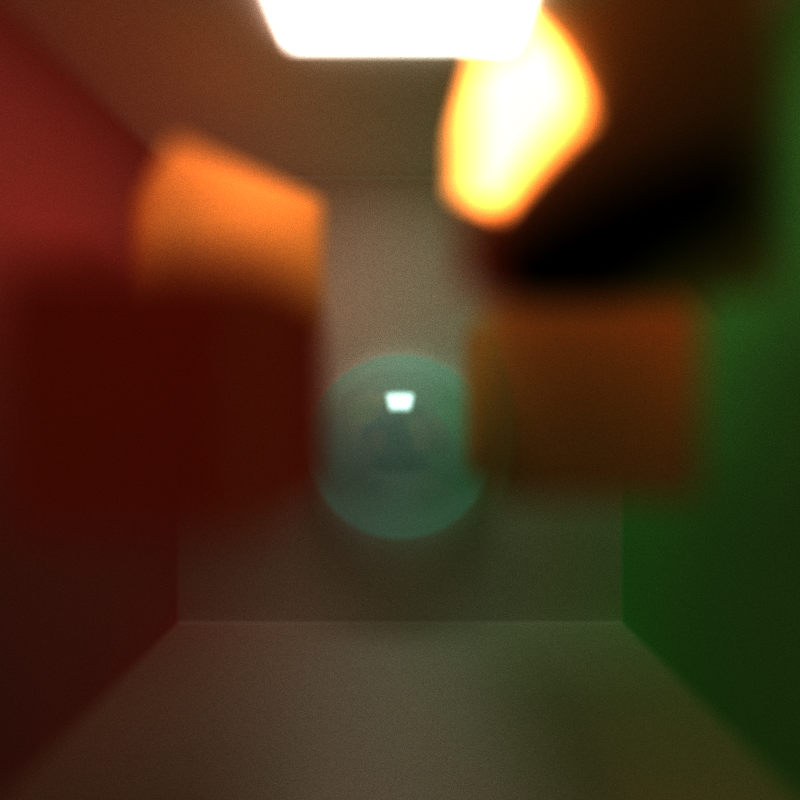

CUDA Path Tracer
================

**University of Pennsylvania, CIS 565: GPU Programming and Architecture, Project 3**

* Ziad Ben Hadj-Alouane
  * [LinkedIn](https://www.linkedin.com/in/ziadbha/), [personal website](https://www.seas.upenn.edu/~ziadb/)
* Tested on: Windows 10, i7-8750H @ 2.20GHz, 16GB, GTX 1060

# Project Goal

  

In this project, I implemented a Path Tracer using the CUDA parallel computing platform. Path Tracing is a computer graphics Monte Carlo method of rendering images of three-dimensional scenes such that the global illumination is faithful to reality. 

# Path Tracing Intro

  

In simple terms, a path tracer fires rays from each pixel, which would bounce off in many directions depending on the objects in the scene. If the ray is fortunate enough, it would hit an illuminating surface (lightbulb, sun, etc...), and would cause the first object it hit to be illuminated, much like how light travels towards our eyes.

## Issues
Path tracing is computationally expensive since for each pixel, our rays might hit numerous geometries along the way. Checking intersections with each geometry is expensive, which is why we employ optimization techniques (culling, caching, stream compaction, material sorting) as well as use a parallel computing platform (CUDA) to take advantage of the GPUs cores.

## Stream Compaction, Caching, & Sorting Optimizations
### Stream Compaction
[Stream Compaction](https://github.com/ziedbha/Project2-Stream-Compaction) helps by ommitting rays that aren't used in an iteration anymore. This happens when a ray hits nothing, or runs out of bounces (e.g hits a light source). This allows for a fewer blocks to launch, and less divergence in threads. The effects are great in different types of open scenes (tall, numerous materials, high-poly count) as shown below:

However, the effects are less impressive when it comes to closed scenes, since stream compaction only comes in when rays hit a light source or natrually run out of permitted bounces. Overall, performance improves a lot with stream compaction.

### Caching

### Material Sorting

| Without Sorting | With Sorting | 
| ------------- | ----------- |
| 

| 

 |

Before shading a ray, I performed an optimization that consisted in sorting the rays by the material type they hit. This allowed the CUDA warps (sets of threads) to diverge less in execution, saving more time. As the graphs above show, there are more branches in the unsorted case, and even more divergence as captured by the CUDA profiler.

## 3D Model Importing (.obj)
| Dedocahedron | Sword | 
| ------------- | ----------- |
|  |  |

To import 3D .obj files, I used TinyObjLoader which is a good parser for this specific file format. .obj files contain vertex information (positions, normals, texture coordinates) as well as triangulation information. Implementing this feature meant that I needed to store separate triangles for one mesh, with each triangle containing the correct vertex data.

As expected, high poly-count meshes take longer to render (see below)

| Wahoo | [Spider](https://poly.google.com/view/cbFePDoI8yi) | 
| ------------- | ----------- |
|  |  |

### Performance & Optimization
Since GPUs aren't able to use resizable arrays, I couldn't store vectors of triangles for each mesh. Instead, I loaded my meshes this way:

| Mesh 1 | Triangle 1-1 | Triangle 1-... | Triangle 1-n | ... | Mesh 2 | Triangle 2-1 | Triangle  2- ...| Triangle 2-m |
| ------------- | ----------- | ----------- | ----------- | ----------- | ----------- | ----------- | ----------- | ----------- |
| End Index of Triangle data | Vertex data | Vertex data | Vertex data | ... | End Index of Triangle data | Vertex data | Vertex data | Vertex data |

So that when I tested intersections against a mesh, I would access the next index to find the first triangle, and I would access the end index to find the last triangle of the mesh.

To test intersections against the mesh, I did two optimizations:
1. *Bounding-Volume Culling*: I compute the bounds of the mesh and surround it by a bounding box. Using this bounding box, I can check if a ray can potentially hit the mesh. If it can't, then no intersection is possible, so we skip it. Else, we test intersections against all triangles.
2. *Deferred Intersection Calculations*: I calculate intersections against triangles in a mesh in one giant batch. In other words, I only keep the closest triangle I intersected for a ray, and THEN perform all needed calculations. This significantly improves the performance of mesh intersection since for high poly-count meshes, simple calculations such as point retrieval become expensive.

## Anti-Aliasing
| Without Anti-Aliasing | With Anti-Aliasing | 
| ------------- | ----------- |
|  |  |

In computer graphics, anti-aliasing is a software technique used to diminish stair-step like lines that should be smooth instead. This usually occurs when the resolution isn't high enough. In path tracing, we apply anti-aliasing by firing the ray with additional noise. If the ray is supposed to color pixel (x,y), we sample more colors around that pixel, and average them out to color pixel (x,y).

The picture below explains the approach. My implementation is represented by the image on the right. A dot is a sample (ray), a square is a pixel.

  

### Performance & Optimization
Anti-Aliasing has no impact on performance since it is essentially 2 more lines of code per ray. All rays do the same anti-aliasing computation, which means that no warps diverge. No further optimization needed.

## Depth of Field

| Without Depth of Field | With Depth of Field | 
| ------------- | ----------- |
|  |  |

In optics, depth of field is the distance about the plane of focus where objects appear acceptably sharp in an image. In path tracing, this is achieved by adding noise to the ray direction about the focal point, as explained in this [article](https://medium.com/@elope139/depth-of-field-in-path-tracing-e61180417027).

### Performance & Optimization
Depth of Field is just a few extra vector computations per ray, and much like anti-aliasing, it has no impact on performance. All rays do the same computation, which means that no warps diverge. No further optimization needed.

## Materials Support

  

My implementation supports diffuse and specular materials. For specular materials, I support pure refractive, reflective, and transmissive materials. 

### Diffuse

  

### Specular Reflective

  

### Specular Refractive

  

### Transmissive using Schlick's Approximation

  

# Bloopers & Bugs
| Weak Seed for Randomly Generated Numbers | Incorrect Access of Path Index in a Thread | Missing Internal Total Reflection & Wrong Normals |
| ------------- | ----------- | ------------- |
| 

 |  

 |  

 |

# Build Instructions
1. Install [CMake](https://cmake.org/install/)
2. Install [Visual Studio 2015](https://docs.microsoft.com/en-us/visualstudio/welcome-to-visual-studio-2015?view=vs-2015) with C++ compativility
3. Install [CUDA 8](https://developer.nvidia.com/cuda-80-ga2-download-archive) (make sure your GPU supports this)
4. Clone this Repo
5. Create a folder named "build" in the root of the local repo
6. Navigate to the build folder and run "cmake-gui .." in a CLI
7. Configure the build with Visual Studio 14 2015 Win64, then generate the solution
8. Run the solution using Visual Studio 2015. Build cis_565_path_tracer.
9. Run cis_565_path_tracer with command line arguments: ../scenes/name_of_scene.txt
