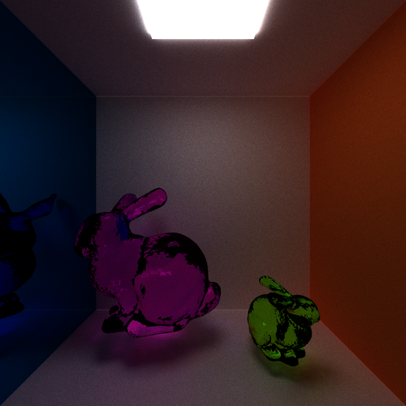
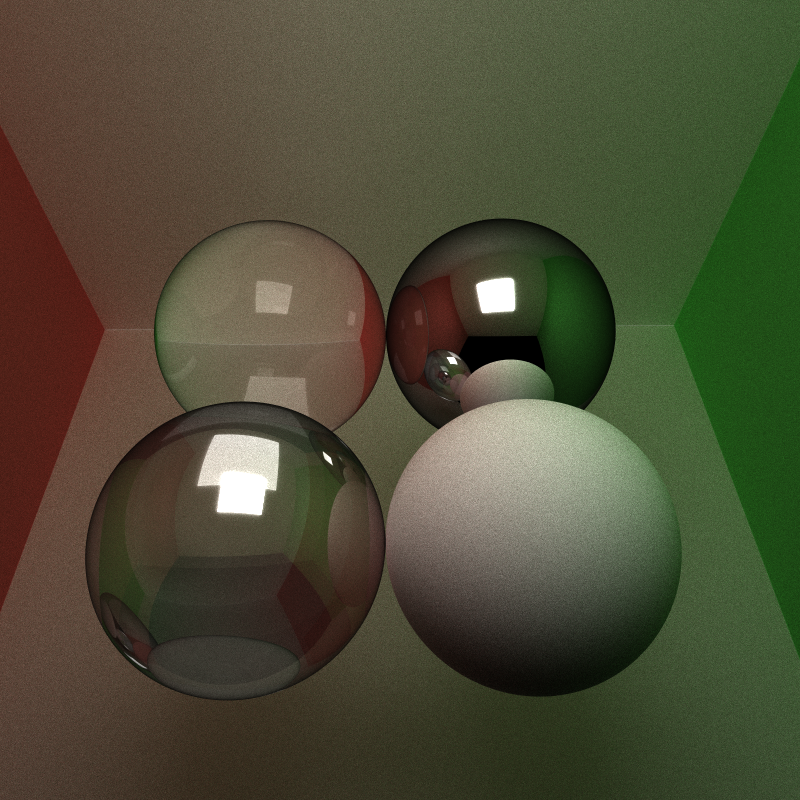

CUDA Path Tracer
================

**University of Pennsylvania, CIS 565: GPU Programming and Architecture, Project 3**

* Jie Meng
  * [LinkedIn](https://www.linkedin.com/in/jie-meng/), [twitter](https://twitter.com/JieMeng6).
* Tested on: Windows 10, i7-7700HQ @ 2.80GHz, 16GB, GTX 1050 4GB (My personal laptop)

Path Tracing 101
================

In general, path tracing is a render technique that simulates the interactions between rays from light sources and objects in the scene.

Like illustrated in the image above, we essentially: 
1. Shoot rays rays from the positions of each pixel, through camera, to the scene;
2. If a ray hits an object, then based on the material of the object's surface:
* 1. The ray bounces off randomly if the object is of diffusive material, which basically creates a new ray starts from the intersection with direction randomly distributed in a hemisphere;
* 2. The ray bounces off only through the reflective direction if the object is of reflective material;
* 3. The ray enters the object if the object is refractive, its direction changes according to the object's index of refraction (eta).
3. Repeat step 2. where rays keep bouncing off from a surface to another surface. 
4. A ray is terminated if:
* 1. It reaches a light source;
* 2. It hits nothing, means it will not do any contribution to the result image;
* 3. It has bounced off enough times (or so-called depth), you can think this as a ray's energy is all consumed. 
5. When all rays are terminated, we gather and average their colors and create a image based on it.

From the path-tracing procedures described above, we can get the sense that 'Path Tracing' is trying to simulate the stochastic phenomenon when light hits objects, which is also known and described by [BSDFs](https://en.wikipedia.org/wiki/Bidirectional_scattering_distribution_function), by shooting a lot of rays a lot of times into the scene, and approximate the continuous probability distribution by enough large number of discrete sampling. The best about Path Tracing is that the rays coming about from different pixels are independent, so we can use the power of GPU to run multiple threads, each carrying a ray, simultaneously on GPU.

Highlighted Renderings
==================

Bunny 

-----------------------------

Colorful diamonds:

------------------------------

Other models

Different BSDFs
==================

The material of an object is represented by its surface BSDFs:

 * Walls usually appears to be purely diffusive, meaning the incident light is uniformly scattered in all directions, so there is no "shiny" visual effect from any angle;
 * Mental materials can be approximated by pure specular BSDF: the incident light entirely bounces off from the reflective direction;
 * Glass and water are described by both reflective and refractive effects. Incident rays are splited into two parts: one goes out in reflective direction, another enters the material. The energy split scheme is described by its [Fresnel Equations](https://en.wikipedia.org/wiki/Fresnel_equations), which usually can be approximated by [Schlick's approximation](https://en.wikipedia.org/wiki/Schlick's_approximation).

The above image shows four material configurations: 
1. Pure diffusive
2. Pure reflective
3. Reflective & refractive 
4. Reflective & refractive with higher index of refraction.

Same scene with smaller number of iterations and slightly different view angle.

An almost pure refractive sphere. Does it remind you of [something](https://www.google.com/search?q=nintendo+switch&source=lnms&tbm=isch&sa=X&ved=0ahUKEwiFmvWHlundAhVNxVkKHWeUC8cQ_AUIESgE&biw=918&bih=364#imgrc=g27scV2cRmd15M:)? 

Arbitray Mesh Loading
==================

Meshes are .obj files loaded by [tiny_obj_loader](https://github.com/syoyo/tinyobjloader) credited to [Syoyo Fujita](https://github.com/syoyo)

Desired .obj files are in wavefront OBJ file format that contains at least: vertices positions, vertices normals and faces

Mesh rendering can be done with or without [Bounding Box](http://www.idav.ucdavis.edu/education/GraphicsNotes/Bounding-Box/Bounding-Box.html), Bounding Box is a simple optimization method that can restrict only the rays hitting the bounding box to actually check intersections with the mesh. Performance improvement on this can be find in the Analysis [part](#bounding-box-culling-for-mesh-loading)

Anti-Aliasing
==================

[Anti-Aliasing](https://en.wikipedia.org/wiki/Spatial_anti-aliasing) is a technique widely used to show sharp edges in renderings. Without AA, sharp edges would appears sawtooth shape on image because the pixels themselves have size. AA solution is path tracing in easy: within each pixel, we jitter the origin of the ray, so that the pixel value has variations, wich is basically what AA needs. 

The following pictures show the effect of Anti-aliasing.

| AA ON | AA OFF|
|:-----:|:-------:|
|||

As seen from the enlarged view above: without AA, the sharpe edges become staircases after zoomed in; with AA enabled, the enlarged image still remain plausible.

Optimization Analysis
==================

In order to fully exploit the power of GPU, we have various possible way to optimize the path tracing scheme:

## Stream Compaction path segments

After each bounce, some of the rays would terminate because they hit the light source or void. For the rays that are terminated (while other rays are still running), we could just terminate the thread, or equivalently, run less threads in next iteration.

Inside the code we keep track of the rays, and use stream compaction to compact all the active threads together after every iteration. In the beginning of each iteration, only active rays (or paths) need to be started and computed again. The follow charts shows the performance difference between with and without rays compaction.

Another issue that worth pointing out in stream compaction is the closure of the scene: if the scene is open, then more rays are likely to terminate early since that bounce off out the scene; with closed scene, the only way for ray termination is to hit a light source. Such difference indicates that the number of active rays can be significantly different after several bounces. The following chart shows the trend:

Stream compaction on rays does a good job: many rays are terminated after second bounces.
Also, as we expected, not so many rays terminated in closed scene.

However, in simple cornell scene with 8 maximum bounce count, closed scene has shorter run time per iteration. This is because when depth are small, computation time for stream compaction countered the advantages from terminated rays.

----------------------------

## First Bounce Cache

For Path tracing without Anti-aliasing, in the start of every iteration, rays are shot out from the same position as the first iteration. So we could store the resulted intersection information of first bounces from first iteration as a cache, and reuse them in the start of every iteration after that. This way we could save the computation time for first bounces.

----------------------------

## Sort by Material Types

Sorting the intersections by material type is driven by a simple idea that if neighboring threads are treating same material type, then essentially they would run the same shading instructions, resulting in potentially no branching within warps. In this way, the warps could possibly reach early termination, which maybe a boost for performance.

The following chart shows the running time for with/without material sort for image of essentially three types of materials:

According to the chart, the shading time does reduce slightly after material sorting, but the sorting time itself is way too time-consuming. Maybe better sorting algorithm would help.

--------------------------------
## Bounding Box Culling for Mesh Loading

With bounding boxes, the loaded mesh is restricted in a known range, so that we don't need to check every ray whether it intersects the mesh or not. Instead, when we are going to check ray-scene intersections, we first perform intersection check against the bounding box. Only if intersected, following check with triangles would be performed. 

The following chart shows the running time comparison for with/without bounding box culling for a stanford bunny model:

It shows that bounding box decrease the computing time considerably.

---------------------------------

Build Commands
===================
`cmake -G "Visual Studio 15 2017 Win64" -DCUDA_TOOLKIT_ROOT_DIR="C:\Program Files\NVIDIA GPU Computing Toolkit\CUDA\v8.0" -T v140,cuda=8.0 ..`

Thanks to
=========================
* [tiny_obj_loader](https://github.com/syoyo/tinyobjloader) 
* [Wikipedia](https://www.wikipedia.org/)
* [Free3D](https://free3d.com/)

