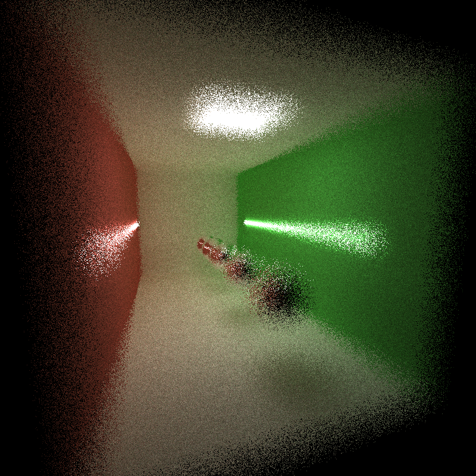

CUDA Path Tracer
================

**University of Pennsylvania, CIS 565: GPU Programming and Architecture, Project 3**

* Yan Wu
* [LinknedIn](https://www.linkedin.com/in/yan-wu-a71270159/)
* Tested on: Windows 10, i7-8750H @ 2.20GHz 16GB, GTX 1060 6GB (Personal Laptop)

### Project Description
 In this project, I implemented a CUDA-based path tracer capable of rendering images. Since in this class we are concerned with working in GPU programming, performance, and the generation of actual beautiful images (and not with mundane programming tasks like I/O), this project includes base code for loading a scene description file, described below, and various other things that generally make up a framework for previewing and saving images.

### Features
* Basic Features:
   - A shading kernel with BSDF evaluation for:
      - Ideal Diffuse surfaces (using provided cosine-weighted scatter function, see below.) [PBRT 8.3].
      - Perfectly specular-reflective (mirrored) surfaces (e.g. using glm::reflect).
      - See notes on diffuse/specular in scatterRay and on imperfect specular below.
   - Path continuation/termination using Stream Compaction
   - Implemented a means of making rays/pathSegments/intersections contiguous in memory by material type
      - Sort the rays/path segments so that rays/paths interacting with the same material are contiguous in memory
   - A toggleable option to cache the first bounce intersections for re-use across all subsequent iterations.

* Extra Features:
   - Refraction (e.g. glass/water) [PBRT 8.2] with Frensel effects using Schlick's approximation [PBRT 8.5]. 
   - Physically-based depth-of-field (by jittering rays within an aperture) [PBRT 6.2.3].
   - Antialiasing.
   - More exciting features in the future...
 
### Result and comparison
* Original scene without anything:  
     
* Without implementing Stream Compaction(So slow!):  
     
   We can see that even those useless paths are taken into count. By using stream compaction we can get a way more efficient outcome.

* With fraction vs Without fraction: 
      
   More realistic with refraction implemented!
* With Anti-Aliasing vs Non-Anti-Aliasing: 
       
      
    If we check carefully at the baseline of the walls, especially on the back wall, we could see that the anti-aliasing feature is working.
* With DOF(Depth of Field) vs No DOF: 
      
    Depth of Field implemented great, we can totally see the difference as distance changes. The program with DOF only executed 433 loop so the right picture is a little too blurry.
    
### Bloopers
* Here are some interesting bugs I encountered when I was trying to implement schlick's approximation(left) and DOF(right). 
      

  
