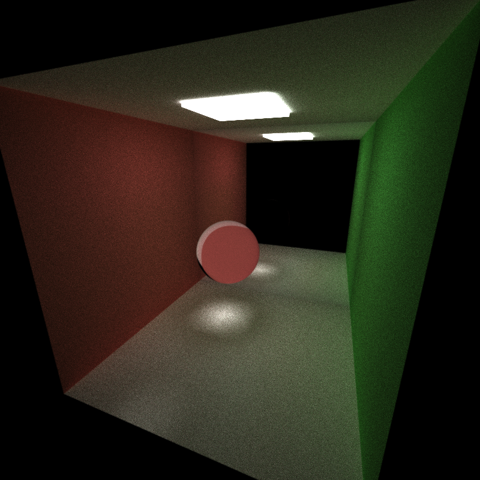

CUDA Path Tracer
================

**University of Pennsylvania, CIS 565: GPU Programming and Architecture**

**Anantha Srinivas**
[LinkedIn](https://www.linkedin.com/in/anantha-srinivas-00198958/), [Twitter](https://twitter.com/an2tha)

**Tested on:**
* Windows 10, i7-8700 @ 3.20GHz 16GB, GTX 1080 8097MB (Personal)
* Built for Visual Studio 2017 using the v140 toolkit
---

Introduction
---

Path tracer is computer graphics technique using which virtual scenes are rendered. The most popular version called as Monte Carlo path tracer is similar to the traditional Ray tracer, but instead of one ray per pixel multiple ray are launched. At each point of intersection, the rays are bounced off in a random direction, based on the material the ray intersected with. The distribution of these bounces are defined by a functional called as Bi Direction scattering distribution function. 

A Path tracer implemented on the CPU is highly inefficient, given that for each pixel, we will need to cast multiple rays from the camera and trace it around the scene. A GPU based implementation would speed up this process, with computation of color for each pixel being run almost simulatanously on multiple threads.

Implemented Features
---

1. A lot of structural changes to the code to reflect the architecture as described in **Physically Based Rendering, Second Edition: From Theory To Implementation** by Pharr, Matt and Humphreys, Greg.

2. Naive Integrator.

3. The path tracer supports the following materials:
* Diffuse materials 

* Refractive material

* Specular (Perfectly specular and glossy)

4. Rays between each iteration are compacted to remove any dead rays. This is done to improve the performance.

5. The Path segments are sorted by material type. This ensure that almost all warps executed on the GPU have similar execution time.

6. The first intersection is cached for subsequent iterations. This saves redundant calculation on the GPU.

7. Implemented Refraction (the refractive index is assumed to be 1.52, which should be later taken as input from the scene file)

8. Stocahstic sampled AntiAliasing. This jitters the ray direction from camera by a small amount. Over multiple interations, this results in a blurred effect.

|| No Anti-Aliasing             |  Anti-Alias 1 |  Anti-Alias 2 |
:-------------------------:|:-------------------------:|:-------------------------: |:-------------------------:
 Original Image|  |   |  
Zoomed|  |   |  

9. Implemented Procedural geometry or implicit surfaces. Current supported implicit surfaces include - box, sphere, torus, capped cylinder. The intersection with the geometry is determined using ray marching.

Analysis
---
Comparison in runtimes between CPU vs GPU based Path tracer (for Naive Integrator)

When compared to GPU based Path tracer, CPU is way more slow. Even with multi-threading enabled, the number of pixels computed per thread is limited.

References
---
[PBRT] Physically Based Rendering, Second Edition: From Theory To Implementation. Pharr, Matt and Humphreys, Greg. 2010.