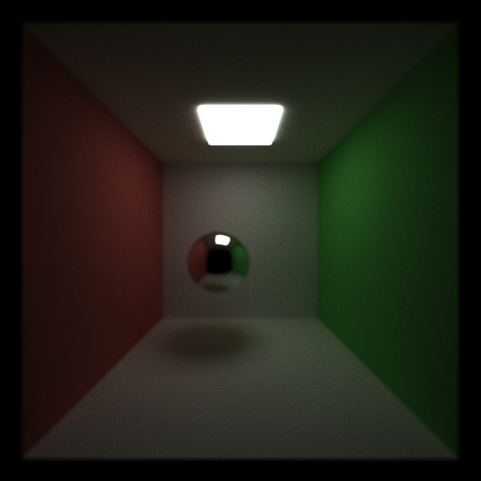

CUDA Path Tracer
================

**University of Pennsylvania, CIS 565: GPU Programming and Architecture, Project 3**

* Name: Bowen Yang
  * [LinkedIn](https://www.linkedin.com/in/%E5%8D%9A%E6%96%87-%E6%9D%A8-83bba6148)
  * [GitHub](https://github.com/Grillnov)
  * [Facebook](https://www.facebook.com/yang.bowen.7399)
  * [Steam](https://steamcommunity.com/id/grillnov)
* Tested on: Windows 10 x64, i7-6800K @ 3.40GHz 32GB, GTX 1080 8GB (Personal computer at home)

# Description

Implement a path tracer with CUDA acceleration enabled, capable of rendering globally-illuminated, photo-realistic images at high speeds. The basecode already has the auxiliary services like I/O, keyboard interrrupts, and OpenGL calls. What we're supposed to do is to implement the core of it.

# Part 1: Basics*

The picture pretty much says it all.

## Performance analysis so far
We choose this default configuration as the benchmark of our performance analysis:
*Anti-aliasing: OFF*
*Depth of Field: OFF*
*1st Cache: OFF*
*Material sort: OFF*

### Performance analysis phase 1: The cached rays

As we can see here the cache significantly boosts the performance.

### Performance analysis phase 2: The sorting

Many of our classmates are suffering from severe performance loss due to this sorting operation. Although thoretically we can expect some performance boost from sorting all the intersections by their material keys, so that the spatial locality becomes better in succeeding phases that tackles with the 

# Part 2: Detail of the radix sort implementation

# Part 3: Anti-Aliasing

With jitter = 0.008f.
# Part 4: Motion Blur

# Part 5: Depth of Field

[Link to the reference for sampling the jitter on the lens](https://pub.dartlang.org/documentation/dartray/0.0.1/core/ConcentricSampleDisk.html)
