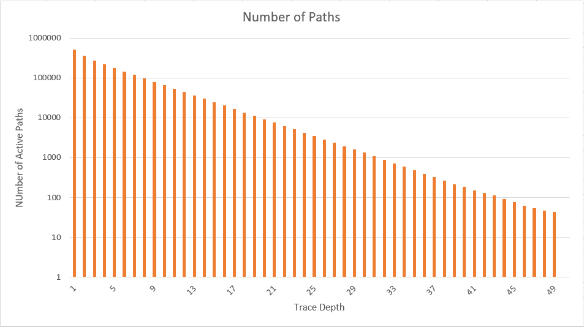

CUDA Path Tracer
================

**University of Pennsylvania, CIS 565: GPU Programming and Architecture, Project 3**

* Angelina Risi
  * [LinkedIn](www.linkedin.com/in/angelina-risi)
  * [Twitter](https://twitter.com/Angelina_Risi)
* Tested on: Windows 10, i7-6700HQ @ 2.60GHz 8GB, GTX 960M 4096MB (Personal Laptop)
  
  
  
</img>
  
## Features
  
### Stream Compaction  
  
Included with the code are methods for stream compaction using shared memory modified from a previous project, tested and confirmed to function when correctly used with the pathtracer. While I had attempted to use the thrust implementation, there was some error in calculating the new number of paths such that it never changed, so it was just dead weight. Stream compaction resorts an array such that non-zero elements (in this case un-terminated ray paths) are at the beginning, and returns the number of these elements. This allows us to reduce the number of paths to check for intersections and the number of paths to shade, and keeps them contiguous in memory.
  
### Depth-of Field  
  

  
Depth of field (DOF) is the effect in which objects further away from the point where the eye is focused become blurry, less well-defined, than those closer to the focal point. This is done by jittering the cast rays' origins in an "aperture" radius and recalculating the direction toward the originally aimed focal point. This method causes greater distortion of the ray from the target point the further it is from the focal point.  
To customize depth-of-field effects there are two main variables: the focal length and aperture radius. Currently the focal length, which determines the focal point of each ray, is determined in code as the difference between the camera position and "Look-At" point, while the aperture radius is defined as a constant (located in path_helpers.h). Increasing or decreasing the focal length moves the curved "focal plane" while changing the aperture size affects the range of jitter, making the image more or less blurry outside of the focal plane.  
Due to the nature of this feature, it cannot be properly implemented while caching the first bounce (described in next section).  
This feature adds a little more overhead in generating new rays from the camera at the begining of each iteration by adding more instructions per thread and memory access. This feature is toggleable from a defined boolean in path_helpers.h.  This would be quite inefficent even for this seemingly small task versus parallel implementations. Since the code itself is short, very few more GPU optimizations can be imagined, but perhaps speeding up memory access such as through using shared memory would be useful.
In a hypothetical CPU implementation, the instructions would essentially be the same, but done sequentially in a loop. This means the cpu would need to generate 2 times the number of pixels random numbers, in sequence, and apply a pair of them to ach ray and recalculate the direction.  
  
#### First-Bounce Caching  
  
First-Bounce caching is the storage of the first set of intersections between the rays from the camera and the scene. Instead of recalculating the first bounce every iteration, we copy the values from the first iterteration into memory and reload it at the beginning of each iteration afterwards. The DOF effect requires randomization of the initial ray, therefore it is not compatible with this caching method, as it would only randomize the first cast and leave the image distorted. This problem can be seen in the following image, even after 373 iterations:  
</img></img>  
This method has little overhead, only requiring a memory copy after the first intersection test, and then replaces subsequent first intersection tests with a memory copy, which should greatly reduce the computation time in the first bounce of each iteration. Since there is some randomized factors involved in shading and bouncing the rays, we can't store the path itself after the first bounce (which would further save on computation).
  
### Materials  
  
#### Diffuse  
  
Diffuse materials are opaque, and due to surface particles scatter light in a "random" direction in a hemisphere around the surface normal of the point intersected. The color of the surface is determined by multiplying the colors each material bounced from. This causes some color bleed from nearby objects, as seen in the example image, in which the red and green walls contribute color to the sphere.  
  
#### Absorbancy  
  
Material absorbancy is modelled in refractive or subsurface scattering materials using an exponential function of path length through the material and material absorbancy. Since I did not implement imperfect specular I reused the materials' SPECEX parameter as the absorbance coefficient. Multiplying e-aL by the accumulated path color models portions of the light energy being absorbed by the material instead of completely passing through. (insert pictures with and without absorbancy)  
    
#### Perfect Specular (Reflective)  
  

  
Perfectly reflective surfaces reflect the incident ras perfectly around the surface normals of the object. In code, the specular color is sampled and the reflected direction calculated from the incident and normal vectors. This creates a mirror-like effect on the object surface. Since the specular color is sampled, the reflection is tinted by this color. A white specular would act as a perfect mirror, while other colors act more like a smooth perfectly reflective colored metal.
An imperfect specular material would still reflect, but with some randomness around the perfect reflection vector, much like the diffuse case. This would better model rough reflective surfaces.  
  
#### Perfect Refractive  
  

  
Refractive materials transmit light through them, but if the refractive index of the material differs from that of the surrounding material (in this case air) the transmitted ray is "bent" in a new angle determined by the ratio of refractive indices and the angle of the incident ray with the surface normal. The result is a distorted view through the object of the objects behind or around it.  
  

    
#### Imperfect Refractive  (Partially reflective/Fresnel Effects)
  

  
Materials with both reflective and refractive elements can be modelled by calculating the portions of the incident ray reflected and transmitted and then choosing which path to pursue using this as a probability. The coloring of the material is determined by adding the portion reflected multiplied by specular color with the portion refracted multiplied by diffuse color. The proportions of reflected versus transmitted rays were calculated using the Schlick Approximation.  
  
#### Subsurface Scattering  
  

  
Subsurface scattering is a material effect in which light diffuses into a material and is scattered by particles in the material. This results in a "milkiness" of the material, such as in candle wax or skin. The absorbancy and "scatter length" of the material are important in determining he color in this case. Currently the program uses a fixed defined scatter length, the average length between "scatter" events in the material, but in real materials this variable would depend on its crystal structure and components. A smaller scatter length means more scattering events on average through the material, so fewer photons would make it through in the number of bounces allowed, and there would be more light attenuation from the absorbancy of material due to the increased total path through the material.  
Potentially one could remove the allowed bounce count decrease when scattering in the material to allow more accuracy, but this would increase compute time per iteration and make it more variable.  
This image made it possible for me to wrap my head around the process of how it physically works:

Source: [Stack Exchange](https://computergraphics.stackexchange.com/questions/5214/a-recent-approach-for-subsurface-scattering) (I did not reference the actual code)  
  
Since the ray is scattering randomly in a sphere around the scatter point, it was necessary to add a function to calculate this as opposed to just a hemisphere as in the diffuse case.  
  
We can compare different scatter length effects from the images below. In order, they use scattering lengths of 0.01, 0.05, 0.1, and 0.5:  
</img></img></img></img>  
  
## Comparison With CPU Implementation  
  
  In this section we'll discuss the advantages of parallel GPU implementation of the features over a hypothetical equivalent sequential CPU implementation. 
  
The depth of field is currently implemented in the generateRayFromCamera kernel function, which initializes the rays and their paths. It is a rather short set of instructions, but involves generating two random numbers and applying them, repeated for each ray. While trivial for a single ray, repeated number of pixels multiplied by number of iterations times becomes very non-trivial in terms of computational overhead when performed serially.  
  
First-bounce caching only requires memory copies. On a CPU, which has memory caching and generally faster clock speeds, this may be faster. However, since our other features are on GPU it is faster to copy device-to-device rather than host-to-device and device-to-host.  
  
Shading processes are almost always going to be faster in parallel GPU processing. Applying material properties to an object can be computationally expensive and must be performed for each pixel being shaded. While the computations themselves may be performed faster (for a single pixel) on the CPU versus the GPU, the same cannot be said for shading on the order of millions of pixels in series as opposed to staggered in parallel. Likewise applying an absorbancy factor is not very computationally expensive, it's just the problem of repeating this calculation for millions of pixels.  
  
The next issue with CPU implementation would be ray compaction for reduced computation. Stream compaction is proven to be much faster for larger array sizes when computed in parallel (on the GPU). Furthermore, this would require being more dynamic in the loop iteration size or some recursion when implementing on the CPU as the point is to reduce the number of rays needed to be shaded as they terminate.
  
  
## Performance Analysis  
  
### Stream Compaction  
  
  
  
The number of paths left unterminated was measured over a single iteration using the "diffuse" scene. The linear slope of the plot using a logarithmic scale shows an exponential decrease in active paths as the depth increases. This means each level deeper a sizeable factor of paths either reached the light or the void outside the scene. With that many fewer rays to process, much fewer warps are required so we can assume a proportionally exponential increase in speed for each higher depth level to process when using compaction, minus the overhead of the compaction process. This also shows the diminishing returns in adding more depth levels, as 90% of the rays terminate by the 11th depth level in this example case.  
  
#### Open vs Closed Scenes  
  
  
  
In an "open" scene, many rays will bounce into the void and thus terminate. However, when the scene is closed, those rays will instead bounce off another wall and continue to be active. While the number of active rays will still considerably reduce due to eventually reaching the light, this is nowhere near the path count attenuation seen in an open scene. In such cases, the stream compaction becomes much less efficient. If the stream compaction were to take longer than the memory access and extra warps from those rays, it would be wasteful.
  
### First-Bounce Caching
  
</img></img>
</img></img>
  
To determine the performance of first-bounce caching, I estimated the run-time for 100 iterations with and without this feature enabled. Running a performance analysis on the pathtracer with first-bounce caching took approximately 61.48 seconds, and without it took 67.86 seconds. That seems to mean approximately 63.8 ms per iteration were saved by caching the first bounce. The analysis shows that there were 99 fewer call of the computeIntersections kernel, as expected from skipping this once per iteration after the first. The analysis shows 552.3 ms difference in total time in that kernel, less than what would be estimated from just the run time difference, and the other kernels taking the bulk of the CUDA run time are around the same time with and without. Thus, most of the difference in total is probably due to fluctuations in CPU time, as this is not the only process running on my machine. Taking the difference between computeIntersections runtime gives an average of 5.52 ms less time per iteration in this kernel.  
  
  
