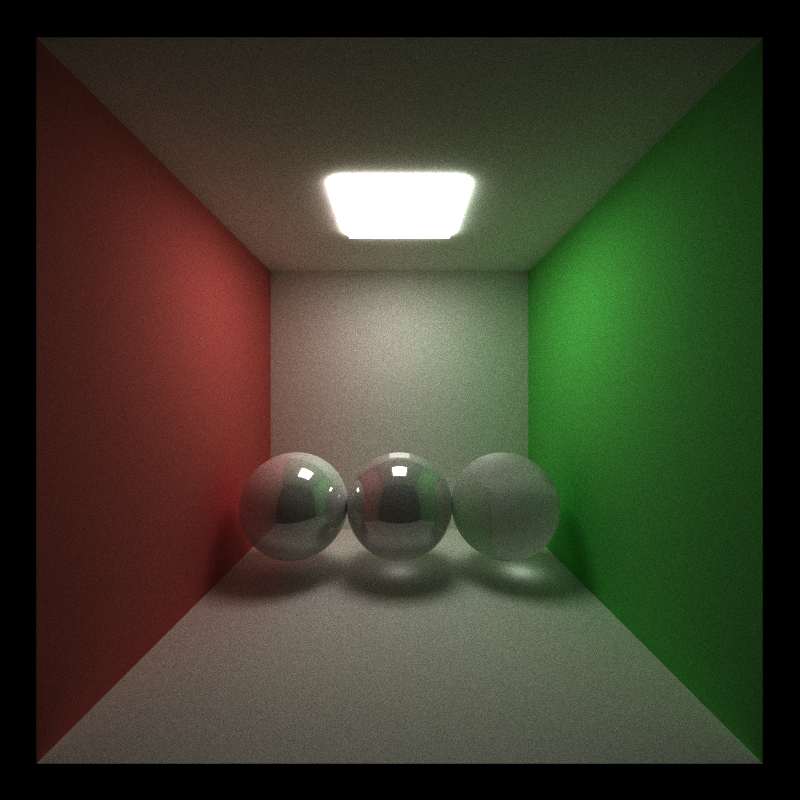

CUDA Path Tracer
================

**University of Pennsylvania, CIS 565: GPU Programming and Architecture, Project 3**

* Yuru Wang
* Tested on: Windows 10, i7-7700HQ @ 2.5GHz 128GB, GTX 1050 Ti 8GB (personal computer)
* Modified CMakeList.txt: changed sm_20 to sm_61 inside cuda_add_library

## Project Description ##
This project implements a CUDA-based path tracer capable of rendering globally-illuminated images very quickly.

A list of features implemented in this project is as follows:
* A shading kernel with BSDF evaluation
* Path continuation/termination using Stream Compaction (with thrust::remove_if)
* Sorting paths by material types (with thrust::sort_by_key)
* Cache first bounce intersections for re-use.
* **Physically-based depth-of-field** by jittering rays within an aperture
* **Stochastic Sampled Antialiasing**
* **Refraction with Snell's law**
* **Motion blur** by averaging samples at different times in the animation

## Results ##
All images below are rendered with 5000 samples and 8 depths.

### Basic Path tracer

### Different Materials
* Perfect surfaces

 Left to right: Ideal diffuse surface, Perfectly specular-reflective surface, and fully refractive surface

* Composite materials
  

 Left to right (reflect/refract/diffuse): 0.3/0.0/0.7, 0.3/0.3/0.4, 0、0.5/0.5.
 Light emissive: 10

### Depth of field

Reference for Concentric Sample Disk function from https://www.dartdocs.org/documentation/dartray/0.0.1/core/ConcentricSampleDisk.html

### Motion blur
| Without Motion Blur | With Motion Blur |
|------|------|
|  |  |

The cube has a velocity of 1 along y axis, and rotate about its z axis by 45 degrees.

### Antialiasing
| Without AA | With AA |
|------|------|
|  |  |

## Performance Analysis and Questions ##

The x horizontal axis of above diagram represents the number of remaining trace depths. As shown on the diagram above, at the end of each bounce, the number of remaining rays is decreasing.

The above figure showing the performances of each optimization tricks. Caching the first bounce intersections did slightly better job than no caching, which is expected because it eliminates one kernel call (calculating initial rays) per iteration. However, unexpectedly, with stream compaction and sorting rays did not actually improve the performance and they even slow down the rendering. I guess that because I used thrust::remove if and thrust::sort_by_key to perform stream compaction and sorting, these two function calls have large overhead which costs more time than directly shading simple materials and geometries. I guess the advantage of using stream compaction and sorting rays would pay off when render large amount of rays/depths and render complex materials.

It can be observed from the diagram above that with stream compaction, the performance is worse than without stream compaction in both open and closed case. As I mentioned above, thrust::remove_if has overhead which kills its advantage in my simple scene settings. However, we can still observe the fact that, with stream compaction, performance in open space is way better than closed space. This is because in open space, many rays would shoot out from the box at every iteration, which means the number of eligible rays would decrease quicker than that in closed box. While for the closed case, all rays are bouncing off in the box until they hit the light source or reach the maximum number of bounces, in which case the stream compaction could only eliminates less rays than that in open space.

## Debugging Log ##

This bug is caused by forgetting to add a small offset to the origin of each new ray. Forgetting to do so makes calculating intersections for those new rays get errors (always get the same intersections as last bounce so that those rays are not able to reach light source)
