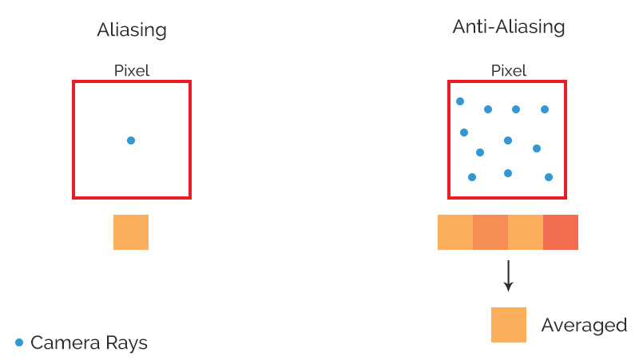
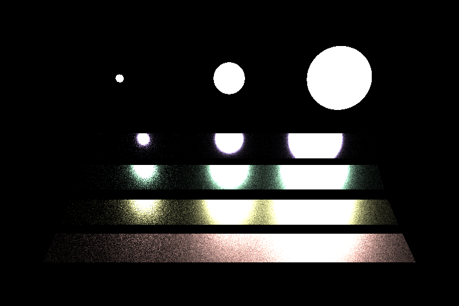

CUDA Path Tracer
======================

**University of Pennsylvania, CIS 565: GPU Programming and Architecture,
Project 3 - CUDA Path Tracer**

* Vasu Mahesh
  * [LinkedIn](http://linkedin.com/in/vasumahesh)
  * [Code Blog](http://www.codeplaysleep.com)

* Tested on a Desktop:
  * Windows 10
  * i7-4790K @ 4.0GHz
  * 16GB RAM
  * GTX 970 4GB
  * Visual Studio 2017 (with v140 toolset)
  * CUDA v8.0

Table of Contents
=============
* [Path Tracer Basics](#path-tracer-basics)
* [Scenes](#scenes)
	* [Metal Bars](#metal-bars)
	* [Droid](#droid)
	* [Wine Glass](#wine-glass)
* [Features](#features)
	* [Textures: Diffuse, Normal, Roughness](#textures-diffuse-normal-roughness)
	* [Procedural Texture](#procedural-texture)
	* [Oren-Nayar Roughness](#oren-nayar-roughness)
	* [Microfacet Distribution](#microfacet-distribution)
	* [Direct Lighting Integrator](#direct-lighting-integrator)
	* [Anti-Aliasing](#anti-aliasing)
	* [Material based Sorting](#material-based-sorting)
	* [Multiple Importance Sampling](#multiple-importance-sampling)
	* [Stream Compaction](#stream-compaction)
	* [Mesh Bounding Box Culling](#mesh-bounding-box-culling)
	* [Sphere Lights](#sphere-lights)
	* [Texture Repeat](#texture-repeat)
	* [Others](#others)
* [Default Scenes](#default-scenes)
* [Building Instructions](#building-instructions)
* [References](#references)

Path Tracer Basics
=============

Path Tracing is a technique to get photo-realistic images. It involves simulating light that bounce around the scene and make interactions.

Here is an example image of how a Path Tracer might function.

(Source: PBRT Page 13)

We basically bounce light around the scene. Light behaves differently based on the material. It may bounce uniformly in a hemisphere around the point of intersection (Diffuse) or it may only bounce in a perfectly reflective direction (Pure Specular).

------------
#### Notes

Note: Diffuse map colors maybe a little inaccurate. This is because I shared some of the data in the same data location. Like instead of having a Ks for specular and Kd for diffuse, they both are stored in the same place but used differently.

------------

Scenes
=============

Metal Bars
---------------

| Spec | Value |
|:-------------|:-----|
| **Iterations** | 1000 |
| **Depth** | 8 |
| **Resolution** | 1280x720 |
| **Render Time** |  ~ 18mins |
| **Materials** | Matte (Oren Nayar), Metal (Fresnel Conductor), Rough Specular (Microfacet BRDF)  |
| **Textures** | Diffuse (2048 x 2048), Normal (2048 x 2048), Roughness (2048 x 2048) |
| **Lights** | 2 Square Plane Arealight (top-left, top-right) |
| **3D Models** | [Gold Bar](https://poly.google.com/view/0w-WpQf7O9J) |
| **Triangle Count** | 4860 |

#### Scene Info

This scene uses spectral data which is discretized & supplied to a Microfacet BRDF with a Fresnel conductor operator. This allows us to render materials like Gold, Silver, Copper etc. and pretty much any alloy or metal. There is also a roughness applied with a Trowbridge Reitz microfacet distribution.

The floor is a matte material with a diffuse, normal and roughness map. Roughness is used by the Oren-Nayar operator in the Lambertian BRDF. If we supply roughness as 0, the Oren-Nayar behaves as a perfect diffuse material.

Notable Things:
- Fresnel Conductors on the metal bars
- Texture Mapping on the floor
- Rough Mirror on the back

#### Debug Views

| Diffuse | Normals | Roughness | All Combined |
|:-----:|:-------:|:-----:|:-------:|
|||||

Droid
---------------

#### Specs

| Spec | Value |
|:-------------|:-----|
| **Iterations** | 1000 |
| **Depth** | 8 |
| **Resolution** | 1280x720 |
| **Render Time** |  ~ 20mins |
| **Materials** | Matte (Lambert - Oren Nayar), Plastic (Lambert - Oren Nayar, Microfacet BRDF)  |
| **Textures** | Diffuse (2048 x 2048), Normal (2048 x 2048), Roughness (2048 x 2048) |
| **Lights** | 1 Square Plane Arealight (top-left) |
| **3D Models** | [Android](https://poly.google.com/view/9-bJ2cXrk8S) |
| **Triangle Count** | 2304 |

#### Scene Info

Notable Things:
- Plastic Material on Android
- Texture Mapping on the floor

| Diffuse | Normals | Roughness | All Combined |
|:-----:|:-------:|:-----:|:-------:|
|||||

Wine Glass
---------------

#### Specs

| Spec | Value |
|:-------------|:-----|
| **Iterations** | 1000 |
| **Depth** | 8 |
| **Resolution** | 1280x720 |
| **Render Time** |  ~ 25mins |
| **Materials** | Glass (Specular BRDF, Specular BTDF), Matte (Lambert - Oren Nayar) |
| **Textures** | Diffuse (2048 x 2048), Normal (2048 x 2048), Roughness (2048 x 2048) |
| **Lights** | 1 Square Plane Arealight (top-left) |
| **3D Models** | [Wine Glass](https://poly.google.com/view/3UBXjSSvl4q) |
| **Triangle Count** | 9960 |

#### Scene Info

Notable Things:
- Glass Material (Specular BRDF & Specular BTDF - Fresnel Dielectric)
- Texture Mapping on the floor

#### Debug Views

| Diffuse | Normals | Roughness | All Combined |
|:-----:|:-------:|:-----:|:-------:|
|  |  |  |  |

Features
=============

## Textures: Diffuse, Normal, Roughness

From the scenes above, you can see that the Path Tracer supports normals, diffuse & roughness maps. Normal maps create an artistic illusion by altering the surface normal for shading. Rays that hit a material that is equipped with a normal map end up using the normal map's specified normal for shading. The above GIF shows an example of the how a normal map adds detail to the scene.

| Scene | Normals |
|:-----:|:-------:|
|||

Roughness maps on the otherhand give us a roughness value for a particular UV coordinates in the texture. The maps used in the renders are grayscale values and are scaled to [0-1) before usage.

| Scene | Roughness |
|:-----:|:-------:|
|||

--------------------------------

## Procedural Texture

| Regular Texture | Procedural Texture |
|:-----:|:-------:|
|||

Created a simple procedural texture to see how much performance difference would it make between memory access and direct computation. I made sure that the textures are relatively similar. Though, a point to note, that the computation logic for the texture was relatively simple and results may vary if the computation does take a longer time than memory access.

Though the global reads is quite a lot, we can still see a significant reduction (about 100K reads) in the amount of reads after using procedural textures. However, this is not always true. If the procedural texture takes a lot of time to compute, you might as well bake the texture to a file.

| File Based - Global Reads (Iteration 0) | Procedural Based - Global Reads (Iteration 0) |
|:-----:|:-------:|
|||

--------------------------------

## Oren-Nayar Roughness

Implemented a basic roughness calculation for lambertian surfaces. This allowed me to render materials like wood. Which are generally matte but also have a texture difference due to their varying roughness. The metal bar scene is a perfect example of their usage there.

--------------------------------

## Microfacet Distribution

| Pure Specular | Rough Mirror |
|:-----:|:-------:|
|||

Implemented a Microfacet BRDF as well as a Microfacet BTDF. Both implement the Trowbridge Reitz distribution for roughness. They are designed to work with the roughness maps as well.

Microfacets interact with light and block certain light rays based on the incident angle. It is a probabilistic model for computing roughness.

(Source: PBRT Page 533)

--------------------------------

## Direct Lighting Integrator

Direct lighting integrators don't have GI (Global Illumination). This is because they are terminated in the 1st bounce itself. Direct Lighting does test for a "shadow ray" which is the reason why we get the shadows. A shadow ray tests the scene against a randomly chosen light for occlusion between the initial intersection point & the light source.

Performance of Direct Lighting is really high as rays don't bounce further. Also, the number of registers used are very less so, we end up with more blocks being executed in parallel.

--------------------------------

## Anti-Aliasing

Anti-aliasing is achieved by jittering the rays shot from the camera film. Due to this jitter, the rays hit different nearby parts of the scene and the color values get averaged out for the target pixel. This image will help understand on how AA is achieved:

| With AA | No AA |
|:-----:|:-------:|
|||

--------------------------------

## Material based Sorting

Material based sorting is used before shading the rays to achieve early warp termination. This is possible because warps that are near each other end up using the same instructions (for shading). For example grouping all lamberts would allow lambert based threads to terminate together and thereby help warps early exit and free some space for the ones next in line.

This is a performance graph showing how material sorting helps in certain scenes:

Scene: The Multi-material cornell box scene (Image below)

--------------------------------

## Multiple Importance Sampling

MIS is a way to weighed average the color contributions between a light source and a material. This is done because of the BSDF of the material is not always a uniform hemisphere, and if we just sample the light source for these materials, we end up incorrectly accumulating light values for sources. MIS also solves the issues related to light sources projecting a small area on the BSDF lobe of the material.

--------------------------------

## Stream Compaction

Stream compaction helps us eliminate and rearrange the rays after 1 bounce of shading. This is really helpful as it moves the rays that have no energy (bounces) left to the very end. And, thereby keeping valid rays in a contiguous memory location.

Following graph shows the number of rays terminated in 1 iteration based on the scene. Also, a comparison is made for a case when the scene occupied a very small space in the camera's view film.

Open box scene:

Closed box scene is the same scene above but with the additional wall. The camera is inside the cornell box. The following results were obtained:

--------------------------------

## Mesh Bounding Box Culling

Mesh data was loaded using tinyobj loader. Since the rays shoot everywhere on the scene, We shouldn't check for the mesh's triangles intersection for every single ray. We limit this by defining a bounding box (AABB - Axis Aligned Bounding Box) that is 1st checked for intersection, before we iterate across all the triangles. The following graph shows the performance gain due to mesh bounding box culling:

--------------------------------

## Sphere Lights

Implemented sphere shaped area lights. This was for a 4th scene but I ran out of time :)

--------------------------------

## Texture Repeat

| With Repeat | No Repeat |
|:-----:|:-------:|
|||

Implemented a simple hack to repeat textures. This was super useful in all the above scenes. I ended up repeating 2K resolution textures which saved a lot of memory and allowed higher quality renders.

--------------------------------

## Others

- Emissive Maps
- Fresnel Dielectrics

--------------------------------

Other Scenes
----------------

--------------------------------

Building Instructions
=============

[Click here](BUILDING_INSTRUCTIONS.md) for build instructions. The Path Tracer has a lot of features. Some features are turned off to improve some performance while rendering (like direct lighting has its own switch - default is full lighting integrator) and to visualize things a bit faster. If you are wanting to build or recreate some of the scenes, I recommend you look over the instructions as they provide a scene by scene guide for enabling certain flags.

References
=============
- PBRT Book
- [CC0 Textures](https://cc0textures.com)
- [Google Poly](https://poly.google.com)

