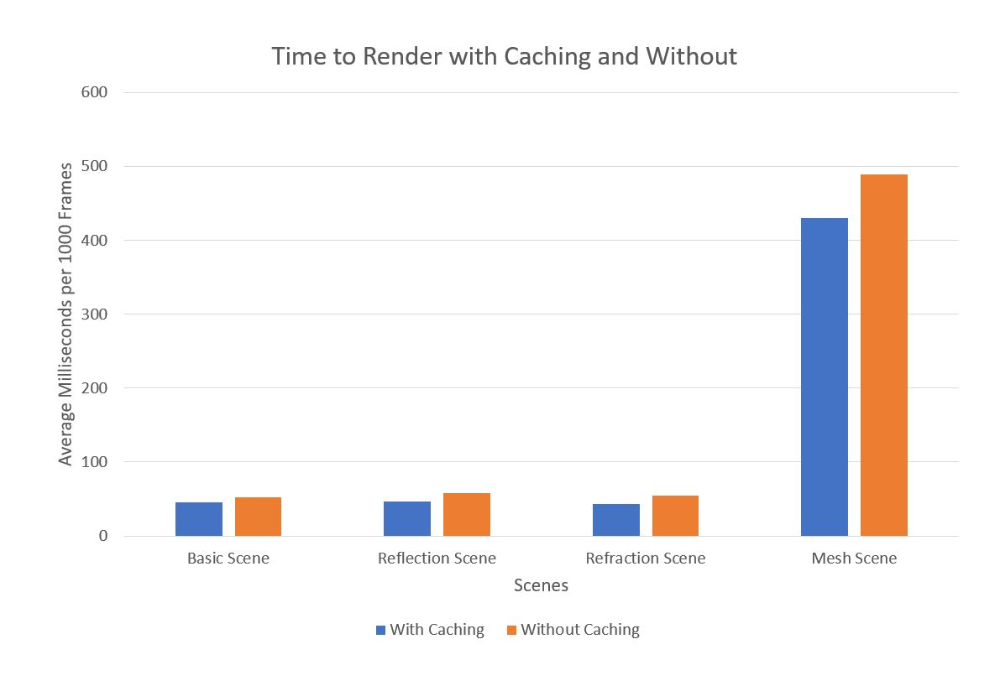
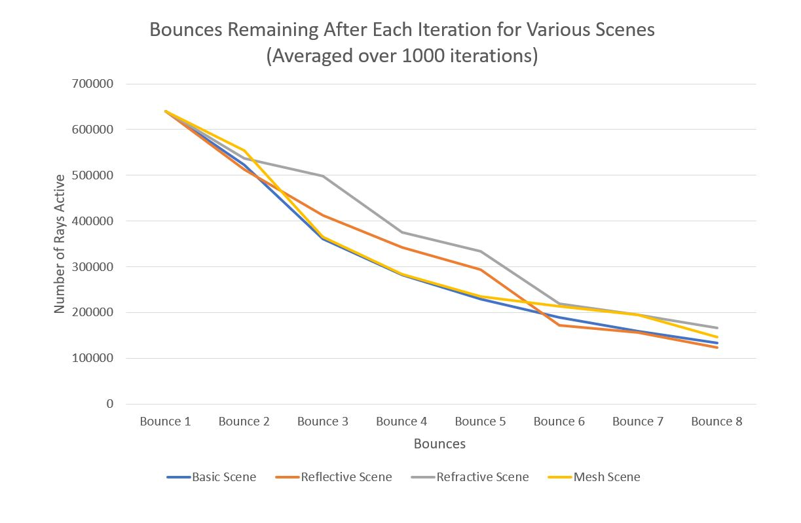

CUDA Path Tracer
================

**University of Pennsylvania, CIS 565: GPU Programming and Architecture, Project 3**

* Ishan Ranade
* Tested on personal computer: Gigabyte Aero 14, Windows 10, i7-7700HQ, GTX 1060

## Images

### Diffuse Sphere

### Reflective Sphere

### Refractive Sphere

### Mesh

## Features Implemented

* Diffuse BSDF and scattering
* Specular scattering
* Refractive scattering with Schlick's approximation
* Antialising through pixel origin jittering
* Mesh loading
* Triangle rendering
* Caching of first bounce
* Sorting my material ids

## Performance Graphs

## Performance Discussion

The caching of the first bounce had limited impact on the performance, saving only a fraction of a millisecond for each frame.  This is probably because the number of objects in the scene was very low, so to truly see the impacts of this performance we would need millions of triangles.  Sorting the materials by id also had a limited impact and actually slowed the pathtracer down.  This could be because the performance saved from sorting was not high enough to eclipse the performance hit from the actual sort operation.  Once again, this would probably be more more useful with more geometry in the scene.

When I implemented the mesh loading the bounding box around the mesh actually did speed up performance a bit, but not as much as a KD tree from a CPU pathtracer would have.  The mesh rendering did slow down the pathtracer in general a lot compared to a single sphere because I did not have a good acceleration structure implemented.

Compared to a CPU pathtracer, the GPU version was much faster.  I was able to get close enough to converged renders in mere minutes, compared to the hours it took with the CPU version.  I also did very basic accumulation of colors and only had a few types of materials.  But, the main performance hit in the CPU is having only one thread trace each pixel at a time, which makes it extremely slow.  The GPU version was much faster because I could trace every ray in the image at once.  Even if I were to add in more advanced rendering techniques and BDSF, it should theoretically still be aster because extra BSDFs just boil down to a few extra math functions that each thread has to do.  Adding in more functionality will probably slow my GPU pathtracer down compared to the current version but it should still be faster than a CPU version.