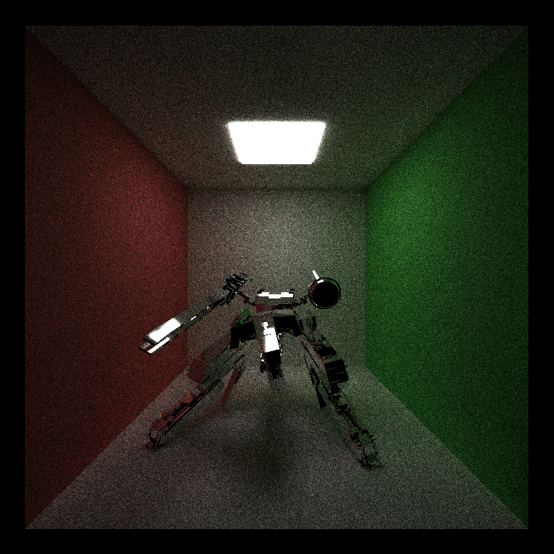

CUDA Path Tracer
======================

**University of Pennsylvania, CIS 565: GPU Programming and Architecture, Project 3**

* Xiao Zhang
  * [LinkedIn](https://www.linkedin.com/in/xiao-zhang-674bb8148/)
* Tested on: Windows 10, i7-7700K @ 4.20GHz 16.0GB, GTX 1080 15.96GB (my own PC)

Analysis (blocksize1d is set to 128 unchanged, image order is direct light integrator, full light integrator and naive integrator)
======================

## 1. Mat scene 800x800 pixel 200 ppx 8 recursion 

* overview

* statistics

* images

A. direct light integrator
  

B. full light integrator
  

C. naive integrator
  

## 2. Two light scene 800x800 pixel 200 ppx 64 recursion

* overview

* statistics

* images

A. direct light integrator
  

B. full light integrator
  

C. naive integrator
  

## 3. Two light scene 800x800 pixel 200 ppx 8 recursion

* overview

* statistic

* images

A. direct light integrator
  

B. full light integrator
  

C. naive integrator
  

## 4. Rex scene 800x800 pixel 200 ppx 8 recursion (28974 triangles in total)

* overview

* statistic

* images

A. direct light integrator
  

B. full light integrator
  

C. naive integrator

## 5. Reflective rex sceen 800x800 pixel 200 ppx 8 recursion (28974 triangles in total)

* overview

* statistic

* images

A. direct light integrator
  

B. full light integrator
  

C. naive integrator
  

## 6. Comparison with CPU path tracer

* overview

