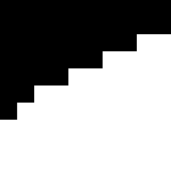

CUDA Stream Compaction
======================

**University of Pennsylvania, CIS 565: GPU Programming and Architecture, Project 2**

* Edward Atter
  * [LinkedIn](https://www.linkedin.com/in/atter/)
  * Tested on: Linux Mint 18.3 Sylvia (4.13.0-41-generic), Ryzen 7 2700x @ 3.7 ghz (base clock) 16GB, GTX 1070 TI 8GB GDDR5 (Personal)
  * CUDA 9

## Overview

This project implements a path tracer with the following features:
 - A shading kernel capable of diffuse, specular, and refractive surfaces with Fresnel effects
 - Antialiasing
 - Stream compaction
 - First bounce caching
 - Built in frame timer

All features may be toggled by changing the defined constants in `src/pathtracer.

## Performance

#### Methodology

Frame timings were calculated by taking the average over 5 frames. In general, after the initial frame, very little variance was observed. The timing for each feature was performed with all other toggleable features disabled.

#### Relative Performance Impact

## Features

#### Anti-Aliasing

 

Anti-aliasing can even out rough edges. This is done by "jittering" the rays' x and y positions slightly at each iteration. The effect is most noticible in high-contrast situations, as in the images above. The image on the left has anti-aliasing disabled, while the image on the right has AA enabled. The image on the right appears less pixelated. 

#### Stream Compaction
Interestingly, stream compaction resulted in a slight decrease in performance. In theory, we should be able to eliminate many of the dead, black rays; but at least with the current implementation, the compaction overhead was to great to yield any appreciable results.

I hypothesized that mostly black images would benefit the most from stream compaction, so I tried again on the `sphere.txt` scene. The results were the same, rendering was faster without stream compaction.

#### First Bounce Caching
Caching the first bounce yielded the largest increase. Unfortunately, it has the effect of dampening the anti-aliasing affect (if both are enabled simultaneously), since the random jitter of the array is cached and reused for each iteration, only being updated during a new frame. 

