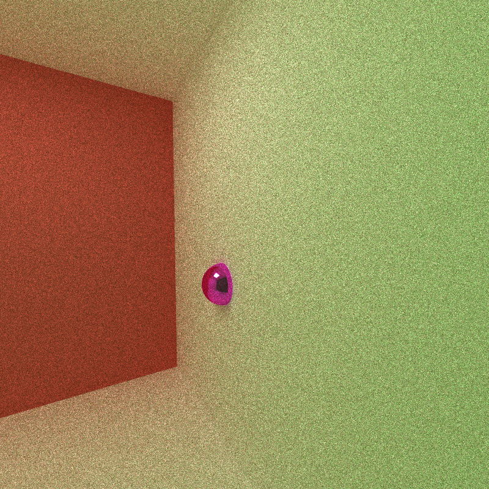

CUDA Path Tracer
================

**University of Pennsylvania, CIS 565: GPU Programming and Architecture, Project 2**

* Yu Sun 
* [LinkedIn](https://www.linkedin.com/in/yusun3/)
* Tested on: Tested on: Windows 10 , i7-6700HQ CPU @ 2.60GHz × 8 , GeForce GTX 960M/PCIe/SSE2, 7.7GB Memory (Personal Laptop)

## Introduction

In this project, a basic path tracer with static scene rendering and shading is implemented. The tracer can shade objects with 
diffusive, specular and refractive surfaces with light source in the scene. 

Below is a very simple scene demonstrating the effect.

The techniques used in order to make the shading process faster include caching the first bounces, sorting the materials by id, and 
stream compaction. Caching can help because the first bounce of the rays would almost always be the same. Sorting the materials by id would help the 
access pattern of the threads, and stream compaction essentially reduce the number of computation that needs to be done. 

Additional features written include anti-aliasing, using depth of field and motion blur.

***Anti-aliasing*** 

Anti-aliasing is a very simple technique that you add some random gaussian noise when shooting the rays so the boundary looks more natural. 

An example of scene with and without anti-aliasing effect is shown below, look how sharp the edge look on scene without anti-aliasing effect

Scene with anti-aliasing       | Scene without anti-aliasing
:-------------------------:|:-------------------------:
  |  

***Depth of Field *** 

Depth of field can be achieved by specifying a camera model with varying focal length and lens size. It uses a technique that's called concentric disc sampling and 
is explained in detail in the book Physically Based Rendering. The result is shown below:

Focal Length = 10      | Focal Length = 15
:-------------------------:|:-------------------------:
  |  

LenSize = 0.2      | LenSize = 0.5
:-------------------------:|:-------------------------:
  |  

***Motion Blur ***

Motion blur can be achieved by sampling the objects in different locations while it moves. The movement speed will effect how the object is captured by the camera.

Speed = 1      | Speed = 2
:-------------------------:|:-------------------------:
  |  

***Refraction *** 

Refraction effect can be achieved by using Snell's law. It helps the object looks more realistic with the effect of letting light through 

Without refraction      | With Refraction
:-------------------------:|:-------------------------:
  |  

## Analysis 

So I mention briefly that stream compaction can help reduce the amount of computation we have. Below is a more concreate analysis on the number of rays reduced after stream compaction. Notice the difference when the scene is closed and when it's open. 

This makes sense as in closed scene the rays needs to bounce more before hitting a light source and terminating, while in open scene it can soon be terminated as it's shooting outside.

It can also be seen that in general the algorithm runs faster when it's in open scene. 

It is also true that using cache helps improving the speed as shown below. 

However, when we need to go with randomrization in the scene creating anti-aliasing effect or motion blur. The technique cannot be used anymore. 

On the other hand, we could still use sorting to help increase the speed. However, although in theory sorting can help increase the performance. In reality, 
one needs to consider its overhead as sorting does come with a price.

Closed Scene      | Open scene 
:-------------------------:|:-------------------------:
  |  

In general, it's more helpful to use sorting in open scene as in closed scene, the rays are rarely terminating. Therefore, the gain of making the memory access continuous 
may not be that much. 

## References

* [PBRT] Physically Based Rendering, Second Edition: From Theory To Implementation. Pharr, Matt and Humphreys, Greg. 2010.
* Wikipedia 

