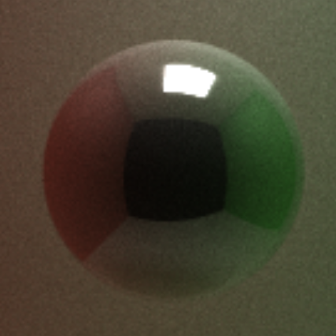
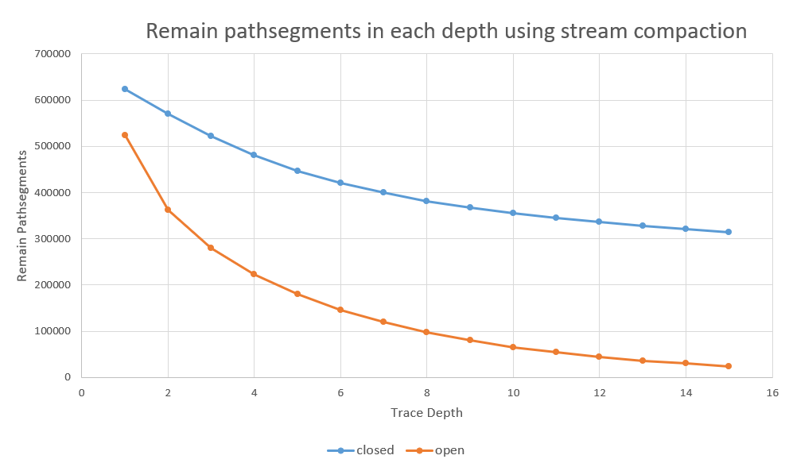

CUDA Path Tracer
================

**University of Pennsylvania, CIS 565: GPU Programming and Architecture, Project 3**

* Siyu Zheng
* Tested on: Windows 10, i7-8750 @ 2.20GHz 16GB, GTX 1060 6GB, Visual Studio 2015, CUDA 8.0(Personal Laptop)

## CUDA Path Tracer

### Anti-aliasing

Used Stochastic Sampled Antialiasing. Stochastic sampling is a discrete antialiasing method which antialiases scenes through the use of a special sample distribution which replaces most aliased image artefacts with noise of the correct average intensity.

   
| No Anti-aliasing        | Anti-aliasing            |
| ------------- |:-------------:|
|       |    |

### Refraction

Refraction [PBRT 8.2] with Frensel effects using Schlick's approximation, which is a formula for approximating the contribution of the Fresnel factor in the specular reflection of light from a non-conducting interface between two media.

| Reflection       | Refraction           |
| ------------- |:-------------:|
|       |    |

### Depth of field

Physically-based depth-of-field. Offset ray origin on a lens. Under the thin lens approximation, parallel incident rays passing through the lens focus at the focal point. If the film plane is placed at a distance equal to the focal length behind the lens, then objects infinitely far away will be in focus, as they image to a single point on the film.

| Focal length 7        | Focal length 12           |
| ------------- |:-------------:|
|       |    |

### Motion Blur

Add a motion vector to the translation vector on the model. So model may have a slightly different transformation for each ray.

| No Motion Blur        | Motion Blur            |
| ------------- |:-------------:|
|      |   |

### Arbitrary mesh loading and rendering
A mesh loading of wahoo.obj.
Used tinyObj to read data. Used triangle intersection function glm::intersectRayTriangle to calculate intersections of the mesh object. (Need improvement with better data structure or aabb)

## Performance Analysis

Sorted the rays/path segments so that rays/paths interacting with the same material are contiguous in memory before shading. 

Compared the performance w/o sorting in defferent trace depth. The non-sorting version is much faster than sorting version. This might because thrust::sort_by_key took longer time than we saved using contiguous memory accessing. Another reason might be the scene is originally composed of same material, so the sorting did not improve a lot. If the scene become more complicated, we might take advantage of material sorting.

Next, cached the first bounces data , so that we don't need to recalculate first bounce path segment after first iteration.

According to the graph, cach first version has better performance since it save the time for recalculation for first bounce path segment after first iteration.

In each iteration, I used stream compaction to terminate path segment which has no more remain bounces. Below is a graph shows how many rays left after each depth. 

As we see from the graph, stream compaction terminate a lot of paths. Compare scenes which are open (like the given cornell box) and closed (i.e. no light can escape the scene), we can see that since rays in closed scene can not escape, there were more rays remain in closed scene. Also, at first few depth open scenes has more rays terminated, later since many rays have already escape from the scene, the curve has a slower downward trend.

## Blooper

thrust::remove_if problem in stream compaction.

Miscalculate refraction ray costheta.

## Reference

[tinyObj](http://syoyo.github.io/tinyobjloader/) to bring the data from object file into C++.

Physically-based depth-of-field (by jittering rays within an aperture) [PBRT 6.2.3].

Stochastic Sampled Antialiasing from [Paul Bourke's note](http://paulbourke.net/miscellaneous/raytracing/)