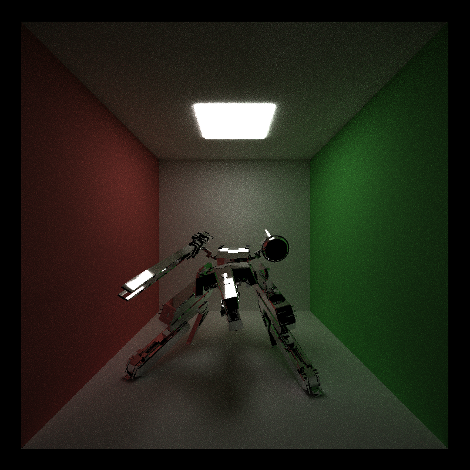

CUDA Path Tracer
======================

**University of Pennsylvania, CIS 565: GPU Programming and Architecture, Project 3**

* Xiao Zhang
  * [LinkedIn](https://www.linkedin.com/in/xiao-zhang-674bb8148/)
* Tested on: Windows 10, i7-7700K @ 4.20GHz 16.0GB, GTX 1080 15.96GB (my own PC)

Analysis 
======================
* blocksize1d is set to 128 unchanged

* image order is direct light integrator, full light integrator and naive integrator

* rendering time is measured in second

---

## 1. Mat scene 800x800 pixel 200 spp 8 recursion 

### overview

### rendering time

### analysis

* integrators

This scene shows 4 types of material that are implemented in this project currently, diffuse, emmissive, specular reflective and specular transmissive. It also shows 3 types of integrators that are implemented in this project as well, direct light integrator, full light integrator and naive integrator. Direct light integrator shades the material based on the sampling of the light sources. And it only traces the path once. Since perfect specular material has zero chance to take the path decided by sampling the light theoretically and there is no second path segment to compensite that, their color is just black. In the full light integrator however, global illumination is factored in by tracing the path multiple times. At the end of each depth, we sample the material to choose the next ray direction. This allows for the perfect specular material to have a chance to sample the light or other material in the next depth to get their color. Naive integrator shades the material by sampling their materials. It multiplies the color that a path sampled together to give the final color. However, if the path doesn't hit a light source until its end, the color of the path will simply be set to black. This is why it produces the most noisy image. In full light integrator, the colors are added together, so whether the path hit a light or not, it always contribute to the final color. This is why it has less noise in the image.

* stream compaction

In this scene, stream compaction doesn't do well in full light integrator and naive integrator, but does really good for direct light integrator. Because the time spent on performing stream compact is more than the time saved by launching less threads in subsequent depth for full light and naive integrator, considering the total depth is only 8. But in direct light integrator, every path will be terminated after the first depth, it will benefit more if we just reduce the total threads number to zero so that it doesn't launch any threads for subsequent depth.

* material batching

No only in this scene but also other scenes, sorting the path and intersections according to material types causes long rendering time. My guess is that the discrepency in shading codes for different materials are not radical enough and the total number of the types of present materials are not large enough to make the process benefit from material batching. However there is an interesting issue I discovered by using thrust sort. According to an online resource, thrust use radix sort if you provide an integer array as key and merge sort if otherwise. So to compare the performace of these two, I used a separate integer array to store material types so that I can use radix sort and I overloaded the "<" operator for ShadedIntersection class so that I can use merge sort. Surprisingly, the radix sort is actually slower than the merge sort. My guess is that when I use a separate integer array to sort both ShadedIntersection and PathSegment, I have to use iterator and tuple to sort these two value array based on one key array. This may caused some performance issue. Also, using another global material type array can be slow since there is more global memory access.

* first path caching

In all cases, caching the first path with stream compaction enabled improves the performance compared with only enabling stream compaction. But since there is only 200 spp, the improvement is not significant.

### images

* direct light integrator
  

* full light integrator
  

* naive integrator
  

---

## 2. Two light scene 800x800 pixel 200 spp 64 recursion

### overview

### rendering time

### analysis

* integrators

Same as the mat scene. Direct light integrator produces incomplete image. Naive integrator produces noisy image. Full light integrator provides best image.

* stream compaction

The stream compaction saves a lot of rendering time since the total depth is 64, which means if we don't teminate a zero contribution path, it will stay there for a longer time than in the mat scene. This is why stream compaction saves time in this scene but wastes time in the mat scene. 

* material batching

Same as the mat scene. Material batching doesn't help when we have so few material types and the shading code discrepency is not radical.

* first path caching

Same as the mat scene. Caching the first path with 200 spp does not help that much.

### images

* direct light integrator
  

* full light integrator
  

* naive integrator
  

---

## 3. Two light scene 800x800 pixel 200 spp 8 recursion

### overview

### rendering time

### analysis

* integrators

Same as the mat scene. Direct light integrator produces incomplete image. Naive integrator produces noisy image. Full light integrator provides best image.

* stream compaction

Just like the mat scene the total depth is 8 now, the stream compaction starts to waste time because the time spent on stream compaction is more than the time saved by launching less threads.

* material batching

Same as the mat scene. Material batching doesn't help when we have so few material types and the shading code discrepency is not radical.

* first path caching

Same as the mat scene. Caching the first path with 200 spp does not help that much.

### images

* direct light integrator
  

* full light integrator
  

* naive integrator
  

---

## 4. Rex scene 800x800 pixel 200 spp 8 recursion (28974 triangles in total)

### overview

### rendering time

### analysis

* integrators

One of the most obvious result is that when there is a lot of geometries in the scene, full light integrator cost more time than naive integrator. This is because in full light integrator, every time we sample a light or a material, we have to an intersection detection called shadow feeler to provide shadow information. This is very costly especially when we have a lot of geometries. Basically, we will do two extra intersection detections in every depth. Even with k-d tree and bounding volume hierachy the time comsumption is still significant. Apart from this, the results are same as the mat scene. Direct light integrator produces incomplete image. Naive integrator produces noisy image. Full light integrator provides best image.

* stream compaction

Unlike the mat scene and the two light scene, even the total depth is still 8, the stream compaction will save time by launching less threads. This is simply because we are doing too much work in one depth, mainly because the intersection detection with large amount of geometries. Full light integrator benefits more from stream compaction because it has two extra intersection detection per depth, which means more work can be saved.

* material batching

Same as the mat scene. Material batching doesn't help when we have so few material types and the shading code discrepency is not radical.

* first path caching

Same as the mat scene. Caching the first path with 200 spp does not help that much.

### images

* direct light integrator
  

* full light integrator
  

* naive integrator

---

## 5. Reflective rex sceen 800x800 pixel 200 spp 8 recursion (28974 triangles in total)

### overview

### rendering time

### analysis

* integrators

Same as the diffuse rex scene, full light integrator cost more time than naive integrator because the extra intersection detections with large amount of geometries. But for full light integrator the rendering time is actually 50 to 100 seconds less in this reflective scene than in the diffuse scene. Because in full light integrator, perfect specular material can skip lots of calculation and step right to the next depth since they are not sampling the light. Apart from this, the results are same as the mat scene. Direct light integrator produces incomplete image. Naive integrator produces noisy image. Full light integrator provides best image.

* stream compaction

Just like the diffuse rex scene, even the total depth is still 8, the stream compaction will save time by launching less threads.

* material batching

Same as the mat scene. Material batching doesn't help when we have so few material types and the shading code discrepency is not radical.

* first path caching

Same as the mat scene. Caching the first path with 200 spp does not help that much.

### images

* direct light integrator
  

* full light integrator
  

* naive integrator
  

---

## 6. Comparison with CPU path tracer

### overview

* 1024x1024 pixel 400 spp 5 recursions for both

* compact and cache are enabled for CUDA path tracer

### cuda path tracer 10 min 51 sec

### cpu path tracer 63.5 hour

## 7. Summary

Stream compaction is optimal there is a lot of work to do during one depth or when your total depth is large. Material batching is optimal there are lots of different material types in the scene. In terms of sorting algorithm, if thrust is used, there is no need to allocate an integer array just to use the raidx sort, overload the "<" operator of a class and sort the objects of this class will not slow you down too much if any. Caching the first path is optimal when the spp value is high enough. Last but not least, full light integrator is not necessarily the fastest. But with the same spp and total depth, it will produce the least noisy image.
