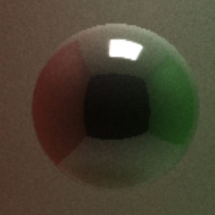

CUDA Path Tracer
================

**University of Pennsylvania, CIS 565: GPU Programming and Architecture, Project 3**

* Siyu Zheng
* Tested on: Windows 10, i7-8750 @ 2.20GHz 16GB, GTX 1060 6GB, Visual Studio 2015, CUDA 8.0(Personal Laptop)

## CUDA Path Tracer

### Anti-aliasing
   

| No Anti-aliasing        | Anti-aliasing            |
| ------------- |:-------------:|
|       |    |

## Performance Analysis

## Blooper

## Reference

[tinyObj](http://syoyo.github.io/tinyobjloader/) to bring the data from object file into C++.

Physically-based depth-of-field (by jittering rays within an aperture) [PBRT 6.2.3].

Stochastic Sampled Antialiasing from [Paul Bourke's note](http://paulbourke.net/miscellaneous/raytracing/)